# Aionios ata05 — Technical Reference Manual (Public Edition)

> **Unofficial technical specification, hardware reference, and operator's
> manual** based on hands-on reverse engineering of a production V14 device.
> Compiled from serial-console investigation, firmware-package analysis, and
> live observation. Compiled in chronological order of discovery.

> **Published / sanitised edition.** This is a public release of an independent,
> community reverse-engineering effort, meant to help other owners understand,
> repair, and interoperate with their own devices. It is **not** affiliated with,
> authorised by, or endorsed by Aionios, TOALL Design, or anyone else; all product
> and company names are trademarks of their respective owners.
>
> **Scope & method.** Every finding was obtained from a device the author owns —
> serial-console observation, analysis of the manufacturer's own published DIY
> material, and bench measurement. Protocol command codes and CRCs were verified
> mathematically. Reverse engineering for interoperability and repair is generally
> permitted in the EU/Germany; this document describes *findings*, not a means to
> infringe anyone's rights.
>
> **Deliberately NOT included.** No firmware images or binaries are distributed
> here (only descriptions of their structure and the backup *method*); no
> confidential or embargoed FCC exhibits; and all per-unit identifiers — the device
> QR serial, production-traceability codes, and accessory serial strings — have been
> redacted. In the protocol examples the 12-byte serial UID is shown as
> `XXXXXXXXXXXX` (i.e. `[SN×12]`): substitute your own device's 12-character serial
> and recompute the serial-dependent CRCs with the routine in §8.4.
>
> **No warranty.** Provided as-is, for educational and interoperability purposes,
> with no warranty of accuracy or fitness. Modifying your device can void its
> warranty and may brick it — proceed at your own risk.
>
> **License:** *suggested* Creative Commons Attribution 4.0 (CC BY 4.0) — adjust to taste.

---

## Table of Contents

1. [About this Document](#1-about-this-document)
2. [Quick Reference Card](#2-quick-reference-card)
3. [Hardware Overview](#3-hardware-overview)
4. [Storage and Boot](#4-storage-and-boot)
5. [Software Stack](#5-software-stack)
6. [Network Architecture](#6-network-architecture)
7. [The Companion MCU (Sub Board EC501_SUB_V1.0)](#7-the-companion-mcu-on-sub-board-ec501_sub_v10)
8. [The LinxPort Plugin Interface](#8-the-linxport-plugin-interface)
9. [Root Access and Serial Console](#9-root-access-and-serial-console)
10. [Watchdog and Stability Tuning](#10-watchdog-and-stability-tuning)
11. [Backup and Recovery](#11-backup-and-recovery)
12. [Known Issues and Bugs](#12-known-issues-and-bugs)
13. [Investigation Methodology](#13-investigation-methodology)
14. [Glossary](#14-glossary)
15. [References](#15-references)
16. [Community Knowledge — Curated FAQ from Kickstarter](#16-community-knowledge-curated-faq-from-kickstarter)
17. [FCC Database Investigation — `2BQFZ-ATAMPM-05`](#17-fcc-database-investigation-2bqfz-atampm-05)

---

## 1. About this Document

This is an **unofficial** technical reference for the Aionios ata05, a
Kickstarter-funded teleoperated pet-companion robot.

The information herein was gathered through:

- Direct analysis of the manufacturer-supplied firmware update packages
- Soldering a UART header to the board's debug pads and obtaining a root shell
- Cracking the legacy DES password hash from the embedded `/etc/passwd`
- Static analysis of the main userspace binary `/mnt/data/ipc71125`
- Live observation of system behaviour on a running device
- Snooping the various UART links

**Nothing in this document was provided by the manufacturer.** The intent is to
preserve the technical knowledge gathered so that owners of this device can:

- Understand what is running on hardware they own
- Recover from firmware-update mishaps
- Build their own peripheral modules for the LinxPort dock
- Make informed decisions about cloud connectivity, privacy, and modification

**Tested against:** Aionios ata05, application firmware version V01.21.01.14
(`build Jan 4 2026 16:00:27`), shipped to backers in early 2026.

**Official product designation** (engraved on the bot's underside):

> **AIONIOS**  
> Humanized Teleoperated Robot.  
> **ATA MPM-05**

So the formal model name is **`ATA MPM-05`** ("ata05" is just the
casual/Kickstarter shorthand). "Teleoperated" is meaningful: the bot is
a true mechatronic device — a low-profile **four-wheel-drive rover** with
a remotely-tiltable camera, designed to be **driven around the operator's
home from anywhere in the world** via the phone app.

**Etymology** (per the official "About AIONIOS" page on aionios-design.com):

- **AIONIOS** comes from the Greek word *αἰώνιος* (= "eternity"). The
  brand philosophy is explicitly anti-obsolescence — "smart products that
  remain timeless despite changing trends".
- The **ATA** product-name prefix is described by Aionios as "three
  letters taken from 'AIONIOS' and 'TOALL'" — i.e. A (AIONIOS) + T (TOALL)
  + A. The trailing "05" refers to the 5th major design iteration; per
  Aionios the product went through "five major iterations and over 50
  rounds of optimization" before mass production.

**OEM hierarchy** (now confirmed both by silkscreen on every PCB and by
the official Aionios About page and the Aionios Kickstarter responses):

- **AIONIOS** — the consumer-facing brand. *"AIONIOS is the smart product
  brand incubated by TOALL Design Agency."*
- **TOALL Design Agency / TOALL Design Consulting (Shanghai) Co., Ltd** —
  the parent design agency that incubated AIONIOS. Per Aionios's own
  Kickstarter reply: **"TOALL Design, a product design and engineering
  firm with 23 years of experience serving international brands."**
  Appears on the underside label of the charging dock as the registered
  manufacturer. Presumably also responsible for final casing/packaging
  and tooling.
- **Airlambo** — the electronics designer / PCB maker. Its name appears in
  silkscreen on every PCB inside the product (both the bot's Qi-receiver
  board and the charging dock's transmitter board carry the identical
  marking `Airlambo ATA05 / 20251115`). The custom Qi IC is also marked `AIRLAMBO` (full marking `AHS12G1 / NHB617000 / 2402A`; see §3.13.13).
- **Lantek** — the PCB fabrication house. Marking `Lantek-06` appears on
  both the main board (`EC501_MB_V3.0`) and the sub-board (`EC501_SUB_V1.0`).

**Regulatory identifiers** (from the official Aionios user manual,
`cdn.shopify.com/.../ata05-user-manual-250925.pdf`):

| Identifier | Value |
|------------|-------|
| Product Name | `ata05 Humanized Teleoperated Robot` |
| Model | `ATA MPM-05` |
| Manufacturer | TOALL Design Consulting (Shanghai) Co., Ltd. |
| Power input | DC 5 V / 2 A |
| **FCC ID** | **`2BQFZ-ATAMPM-05`** — US radio-cert ID, queryable at fcc.gov for internal photos, block diagrams, RF reports |
| **CMIIT ID** | **`25 J312VYA623`** — Chinese radio cert |

Anyone looking for spare parts, replacement PCBs, or related documentation
should search for **"Airlambo ATA05"** or **"EC501"** (the internal board
number), or query the FCC database with the FCC ID above for
regulatorily-required technical disclosures.

**Industry recognition:** The ata05 is a **iF Design Award winner** (per
the iF Design Award database entry "AIONIOS TOALL Humanized Teleoperated
Robot ata05").

**Official contact:** `hi@aionios-design.com` (Mon–Fri, 48h response time
per Aionios FAQ).

### 1.1 Marketed Product Story and Official Specs

The ata05 is marketed by Aionios as a **multi-purpose teleoperated avatar**
sitting at the intersection of three product categories — pet companion,
pet monitor, and remote-presence/security camera. The phone app and the
website (aionios-design.com) present the same hardware under three
narratives:

1. **Remote presence / teleoperated avatar.** "Drive into any room, see
   in real time, and talk instantly." The user drives the bot around
   their own home from anywhere, with live video and two-way audio.
2. **Pet companion + pet monitor.** Designed for interacting with cats
   and dogs — playful pet sound effects, an optional motorised laser
   ("Purr Laser") for cat play, and pet-aware bot behaviour.
3. **Sentry / security camera** (see §5.5). When armed, the bot wakes on
   radar-detected motion and auto-records the event.

**Officially published hardware specifications:**

| Parameter | Value |
|-----------|-------|
| Drivetrain | Four-wheel drive, tank-style spin-in-place |
| Body thickness | **74 mm** (low-profile, slides under furniture) |
| Slope rating | Up to **25°** |
| Obstacle clearance | **30 mm / 3 cm** |
| Top speed | **0.55 m/s** (≈ 1.23 mph) |
| Camera | HD 1080p, **95° wide-angle**, Wide Dynamic Range (WDR), with ambient light sensor |
| Camera tilt range | Remotely tiltable up to **30°** |
| Night vision | **IR-cut filter switchable** (mechanical, audible click) **plus two on-board IR emitters**. The fill-light button is dual-function: in colour mode it switches on 2 white LEDs, in night mode the same button switches on 2 **IR emitters** (confirmed by phone-camera test — invisible to the eye, visible as an IR glow on a phone sensor — and faintly as a dull red glow at the emitters even to the naked eye, which points to **~850 nm** parts rather than covert ~940 nm; wavelength not yet measured, treat as hypothesis). See §12.7. |
| White-light illuminator | One PWM-controlled white LED on PWM2 (the `AudoLight` task; see §3.5) |
| Wireless | Dual-band Wi-Fi 6 |
| Battery | **5200 mAh** |
| Charging time | 4 h (10 W Qi) |
| Standby time | up to **150 days** ("smart energy saving" — actually advertised as "120 days" when armed in Sentry Mode, per Aionios's own Kickstarter reply; the published numbers are not fully self-consistent) |
| Active operation | up to **12 hours** continuous |
| Sentry motion range | **> 3 m** (24 GHz mmWave radar, see §3.10) |
| Multi-user | Multiple simultaneous app users supported |
| Local storage | microSD ("TF card") slot — see §3.6 |
| Tires | Removable, replaceable, washable silicone |
| Packaging | Biodegradable pulp |

**Industry recognition** (the ata05 is, as of June 2026, the most-awarded
single Kickstarter teleoperated-robot of its generation):

- **iF Design Award 2026** (Product & Computer category) — Aionios's
  Update #18 (March 2, 2026). iF Design Award database entry "AIONIOS
  TOALL Humanized Teleoperated Robot ata05" #758287.
- **Red Dot: Product Design 2026** — Aionios's Update #22 (April 9, 2026).
- **Good Design Award** (Japan, G-Mark) — referenced by Aionios in
  Update #22 as one of the prior wins ("Following our recent wins at
  the MUSE Design Awards, Good Design Award, and the iF DESIGN AWARD
  2026 …").
- **MUSE Design Award Gold Certificate** in three categories: Smart
  Home, Pet-Friendly, and User Experience.

**Architectural implication of these specs:** the four-wheel-drive +
spin-in-place + tilt camera capability means the chassis has *at least*
one drive subsystem (for forward/backward/turn — likely two paired DC
motors via the SA8833C on the sub-board) **plus** a camera tilt motor.
The SA8833C dual H-bridge can drive either two brushed DC motors (most
likely for the wheel pairs in a tank-steer 4WD configuration) or one
bipolar stepper; the sub-board silkscreen says 步进电机 (stepper) but
this may be generic legacy labelling — see §3.11 for the open
investigation.

**Privacy claim — known discrepancy with our findings:**

The Aionios website prominently states:
*"Your Privacy, Fully Protected. ata05 keeps your data safe with local
storage only – nothing goes to the cloud."*

This claim is **not fully consistent with the firmware as shipped.** The
main userspace binary `/mnt/data/ipc71125` links against `libqiniu.so`
(Qiniu Cloud Storage SDK, a Chinese object-storage service), and against
Agora RTC SDK (a real-time-communication cloud service that *necessarily*
proxies live video and audio through Agora's servers — the "no-lag
remote-presence" feature would not work otherwise).

Possible reconciliations of the claim:

- "Local-only" may be a strict statement only about *recorded footage*
  (Sentry-Mode clips and on-demand recordings) rather than about live
  teleoperation streams. Live-presence frames going through Agora are
  not stored anywhere — they are ephemeral.
- The `libqiniu.so` library may be present in the binary but *not
  actually invoked* in production firmware (e.g. inherited from the
  CVITEK SDK template; or only activated in regional builds).
- "Local-only" may apply by default but be opt-in-toggle-able to cloud
  on a per-feature basis by the user.

Owners who care about this should verify empirically — for example by
running Sentry Mode while watching outbound traffic from the bot's IP
on their LAN, before drawing conclusions. The `libqiniu.so` is present
in the binary either way; whether it is **called** at runtime is the
relevant question.

---

## 2. Quick Reference Card

For the impatient. Detail follows in later sections.

| Item | Value |
|------|-------|
| SoC | Sophgo / CVITEK CV1811C (RISC-V, T-Head C906 core) |
| Camera sensor | SOI F35, 2 MP, 30 fps, MIPI, 10-bit |
| Board ID | `EC501_MB_V3.0` |
| SDK | `cv181x_cv180x_v4.2.0_daily_build` (Jenkins CI) |
| Flash | SPI-NOR **Macronix MX25L25645G**, 32 MB (256 Mbit); ~22 MB used across 10 MTD partitions |
| WiFi | AIC8800 (binary blob driver `aic8800_netdrv-yao.ko`) |
| Console UART | `ttyS0` @ 115200 8N1, autologin root |
| MCU link | `ttyS1` @ 115200 8N1 raw |
| Default root password | `cvitek` |
| Device IP (default) | DHCP via WiFi |
| RTSP server | `0.0.0.0:8554` (live555-based) |
| Stream URLs | `rtsp://<ip>:8554/live0`, `…/live1` |
| Cloud RTC | Agora.io (ap-*.agora.io) |
| Cloud storage | Qiniu (libqiniu.so) |
| Application binary | `/mnt/data/ipc71125` (1 660 648 bytes for V14) |
| Read-only rootfs | `/dev/mtd8`, squashfs |
| Writable storage | `/dev/mtd9`, JFFS2, mounted at `/mnt/data` |

---

## 3. Hardware Overview

### 3.1 System-on-Chip

The ata05 is built around the **CVITEK CV1811C**, a single-core RISC-V SoC
in the cv181x family. It is closely related to the open-source **Milk-V Duo**
development board, which means a great deal of community knowledge from the
Milk-V ecosystem applies here.

| Property | Value |
|----------|-------|
| Architecture | RISC-V (RV64) |
| Core | T-Head C906 |
| Image Signal Processor (ISP) | CV181x ISP pipeline |
| Video Encoder | H.264 / H.265 (VENC) |
| Audio | CVI AUDIO subsystem |
| AI accelerator | CVI TPU (present but unused by ata05 firmware) |

**Package:** the chip is supplied in this device as an **unmarked SiP
(System-in-Package)** variant, with a **DDR2/DDR3 die stacked inside the
same package**. This is why no separate DRAM chip is visible on the board,
and why the central SoC has no visible top-surface markings. CVITEK SiP
variants are commonly laser-marked very faintly, on the underside, or not
at all in cost-optimized OEM batches. Identification is unambiguous from
`/proc/cpuinfo`, `uname -a`, the U-Boot banner, and the cv181x-specific
peripherals exposed by the kernel.

The SoC integrates a Linux-capable application processor and an
**RTOS-capable secondary core** (YOC / AliOS-related) that runs in parallel.
The two halves communicate via a virtual ethernet bridge exposed to Linux as
`vnet0`.

### 3.2 The Companion MCU — On a Separate Sub-Board (EC501_SUB_V1.0)

> **History note:** Earlier drafts of this document hypothesized that "the
> MCU" referenced in the firmware source strings was the **C906L little
> core** inside the CV1811C SoC (i.e. the RTOS half of a dual-OS design).
> That hypothesis was based on incomplete hardware inspection.
> Subsequent disassembly down to the rear of the LinxPort interface
> revealed a **separate daughter-board PCB carrying a real, discrete MCU**
> — see Section 3.12 for the full board description. The references to
> "MCU" in the binary strings (`mcu_uart_fd`, `info mcu charge led`,
> `uidEnableMCUPlugin`, `MCUPerECS`, etc.) point at **this physical chip**,
> not the SoC's secondary core.
>
> The C906L / RTOS dual-OS architecture inside the CV1811C *is* still real
> (it is part of the CVITEK SDK), but in this product its role appears to
> be limited to internal SDK functions (audio stack, power management),
> not to the bot-specific "MCU plugin" workflow.

**Where it is:** mounted near the LinxPort dock interface at the rear of
the bot, on a dedicated sub-board labelled `EC501_SUB_V1.0`. The board
connects to the main board (EC501_MB_V3.0) by a flat ribbon cable (FFC).

**What it does:**

- Drives the **two DC gearmotors** that move the bot's "snail-eye-stalk"
  horns (Motor 1 via JST connector labelled `1A 电机 1B`, Motor 2 via
  `2A 电机 2B`). The motor driver is a `SA8833C` dual H-bridge.
- Owns the **LinxPort dock interface** — the INT/TX/RX/GND/VCC pads on
  the bot's underside (see Section 8). The LinxPort UART (9600 8 N 1) is
  driven directly by this MCU's GPIOs/UART, not by the main SoC.
- Speaks **upstream to the main board over UART** at 115200 8 N 1 — this
  is the `/dev/ttyS1` device on the Linux side. Frames follow the MODBUS-
  flavoured format described in Section 3.2.1.
- Likely also relays charging-status, button presses, and other low-level
  realtime events to Linux.

**Programmability:**

This MCU is **fully accessible for development**:

| Header / Pad set | Labels | Use |
|------------------|--------|-----|
| Tactile buttons | `BOOT`, `RST` | Bootloader-entry sequence (hold BOOT, pulse RST, release BOOT) and warm reset |
| SWD header (4 gold pads) | `GND / SDWCK / SWDIO / 3V3` | **Serial Wire Debug** — flash, dump, and live-debug with ST-Link / J-Link / similar |
| UART header (4 gold pads) | `GND / TX / RX / 3V3` | MCU console / debug UART. 3.3 V logic. |

This implies the MCU is most likely an **ARM Cortex-M class** part
(STM32, GD32, …) or a **RISC-V part that supports SWD** (e.g. WCH CH32V
series, which deliberately mirrors the SWD interface to be ST-Link
compatible). **The MCU has now been positively identified — see below.**

**MCU identification (confirmed from close-up macro photo):**

```
ⒽⒹⓈⒸ
HC32L130
J8TA
241123N
A26446...
```

The MCU is a **HDSC HC32L130J8TA**:

| Property | Value |
|----------|-------|
| Manufacturer | **HDSC = Huada Semiconductor (华大半导体)**, Shanghai, China (part of CEC group) |
| Family | HC32L130 — low-power 32-bit MCU line |
| Core | **ARM Cortex-M0+** |
| Clock | up to 48 MHz (with internal RC) or via external 8.000 MHz crystal (present on board) |
| Flash | **64 KB** (the `J8` suffix) |
| SRAM | typ. 8 KB |
| Package | **LQFP48** (the `TA` suffix; ~48 fine-pitch leads, matches the photo) |
| Date code | `241123` = **week 23 of 2024** (June 2024 production) |
| Lot code | `A26446N…` |
| Debug interface | **SWD** (ARM standard — `SDWCK / SWDIO` pads on the sub board match) |
| Peripheral set | multiple UARTs, SPI, I²C, GPIO, PWM, ADC, RTC — sufficient for "FFC UART to main board + LinxPort UART to accessory + stepper control" |

**Why this matters for custom firmware (good news!):**

- **Public datasheets:** the HC32L130 reference manual and datasheet are
  freely available from hdsc.com.cn (and via several English mirrors).
- **Open-source SDK:** HDSC publishes a C HAL/SDK with example code on
  their site and on GitHub (`github.com/hdscmcu`).
- **OpenOCD support:** HC32L1xx is supported by mainline OpenOCD (or with
  a small custom config that mirrors STM32-Cortex-M0 settings).
- **CMSIS Device Family Pack** is officially available, direct download:
  https://raw.githubusercontent.com/hdscmcu/pack/master/HDSC.HC32L130.1.0.1.pack
- **Free toolchain options:** Keil Studio (free VS Code extension that
  consumes CMSIS packs), Keil μVision Community Edition, or pure GCC-ARM
  via the CMSIS pack.
- **Cheap programmer:** an **ST-Link V2 clone (~5 €)** is sufficient — the
  SWD pinout is the ARM standard.

**Concrete pin mapping — datasheet pin to sub-board pad:**

| Sub-board feature | HC32L130J8TA pin | Function |
|-------------------|------------------|----------|
| Gold pad `SWDIO` | PA13, pin 34 | SWD data line |
| Gold pad `SDWCK` (= SWCLK) | PA14, pin 37 | SWD clock line |
| `RST` tactile button | RESETB, pin 7 | Resets the MCU |
| `BOOT` tactile button | PD03 / MODE, pin 44 | Selects ISP boot mode when held high during reset |
| Crystal `HCIZJ 8.000` | XTHI / XTHO, pins 5 / 6 | 8.000 MHz HSE for PLL up to 48 MHz |
| Debug UART pads `TX / RX` | likely PA9 / PA10 (UART0) | MCU's debug console; also doubles as ISP-mode UART |

**Programming workflows:**

```
SWD path (always works unless read-protect is set):
  ST-Link → SWDIO/SWCLK/3V3/GND → OpenOCD / pyOCD / Keil → flash

ISP path (UART-based bootloader, alternative if SWD is locked):
  1. Hold BOOT button down
  2. Pulse RST button
  3. Release BOOT
  4. MCU enters ISP mode, listens on PA9/PA10 UART
  5. Use HDSC's ISP tool over USB-UART to flash a new image
```

**Power modes (datasheet-confirmed):**
- Active: 130 µA / MHz @ 3 V (~3 mA at 24 MHz)
- Sleep: 35 µA / MHz @ 3 V (CPU stopped, peripherals run)
- **Deep Sleep: 0.5 µA @ 3 V** — all clocks off, IO state preserved, IRQ wake possible
- **Wake-up time: 4 µs** — fast enough for radar-driven wake-on-motion without perceptible latency

**Peripheral inventory (4 UARTs!):**

| Peripheral | Quantity | Bot mapping (hypothesis) |
|------------|---------:|--------------------------|
| UART (standard) | 2 (UART0, UART1) | FFC link to main board + LinxPort 9600 baud |
| **LPUART** (works in deep sleep) | 2 (LPUART0, LPUART1) | One of them may be the radar / wake-on-UART path |
| SPI | 2 | spare / unused |
| I²C | 2 | possibly LCD or battery-gauge IC |
| Timers (TIM0-6 + LPTIM + PCA) | 8 total | Stepper microstepping + timing |
| 12-bit SARADC | 1 (30 channels) | Battery voltage monitor |
| GPIOs | 40 (LQFP-48 variant) | motors, LEDs, buttons, control lines |

The **LPUART** is worth highlighting: it can receive and wake the MCU from
deep sleep without the main clock running. This is almost certainly what
lets the bot sleep when the pet is out of the room and wake instantly when
the radar signals presence — the wake doesn't even need the radar IRQ
lines, the radar's UART chatter itself wakes the MCU.

The presence of SWD + BOOT + RST means:
- Custom firmware can be flashed onto this MCU (subject to read-protect)
- The MCU traffic can be **live-debugged or sniffed at the UART pads**
  with a 3.3 V USB-UART adapter, *without* needing to build a LinxPort
  plugin — this is the easiest entry point for protocol reverse
  engineering.


### 3.2.1 The App ↔ MCU Link

Under the hypothesis above, the link is a **virtual UART between the two
internal cores**, exposed to Linux as `/dev/ttyS1`:

| Property | Value |
|----------|-------|
| Linux device | `/dev/ttyS1` |
| Baud rate (configured by the app) | 115200 |
| Format | 8 N 1, raw |
| MMIO base | `0x04150000` |
| IRQ | 13 |
| App opens it on | fd 9 (changes per run) |
| App read mode | VMIN=0, VTIME=100 (10 s timeout) |

**Important behaviour:** The MCU-side is **strictly query-response**. It
transmits nothing on its own — no heartbeat, no autonomous status. If the
application does not query it, the line is silent. This makes passive
snooping in idle state useless; useful captures would require triggering
events (boot, SD insertion, LinxKey docking, etc.).

A single example frame has been recovered from the boot log:

```
03 00 00 00 00 00 00 00 00 00 00 00 00 46 00 01 00 d5 bc
```

The trailing `d5 bc` is presumed to be a CRC-16 (little-endian). The
function-byte `46` may be a sub-command identifier. This frame did **not**
elicit any response on replay, suggesting it is a fire-and-forget "set"
command rather than a query.

### 3.3 Image Sensor

The camera is an **SOI F35**, identified by the kernel/userspace boot log as
`SOI_F35_MIPI_2M_30FPS_10BIT`:

| Property | Value |
|----------|-------|
| Resolution | 2 MP (~1920×1080) |
| Frame rate | 30 fps |
| Interface | MIPI-CSI |
| Bit depth | 10-bit |

### 3.4 Wireless

WiFi and BLE are provided by an **AIC8800M40B** module mounted on the
main board as a small blue daughter-board. The Linux driver loads as
`aic8800_netdrv-yao.ko` — the `-yao` suffix is an internal build tag.

Visible markings on the module die (top to bottom):

```
AIC8800M40B           <- chip part number
244S-3GCW             <- production lot (week ~44 of 2024)
TS4F47.00
ES8227 K1
FA00.012              <- internal firmware/sub-assembly tag
```

- **Crystal:** `LK40 1AH` = 40 MHz reference oscillator
- **Antenna connector:** external IPEX/u.FL labelled `WIFI ANT` on the
  main PCB
- **Antenna part (FCC-confirmed, §17.8.2):** A single dual-band PIFA-class
  antenna from **Shenzhen Deshiqin Technology / Dosking MicroElectronics**,
  internal designation **`EC501 Antenna`** — the same `EC501` project
  string that appears on the bot's PCB silkscreens. Covers
  2400–2550 MHz (2.4 GHz Wi-Fi/BLE) and 5150–5850 MHz (5 GHz Wi-Fi).
  Gain ~0 dBi on 2.4 GHz, peak +1.6 dBi on 5 GHz (5400–5600 MHz);
  efficiency 27–51%.
- **FCC-certified frequency ranges:** 2412–2462 MHz (2.4 GHz, channels 1–11),
  5180–5240 MHz (UNII-1), and 5745–5825 MHz (UNII-3). The DFS bands
  5250–5725 MHz (UNII-2) are **not** in the FCC grant — see §17.6.
- **BLE:** the chip's Bluetooth radio is used at first-time setup, where the
  phone app configures WiFi credentials via the **SmartConfig / BLE-config**
  flow (log strings: `-------ble-config---`, `SMartconfig success`).

### 3.5 Peripherals via sysfs

The Linux side controls several peripherals through standard sysfs:

| Path | Function |
|------|----------|
| `/sys/class/pwm/pwmchip0/pwm2/enable`, `…/duty_cycle` | White-light illuminator LED (PWM2; observed duty cycle `850000`) |
| `/sys/devices/platform/30f0000.saradc/iio:device0/in_voltage1_raw` | Analog voltage measurement, used as `shangADCValue` (likely battery voltage) |
| `/sys/class/gpio/gpio353/value` | Linux→RTOS power keep-alive line; written `0` shuts the device down |

### 3.6 Mechanical & Connectivity

The main board is **EC501_MB_V3.0**, a long rectangular two-sided PCB. The
top side carries the debug headers and test pads; the bottom carries the
heavy compute (SoC, WiFi module, charger).

**Internal connectors and headers:**

- **LinxPort magnetic dock** — five pogo pins
  (VCC / GND / RX / TX / INT). See [Section 8](#8-the-linxport-plugin-interface).
- **Console UART header** — four pads, silkscreen-labelled
  `3V3 / RX / TX / GND` (= SoC `ttyS0`). See
  [Section 9.1](#91-uart-header-location) for usage.
- **Secondary serial header** — four pads, silkscreen-labelled
  `GND / TX / RX / VBAT`. Purpose unconfirmed; most likely an
  MCU-side programming or debug UART.
- **GPIO test pads** — four pads, silkscreen-labelled
  `3.3V / GND / IO_B1 / IO_B0`.
- **Wake/Reset test pads** — four pads, silkscreen-labelled
  `GND / WAKE / RST / UP`.

**External connectors:**

- **USB Type-C port** on the main board — presumably for direct wired
  charging and/or factory firmware programming. The bot can therefore be
  charged via USB-C in addition to the Qi dock.
- **microSD card slot** mounted at `/mnt/sd` (auto-mounted by detect.sh
  when active; otherwise manual `mount -t vfat /dev/mmcblk0 /mnt/sd`).
- Multiple **FFC ribbon connectors** for the camera module and other
  internal cabling.
- Small **JST-style plugs** for the speaker and the 2-pin power lead
  from the Qi receiver board.

### 3.7 Power and Charging Architecture

> **Historical note:** Per Aionios's Kickstarter Update #5 (October 13,
> 2025), *"The original ata05 was designed for Type-C charging. However,
> during the campaign, many backers showed strong interest in wireless
> charging. In response, we upgraded the design to include wireless
> charging functionality."* This explains the curious internal layout:
> the Qi-receiver coil and electronics sit on a **separate auxiliary
> PCB** in the bottom shell, connected to the main board with a simple
> 2-pin DC cable. It is structurally a retrofit, not a from-scratch
> integration — which is why the bot remains fully chargeable via the
> Type-C port even with the Qi PCB physically disconnected. Backers who
> did not order the wireless-charging upgrade received the same bot
> without the Qi PCB fitted.

The device is battery-powered with both Type-C wired charging and an
optional integrated Qi wireless-charging receiver:

- **Battery:** Li-Ion/Li-Po cell, nominal **3.4 – 4.2 V** (the same range
  exposed on the LinxPort VCC pin).
- **Qi-receiver board:** A separate small PCB mounted to the inside of the
  bottom shell, containing the coil, rectifier, Qi-protocol IC, and a buck
  DC-DC converter. PCB silkscreen: `Airlambo ATA05`, date code `20251115`.
- **Output to main board:** **2-pin cable** (red = +V, black = GND),
  connected via a small JST-style plug. Regulated DC (≈ 5 V) to the main
  board's charge controller.
- **Charge controller / battery management:** On the main board, takes the
  Qi DC input and charges the Li-ion cell with the usual current / voltage /
  temperature limits.
- **MCU monitoring:** The companion MCU monitors charging state and drives
  the user-visible charge LED. Log strings show this as
  `info mcu charge led:%d`. The battery voltage is also sampled by Linux
  via SARADC channel 1 (`shangADCValue`).

**Identified components on the Qi-receiver board:**

| Component | Marking | Function |
|-----------|---------|----------|
| Qi-receiver IC | `AHS12G1 / NHB617000 / .2402A / AIRLAMBO` (QFN) | Qi protocol, rectifier control, voltage regulation feedback to TX side |
| Rectifier diodes (×2) | `EB0H SS54` | 5 A / 40 V Schottkys, full-wave rectifier from coil AC |
| Buck DC-DC IC | SOIC-8 (unmarked in available photos) | Step-down to the 5 V output rail |
| Buck inductor | `100` (= 10 µH) | Energy storage for the buck |
| Current-sense resistors | `R050`, `R020` ×2 | Output / input current monitoring |

**Disassembly note:** the Qi coil board can be **disconnected without
affecting normal battery-powered operation**. The device simply reports
"not charging" indefinitely; the MCU sees this as the normal off-dock
state. Reconnect (polarity matters: red→VCC, black→GND on the 2-pin
header) to restore wireless-charging capability.

A separate **charging dock** (Qi transmitter) is sold alongside the bot;
see [Section 3.8](#38-the-charging-dock--snail-base).

### 3.8 The Charging Dock — "Snail Base"

The optional charging dock is a Qi wireless-charging transmitter. The bot
sits on top, with the receiver coil aligned over the dock's transmitter
coil. The bot's silhouette has two protrusions on its top cover, suggesting
a *snail* design language — hence the dock's official product name
**Snail Base**.

**Label data (printed on the dock's underside):**

| Property | Value |
|----------|-------|
| Product name | Snail Base — Wireless Charging Base |
| Input | DC 5 V / 3 A, 9 V / 2 A, 12 V / 1.5 A (i.e. USB-PD profiles) |
| Output | 10 W max (Qi) |
| Power connector | USB Type-C |
| Manufacturer | TOALL Design Consulting (Shanghai) Co., Ltd |
| Origin | Designed and developed by TOALL, made in PRC |

The dock is powered from any standard USB-C source. Plain 5 V (legacy chargers,
PCs) gets it the basic profile; a USB-PD-capable charger lets it negotiate
9 V or 12 V for higher efficiency.

**Inside the dock — Airlambo PCB `ATA05 20251115`:**

The internal electronics are again Airlambo-branded and carry the same
date code as the receiver in the bot (`20251115` = 15 November 2025), so both
boards came from the same production batch.

| Component | Marking | Function |
|-----------|---------|----------|
| Main Qi controller | `AHS12G1 / NHB617000 / .2402A / AIRLAMBO` (QFN) | Same IC family as the receiver — apparently a **dual-mode (TX / RX configurable) Qi controller**. Here operated as the transmitter. |
| USB-PD controller | `SC500B / 9E73 / 24SJG` (SOIC) | Negotiates 5 V / 9 V / 12 V from the USB-C source before feeding the Qi transmitter |
| Tank capacitors (×4) | unmarked MLCCs | LC-resonant tank with the coil (~110–200 kHz Qi frequencies) |
| Current sense | `R020` | Output / coil-current monitoring |
| Smoothing / decoupling | various MLCCs | — |
| Coil | flat multi-layer copper spiral on ferrite shield | Qi-standard TX coil |

The use of the **same Qi IC on both transmitter and receiver** is unusual
in commercial designs and strongly suggests `AHS12G1` is a configurable
dual-mode part (TX/RX selected by strap or firmware). This saves the OEM
a second silicon line.

A QR code is printed on the PCB silkscreen — likely a serial number /
batch-traceability code internal to Airlambo.

**Use notes:**
- Polarity-free placement: the bot's bottom is flat, the dock has a
  matching recess to centre the receiver coil over the transmitter coil.
- Standard Qi compatibility means in theory the bot could also charge on
  any 10 W Qi-certified third-party pad, though the recessed alignment of
  the Snail Base will give the best coupling and least heat.

### 3.9 Main Board Component Inventory (EC501_MB_V3.0)

Identifiable silkscreen markings on the main PCB:

| Marking | Meaning |
|---------|---------|
| `EC501_MB_V3.0` | Board model and revision |
| `Lantek-06` | PCB fab variant (Lantek = the bare-PCB fabricator in PRC) |
| `94V-0`, `E253430` | UL flammability rating + UL recognized-component number |
| `2937` (date code) | Manufacturing week/year code |
| `WIFI / 写号 / 固件 / 测试` | Chinese factory test checkboxes: *WiFi flashed / serial written / firmware loaded / tested* |
| `XXXXXXXXXXXX` (QR) | Per-board serial / batch ID |
| `0303D07L / (redacted)` | Additional batch tracking |

Identifiable ICs on the main board:

| Component | Marking | Function |
|-----------|---------|----------|
| Main SoC | (large unmarked central chip — see note below) | **CVITEK CV1811C** — see §3.1 |
| WiFi/BLE module | `AIC8800M40B` on blue submodule | 2.4 GHz WiFi + BLE 5.0 — see §3.4 |
| WiFi crystal | `LK40 1AH` | 40 MHz reference for the AIC8800 |
| SPI-NOR flash | **Macronix MX25L25645G** (SOIC-8 next to the SoC) | 256 Mbit = **32 MB** physical; ~22 MB partitioned into the 10 MTD regions (§4.1). Marking read from bottom-side photo (§3.13.4). |
| System crystal | `25.000` MHz | SoC main reference clock |
| Battery charger / PMIC | `SOUTHCHIP / SC8933 / ADD01` | Battery charge controller — takes the 5 V from the Qi receiver (and/or USB-C) and charges the Li-Po cell |
| Buck inductor | `3R3` (3.3 µH) | SoC core / DDR DC-DC rail |
| Companion MCU | unidentified small package | Position not yet pinpointed in available photos |

> **Note on the companion MCU:** the small chip handling charge-LED, BLE
> WiFi-pairing, SARADC, LinxPort dock protocol, and the App ↔ MCU UART
> traffic (see §7) was not unambiguously identified in the available main
> board photos. It is one of the smaller SOT/QFN packages on either side
> of the PCB. Identifying it precisely would help close the last gaps in
> the protocol RE.

> **Note on the SoC package — unmarked SiP:** the large central chip on
> the back side has **no visible top-surface markings**. This is consistent
> with the CV1811C being supplied in its **SiP (System-in-Package)** variant,
> in which a DDR2/DDR3 die is stacked on top of the C906 SoC die inside the
> same package. SiP variants:
>
> - are physically thicker than a plain QFN (two dies plus encapsulation),
> - are often laser-marked only very faintly, on the underside, or not at
>   all (especially in cost-optimized OEM batches), and
> - explain why there is **no separate DRAM chip visible anywhere on the
>   board** despite the device clearly running Linux on several tens of
>   megabytes of RAM.
>
> The chip identity (CV1811C) is confirmed independently from `/proc/cpuinfo`,
> `uname -a`, the U-Boot banner, and the cv181x-specific MTD partition table.
> Faint markings can sometimes be made visible with grazing-angle lighting
> or a macro lens, but doing so is not necessary to confirm the part.

### 3.10 24 GHz mmWave Radar Sensor

The bot contains a **front-mounted 24 GHz mmWave radar daughter-board** for
presence and motion detection. It is fitted behind the front-facing surface
of the bot's housing (so its FoV points outward in the bot's "forward"
direction), and connects to the main board via a 6-wire cable.

**Radar IC:** `SKYRELAY / RC2412 / PE3A312526B` — a 24 GHz radar transceiver
from **SkyRelay**, a Chinese mmWave radar IC vendor. The "RC2412" naming
strongly suggests *Radar Chip, **24** GHz*.

**Antenna configuration:** **1 TX + 2 RX** patch antennas on the PCB top
side (gold rectangles, ~5×5 mm each, sized for 24 GHz):
- Two RX patches arranged close together for **Angle-of-Arrival**
  estimation via phase comparison
- One TX patch with a longer microstrip feed

**FCC-confirmed radar performance** (per the test report filed
2026-04-23 by MORLAB, exhibits in §17.8.3 and §17.8.4):

| Property | Value |
|----------|-------|
| Centre frequency | **~24.03 GHz** (narrow band, ~6 MHz wide — consistent with CW Doppler or low-BW FMCW, *not* high-resolution wideband FMCW) |
| Operating band | 24.0 – 24.25 GHz (FCC §15.245 — Field Disturbance Sensors) |
| Combined antenna gain | **0.36 dBi** measured |
| EIRP | **10 dBm** (10 mW) |
| Antenna config (FCC) | **1T2R** — matches the visual ID above |
| E-plane beamwidth | 95° (−45° to +50° at 0 dBi roll-off) |
| H-plane beamwidth | 115° (−58° to +57°) |
| Side-lobe suppression | ≥ 20 dB |
| Antenna PCB size | 39 × 13 mm |
| TX/RX isolation | −43.86 dB |
| 2nd-harmonic emissions (~48 GHz) | 30+ dB below FCC limit |

The narrow ~6 MHz bandwidth means the radar reports presence and
gross motion but not fine range resolution — consistent with the
"presence + simple motion" role we infer below.

**Supporting components:**
- 40 MHz reference crystal (`YXC 40.000 53521`) for the radar PLL
- A small SOT-23 LDO (`2D21`) for clean analog supply

**Connector pinout** (6-pin JST, silkscreen labelled on the bottom side):

```
+----+----+----+----+----+----+
| V  | G  | T  | R  | O1 | O2 |
+----+----+----+----+----+----+
```

| Pin | Name | Function |
|-----|------|----------|
| V | VCC | Module supply (likely 3.3 V) |
| G | GND | Ground |
| T | TX  | UART transmit from radar → host |
| R | RX  | UART receive (host → radar, for configuration) |
| O1 | DO1 | Digital output #1 — most likely "presence detected" |
| O2 | DO2 | Digital output #2 — most likely "motion detected" |

The two digital outputs are interrupt-style flags so the host can sleep
until something enters the radar's field of view, without polling the UART
continuously.

**Other markings:** silkscreen `RW1.2.36.043T 2537` — `RW1.2.36.043T` is
plausibly the radar module's internal firmware version; `2537` is a date
code that matches the same code on the main board, so the radar module
and the main board are from the same production batch.

**Software integration (hypothesis):** the radar's UART almost certainly
connects to the C906L little core of the CV1811C (see §3.2) rather than
directly to Linux — that is consistent with the radar-related strings
present in `ipc71125` but the *absence* of radar log activity at runtime:
the small core handles the radar protocol and only forwards summarised
events to Linux via `vnet0`. This is the same pattern as charging-status,
LinxPort, and battery monitoring.

**Likely uses in the product:**
- **Sentry Mode trigger** *(confirmed via the phone app — see §5.5)* —
  the radar is the wake-on-motion sensor that initiates automatic video
  recording when Sentry Mode is armed
- **Presence detection** — knowing a pet (or person) is in the room
  without running the camera/AI pipeline (likely also used outside Sentry
  Mode for pet-aware behaviours)
- **Wake-from-sleep trigger** — the bot can drop to low-power and only
  wake when the radar's O1/O2 signals fire
- **Coarse pet localisation** — the two RX patches enable angle-of-arrival
  estimation, so the bot can know roughly *where* the pet is
- **Activity/wellness tracking** — accumulated motion statistics fed back
  to the phone app

### 3.11 Mechanical Actuators

> **Reader note:** an earlier draft of this document interpreted the
> mechanics as a stationary table-top robot whose moving parts were the
> two "snail-eye-stalk" horns on top of the case. This was **wrong**.
> The official product description (aionios-design.com) makes clear the
> bot is a **mobile four-wheel-drive rover**. The section below reflects
> the corrected understanding; some questions remain open and are
> marked explicitly.

**Confirmed by Aionios marketing copy + Aionios's own Kickstarter
responses:**

- **Four-wheel drive** chassis. *"Rugged four-wheel drive, sliding under
  beds and sofas, climbing 25° slopes, and clearing 3cm obstacles with
  ease."*
- **Spin-in-place** capability. Implies tank-style differential steering
  (left wheel-pair and right wheel-pair driven independently), as
  opposed to Ackermann steering with a dedicated steering motor.
- **Camera tilt motor** confirmed by Aionios directly: *"the camera
  motor runs a bit tight right out of the box — it's designed to tilt
  across a 30° range, by the way. Could you try gently adjusting the
  camera manually a few times? That usually loosens up the motor."*
  So there is **a dedicated motor for camera tilt**, and new units may
  need mechanical break-in.
- **The bot drives even when flipped upside down** — confirmed by
  multiple backers (*"Btw, I quickly realized one
  accessory that I'm gonna need: A plow for retrieving things... it
  can drive upside-down!!!"*). This means the chassis is essentially
  symmetric: same drive characteristics top or bottom. Notable design
  property that doesn't appear in the marketing copy.
- **Wheel-spin on smooth floors** is a known unresolved issue: *"the
  wheels spin when accelerating, which makes it very difficult to
  steer"* (a backer). Aionios's response: *"There's no acceleration
  adjustment in the app right now, so try using it on a grippier
  surface or accelerating more gradually."*
- **Top speed 0.55 m/s** (≈ 1.23 mph), with a **"shift" button in the
  app** for **2× speed** (a "little running man" icon that you hold
  for the duration of the boost).
- **74 mm body thickness** + **3 cm obstacle clearance** → motors and
  gearboxes are physically very compact.
- **Removable, replaceable, washable silicone tires** — confirmed the
  wheels are conventional rubber/silicone tyres, not omni-wheels or
  tracks. Multiple backers have called for an upgraded high-grip set.

**Observed when the bottom plastic shell is removed:**

- Two **white plastic gearbox housings** on the left and right sides of
  the chassis. These almost certainly drive the **wheel pairs** (one
  gearbox per side, each driving two wheels via a shaft or chain).
  *(Earlier draft interpreted these as eye-stalk-horn drives — this was
  wrong; they are the drivetrain.)*
- A bundle of **multi-coloured motor wires** (red / black / yellow /
  blue) feeding small white **JST-XH-style connectors** that plug into
  the sub-board's motor-driver outputs.
- The motor-driver IC (a `SA8833C` — TI DRV8833 pin-for-pin equivalent,
  see §3.12) is on the sub board.

**Motor configuration — most likely interpretation (given new evidence):**

| Motor channel | What it drives | Type |
|---------------|----------------|------|
| Sub-board `1A/1B` | Left wheel-pair drive | Most likely brushed DC (despite `步进电机` silkscreen — see below) |
| Sub-board `2A/2B` | Right wheel-pair drive | Most likely brushed DC |
| Camera tilt | A separate, dedicated motor (Aionios confirms) | Likely small DC or servo, probably driven from the main board, not the SA8833C |

**Open question — `步进电机` ("stepper motor") silkscreen vs. brushed DC behaviour**

The DRV8833 / SA8833C can drive either bipolar steppers or two brushed
DC motors. The silkscreen label `步进电机` suggests stepper. But:

- Wheel-spin on smooth floors (a backer's complaint) is a brushed-DC
  failure mode — a stepper would simply lose steps without spinning.
- Aionios's response was to "accelerate more gradually" rather than
  "your stepper is slipping" — phrasing consistent with brushed DC.
- A bot that "drives upside down" benefits from a wheel-drive that
  doesn't care about orientation (DC behaves identically; a stepper
  ought to too, so this isn't decisive).

Best working hypothesis: the silkscreen `步进电机` is **generic legacy
text on a re-used board layout**, and the production motors are
brushed DC. Verifiable empirically by either probing the motor coils
(stepper coils have ~halves of an ohm to tens of ohms; brushed DC
motors typically a few ohms total with no centre tap), or by listening
for the characteristic stepper buzz vs. DC-motor whirr during slow
motion.

### 3.12 Sub Board (EC501_SUB_V1.0) — Motor Controller + LinxPort Hub

A **separate daughter board** mounted at the rear of the bot, behind the
LinxPort dock cutout. Silkscreen identification: `EC501_SUB_V1.0`. It is
the home of the **physical companion MCU** discussed in §3.2.

**Connection to the main board:** a flat **ribbon cable (FFC)** plugged
into a 0.5 mm-pitch FFC connector on the sub board. This cable carries the
115200-baud UART (`/dev/ttyS1` on the Linux side), plus presumably power
and a wake/reset line.

**On-board features (silkscreen-confirmed):**

| Marking / Location | Component | Function |
|--------------------|-----------|----------|
| `HDSC HC32L130J8TA / 241123N / A26446N` (LQFP48) | **The companion MCU** — ARM Cortex-M0+, 64 KB flash, ~48 MHz, SWD-debuggable (see §3.2 for full spec) | Stepper control + LinxPort host + main-board liaison |
| `HC12V 8.000` (crystal) + `T527A` | 8.000 MHz HSE crystal | High-speed external oscillator for the HC32L130 |
| `SA8833C / 408` | **Bipolar stepper motor driver** (likely a TI DRV8833 second-source / pin-compatible clone — SSOP-16 with thermal pad, 2× 1R00 sense resistors flanking it) | Drives the stepper-motor coils via current-chopping H-bridges |
| `1R00` (× 2) | 1.00 Ω shunt resistors | Stepper coil current sensing for the chopper |
| `YFDtm2` (small SOIC) | Auxiliary IC | Likely auxiliary driver or protection IC |
| `S5` (SOT-23) | Small signal device | Probably a TVS or transistor |
| JST connector `1A 电机 1B` | Stepper coil #1 (2 wires: A / B) | One coil of the bipolar stepper |
| JST connector `2A 电机 2B` | Stepper coil #2 (2 wires: A / B) | The other coil of the same bipolar stepper, OR a second independent stepper |
| 5-pin JST `VCC / GND / RX / TX / INT` | **LinxPort cable** | Goes directly to the 5 gold contact pads on the bot's outer housing — **this is the full LinxPort signal path: outer pads → 5-pin JST → sub-board → MCU** |
| Silkscreen `步进电机` | Chinese: ***stepper motor*** | Confirms the use of stepper rather than plain DC motors |
| FFC connector | Cable to main board | UART + power + control |
| Silkscreen `Lantek-06 / 94V-0 / E253430` | PCB fab info | Same Lantek-06 designation as the main board — both PCBs from the same fabricator |
| QR `0303D07M / 03D07M5 / (redacted)` | Per-board tracking | Production traceability code |
| Tactile button `BOOT` | MCU boot-mode selector | Hold during reset to enter the MCU's bootloader |
| Tactile button `RST` | MCU reset | Warm reset of the MCU |
| Gold pads `GND / SDWCK / SWDIO / 3V3` | **SWD programming header** | ARM Serial Wire Debug interface — flash, dump, debug |
| Gold pads `GND / TX / RX / 3V3` | **MCU UART debug header** | 3.3 V CMOS UART, baud unknown until probed |
| Silkscreen `电机` | Chinese: *motor* | Confirms the boards' motor-control purpose |

**LinxPort signal routing:**

The five LinxPort dock pads on the bot's outer housing
(INT / TX / RX / GND / VCC) are **wired directly to the sub-board MCU**.
The MCU is therefore the gateway between the main SoC and any docked
accessory:

```
              Main Board                         Sub Board
   ┌─────────────────────────────┐    ┌─────────────────────────┐
   │                             │    │                         │
   │  CV1811C (Linux)            │    │   MCU (Cortex-M / CH32V)│
   │     │                       │    │     │       │           │
   │     │  /dev/ttyS1           │    │     │       │           │
   │     │  115200 8N1           │    │     │       │           │
   │     └──── FFC UART ────────────────┘     │       │           │
   │                             │              │       │           │
   └─────────────────────────────┘              │       │           │
                                                 │       └─► Motor 1/2
                                                 │             (SA8833C)
                                                 │
                                                 └─► LinxPort UART
                                                     9600 8N1
                                                     ▼
                                            (INT, TX, RX, GND, VCC pads)
                                                     ▼
                                            Docked LinxPort accessory
```

**Implications for reverse engineering / development:**

1. **Direct MCU sniffing:** because the MCU has labelled UART debug pads
   on the sub board, you can connect a 3.3 V USB-UART adapter to
   `GND / TX / RX` and **observe the MCU's own debug output in real time**,
   without needing to interfere with the main board's `/dev/ttyS1`.

2. **Firmware extraction:** with an ST-Link / J-Link / similar SWD
   programmer (~5 € for ST-Link V2 clones) you can attempt to **read out
   the MCU firmware** from the SWD pads. Whether this works depends on
   whether the MCU has read-protect enabled at the factory; if it does,
   you can still flash a new firmware but not read the old one.

3. **Custom firmware:** the same SWD interface allows flashing
   replacement firmware onto this MCU. Combined with the discovered LinxPort
   protocol (see §8), this opens the door to:
   - Adding new LinxPort plugin types unsupported by stock firmware
   - Modifying the motor behaviour
   - Adding new sensors / actuators
   - Building a fully open-source bot brain

4. **Easier plugin prototyping:** instead of fabricating a magnetic
   pogo-pin plugin from scratch, a developer can solder test wires to
   the LinxPort pads on the housing and develop the plugin protocol on a
   standard breadboard MCU.

### 3.13 Annotated Board Photographs

High-resolution photographs of the four PCBs — the **EC501_MB_V3.0**
main board (§3.13.1–§3.13.4), the **EC501_SUB_V1.0** sub-board
(§3.13.5–§3.13.8), the 24 GHz radar daughter-board
(§3.13.9–§3.13.11), and the Qi wireless-charging receiver board
(§3.13.12–§3.13.13) — annotated with numbered callouts cross-referenced
to the sections above. Photographs were supplied by the project maintainer.

#### 3.13.1 EC501_MB_V3.0 — Top Side

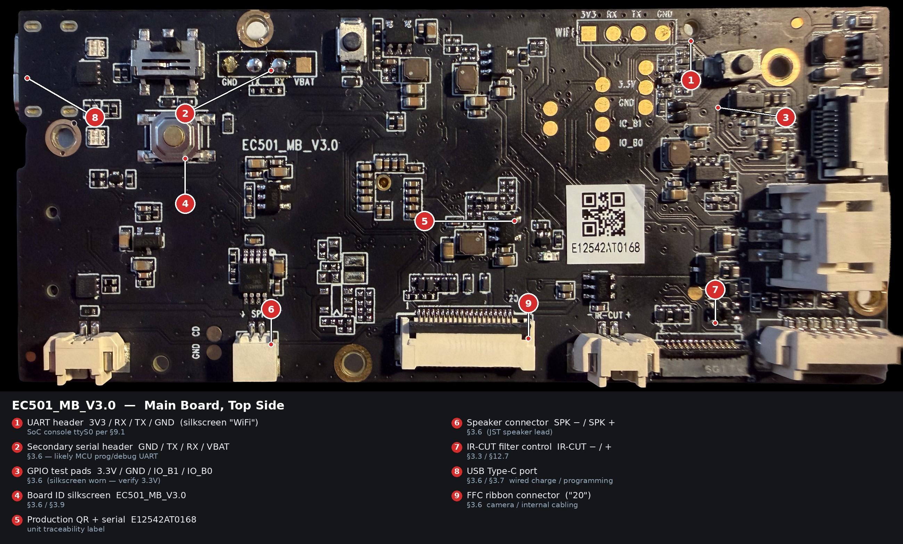

The top side carries the debug / test headers and the internal connectors; the
heavy compute (SoC, WiFi module, charger) sits on the bottom side (§3.13.2).

| # | Feature | Silkscreen | Notes |
|---|---|---|---|
| 1 | UART header | `3V3 / RX / TX / GND` | Board silkscreen reads **"WiFi"**; §9.1 identifies these four pads as the SoC console `ttyS0` (115200 8N1, autologin root). Worth re-confirming whether this is the SoC console or the WiFi-module UART. |
| 2 | Secondary serial header | `GND / TX / RX / VBAT` | Purpose unconfirmed; most likely an MCU-side programming / debug UART (§3.6). |
| 3 | GPIO test pads | `3.3V / GND / IO_B1 / IO_B0` | Top-pad silkscreen is worn and reads ambiguously (3.3V vs 5.5V); §3.6 records 3.3V, plausible as a logic rail. Verify on the physical board. |
| 4 | Board ID | `EC501_MB_V3.0` | Confirms the EC501 family codename (§3.6 / §3.9). |
| 5 | Production label | QR + `XXXXXXXXXXXX` | Per-unit traceability serial. |
| 6 | Speaker connector | `SPK − / SPK +` | JST speaker lead (§3.6). |
| 7 | IR-cut filter control | `IR-CUT − / +` | Mechanical IR-cut switch lines (§3.3 / §12.7). |
| 8 | USB Type-C port | — | Wired charging / factory programming (§3.6 / §3.7). |
| 9 | FFC ribbon connector | `"20"` | Camera / internal cabling (§3.6). |

> **Cross-validation note.** Two silkscreen details refine §3.6: the
> `3V3/RX/TX/GND` console header is physically labelled "WiFi", and the GPIO
> test-pad rail marking is worn (3.3V vs 5.5V). Both are flagged for physical
> verification.

#### 3.13.2 EC501_MB_V3.0 — Bottom Side

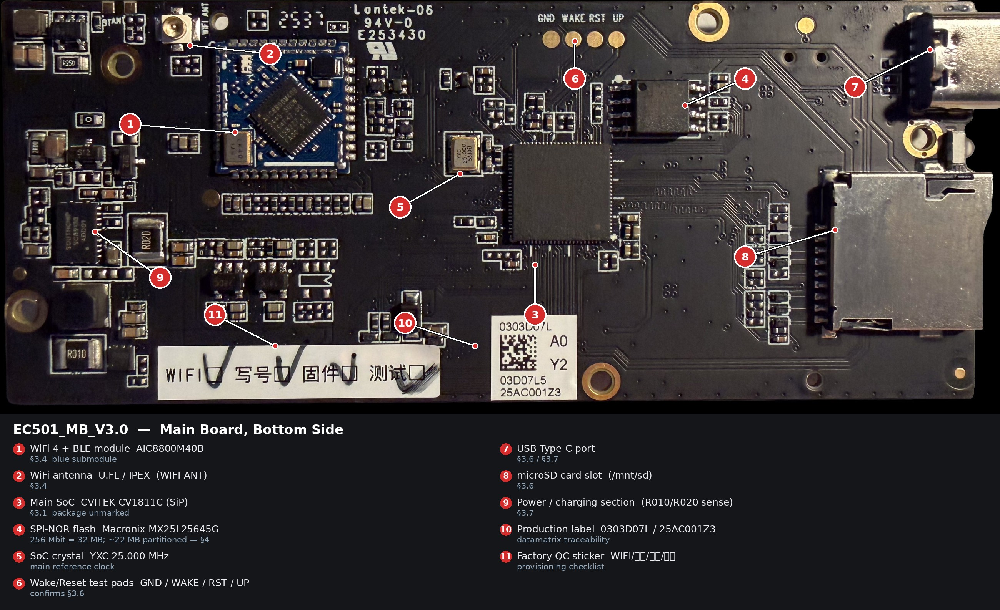

The bottom side carries the heavy compute and RF: the SoC, the WiFi/BLE
module, the SPI-NOR flash, the USB-C and microSD connectors, and the
power / charging front-end.

| # | Component | Marking | Notes |
|---|---|---|---|
| 1 | WiFi 4 + BLE module | `AIC8800M40B` | 2.4 GHz WiFi + BLE 5.0, blue submodule (§3.4). |
| 2 | WiFi antenna | U.FL / IPEX (`WIFI ANT`) | §3.4. |
| 3 | Main SoC | CVITEK CV1811C (SiP) | Package top is unmarked (§3.1). |
| 4 | SPI-NOR flash | `MXIC 25L25645G` | Macronix MX25L25645G; see §3.13.4. |
| 5 | SoC crystal | `YXC 25.000` | 25 MHz reference clock. |
| 6 | Wake/Reset test pads | `GND / WAKE / RST / UP` | Confirms the §3.6 pad set. |
| 7 | USB Type-C port | — | Wired charging / programming (§3.7). |
| 8 | microSD card slot | — | `/mnt/sd` (§3.6). |
| 9 | Power / charging section | `R010`, `R020` sense resistors | Buck regulators + current sense (§3.7). |
| 10 | Production label | `0303D07L … (redacted)` | Datamatrix traceability. |
| 11 | Factory QC sticker | `WIFI / 写号 / 固件 / 测试` | Factory checklist: WiFi, serial-write, firmware, test. |

#### 3.13.3 Detail — WiFi / BLE Module

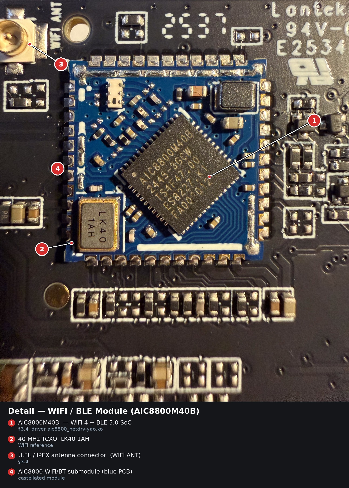

Close-up of the blue AIC8800 submodule. The main die is laser-marked
**`AIC8800M40B`** (lot `2445-3GCW`), beside a **`LK40 1AH`** 40 MHz TCXO and
the module’s U.FL antenna connector (`WIFI ANT`). This is the part driven
by `aic8800_netdrv-yao.ko` on the RTOS side (§3.4 / §5).

#### 3.13.4 Detail — SoC & SPI-NOR Flash

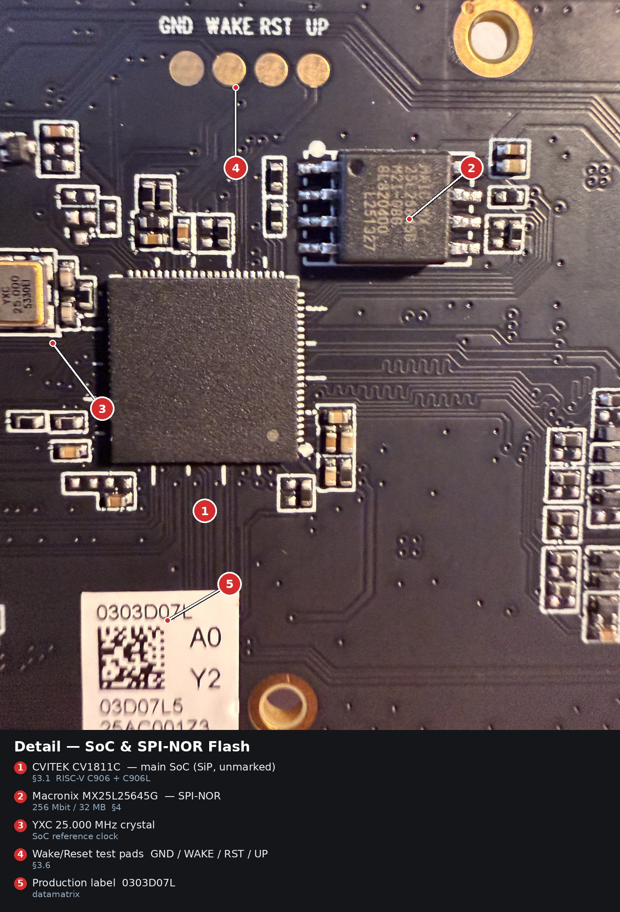

Close-up of the compute cluster. The large central QFN is the **CVITEK
CV1811C** SiP — its top surface carries no legible marking, consistent with
the SiP packaging discussed in §3.1. To its upper-right is the boot flash,
now legible as **Macronix `MX25L25645G`** (`M2I-08G`), a **256 Mbit / 32 MB**
SPI-NOR. This refines §3.9 / §4: the chip is physically 32 MB, of
which only ~22 MB is described by the 10 MTD partitions — leaving ~10 MB
unallocated. A `YXC 25.000 MHz` crystal provides the SoC reference clock, and
the `GND / WAKE / RST / UP` test pads (§3.6) sit along the top edge.

#### 3.13.5 EC501_SUB_V1.0 — MCU / LinxPort Side

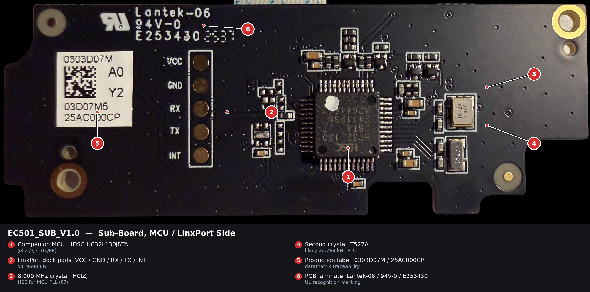

This side faces the LinxPort dock. It carries the companion MCU, its clock
crystals, the five LinxPort pogo pads, and the unit production label.

| # | Component | Marking | Notes |
|---|---|---|---|
| 1 | Companion MCU | `HDSC HC32L130J8TA` (lot 241123N) | LQFP; §3.2 / §7. |
| 2 | LinxPort dock pads | `VCC / GND / RX / TX / INT` | 9600 8N1 accessory UART (§8). |
| 3 | Main crystal | `HCIZJ 8.000` | 8.000 MHz HSE (§7). Corrects the earlier "HC12V" reading. |
| 4 | Second crystal | `T527A` | Not previously documented; likely the 32.768 kHz RTC crystal. |
| 5 | Production label | `0303D07M … (redacted)` | Datamatrix (main board was `…D07L`, sub-board `…D07M`). |
| 6 | PCB laminate | `Lantek-06 / 94V-0 / E253430` | UL recognition marking (same as main board). |

#### 3.13.6 EC501_SUB_V1.0 — Component / Connector Side

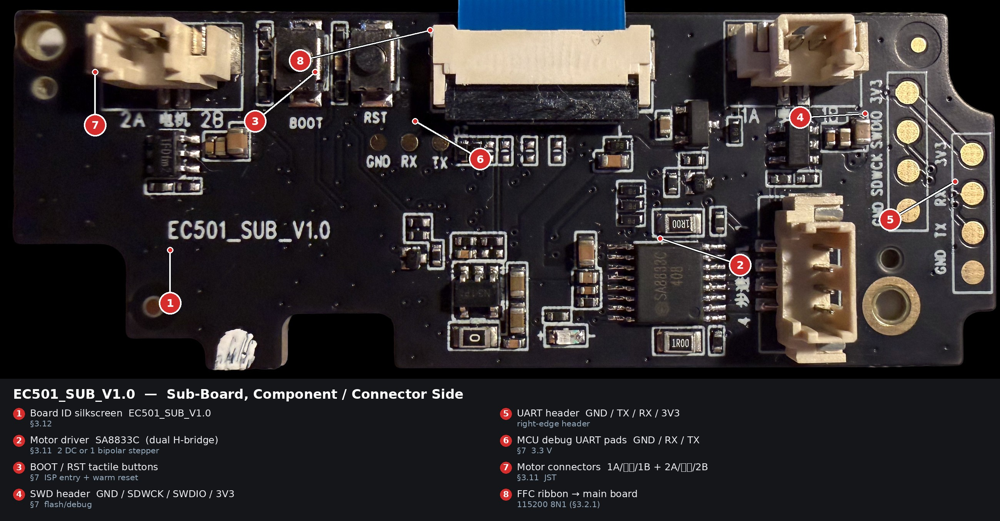

The opposite side carries the motor driver, the debug / programming headers,
the motor connectors, and the FFC link to the main board.

| # | Component | Marking | Notes |
|---|---|---|---|
| 1 | Board ID | `EC501_SUB_V1.0` | §3.12. |
| 2 | Motor driver | `SA8833C` (lot 408) | Dual H-bridge; two brushed DC motors or one bipolar stepper (§3.11). |
| 3 | Tactile buttons | `BOOT` / `RST` | ISP-entry + warm reset (§7). |
| 4 | SWD header | `GND / SDWCK / SWDIO / 3V3` | Serial Wire Debug — flash / dump / debug (§7). |
| 5 | UART header | `GND / TX / RX / 3V3` | Right-edge 4-pad header. |
| 6 | MCU debug UART pads | `GND / RX / TX` | 3.3 V (§7). |
| 7 | Motor connectors | `1A 电机 1B`, `2A 电机 2B` | Two JST motor leads (电机 = motor); §3.11. |
| 8 | FFC connector | — | Ribbon to the main board, 115200 8N1 (§3.2.1). |

#### 3.13.7 Detail — Companion MCU (HC32L130J8TA)

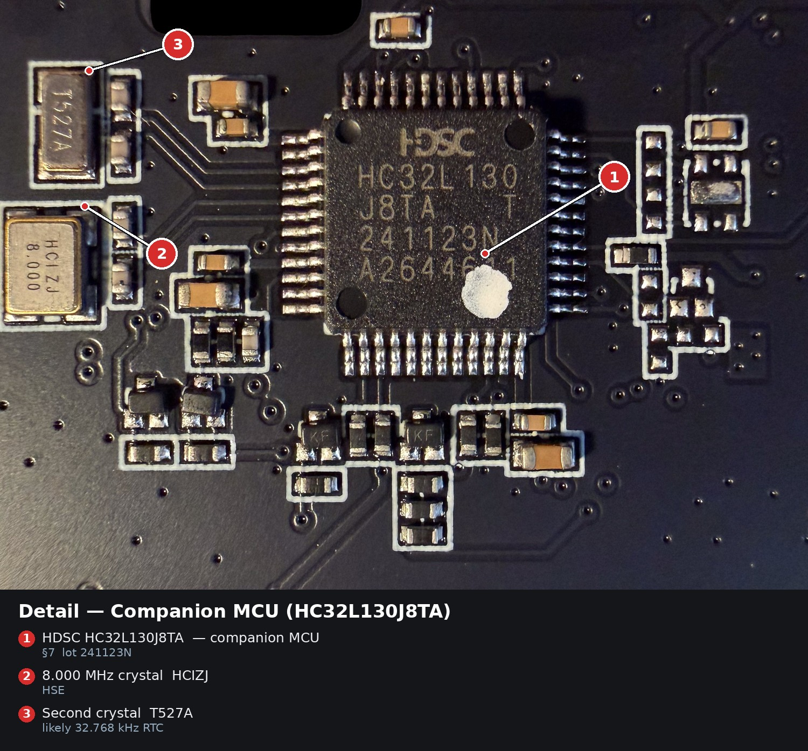

Close-up of the **HDSC `HC32L130J8TA`** (lot `241123N`), the low-power 32-bit
MCU that owns the LinxPort UART, the radar / wake path, and the stepper control
(§7). To its left sit the two clock crystals: the **`HCIZJ 8.000`** 8 MHz
HSE and a second `T527A` crystal (likely the 32.768 kHz RTC). The "HC12V"
reading recorded earlier in §7 was a misread of this `HCIZJ` part.

#### 3.13.8 Detail — SA8833C Motor Driver

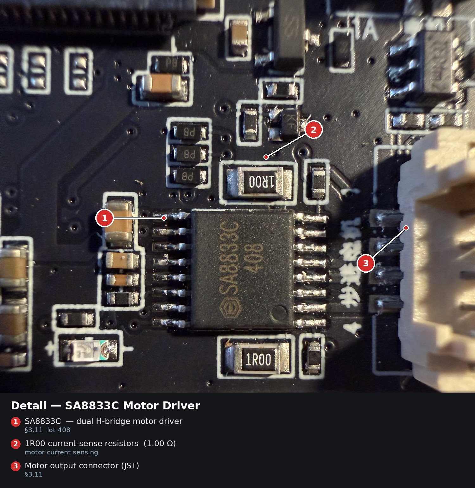

Close-up of the **`SA8833C`** dual H-bridge motor driver (lot `408`), flanked
by `1R00` (1.00 Ω) current-sense resistors and feeding the JST motor
connector at the board edge. Per §3.11 this drives the bot's pan / tilt
actuator(s) — two brushed DC motors or one bipolar stepper.

#### 3.13.9 24 GHz Radar — Antenna Side

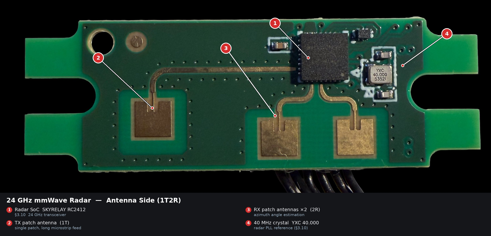

The front-mounted radar daughter-board (§3.10). The antenna side confirms
the **1T2R** configuration: a single TX patch (left, fed by a long microstrip)
and two RX patches (right) for azimuth angle estimation.

| # | Component | Marking | Notes |
|---|---|---|---|
| 1 | Radar SoC | `SKYRELAY RC2412` | 24 GHz transceiver (§3.10). |
| 2 | TX patch antenna | — | Single patch (1T), long microstrip feed. |
| 3 | RX patch antennas ×2 | — | Two patches (2R) for azimuth. |
| 4 | Crystal | `YXC 40.000` | 40 MHz radar PLL reference. |

#### 3.13.10 24 GHz Radar — Connector Side

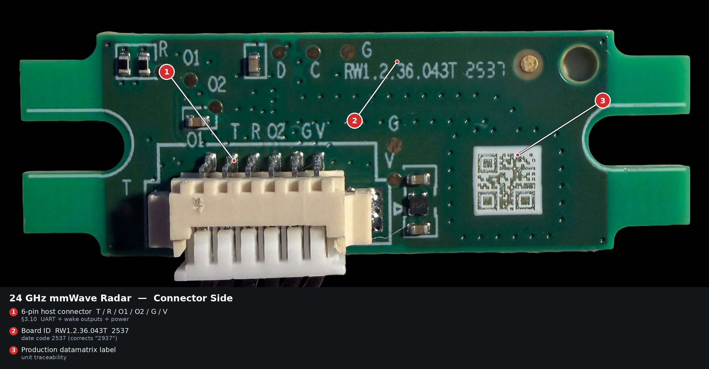

The reverse carries the 6-pin host connector and the board identity.

| # | Item | Marking | Notes |
|---|---|---|---|
| 1 | Host connector | `T / R / O1 / O2 / G / V` (6-pin JST) | UART (T/R) + wake outputs (O1/O2) + power (G/V); §3.10. |
| 2 | Board ID | `RW1.2.36.043T  2537` | Date code **2537** (corrects the "2937" reading in §3.10). |
| 3 | Production label | datamatrix | Unit traceability. |

#### 3.13.11 Detail — SKYRELAY RC2412 Radar SoC

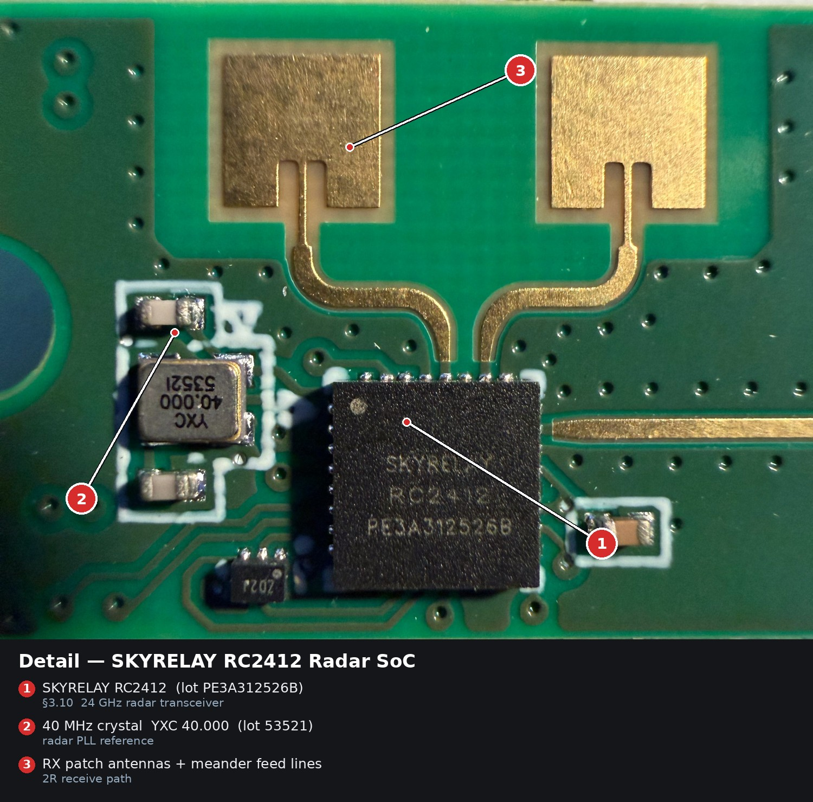

Close-up of the **`SKYRELAY RC2412`** (lot `PE3A312526B`), the 24 GHz radar
transceiver, with its **`YXC 40.000`** (lot `53521`) 40 MHz PLL reference and
the gold RX patch antennas with their meander feed lines (§3.10).

#### 3.13.12 Qi Wireless-Charging Receiver Board

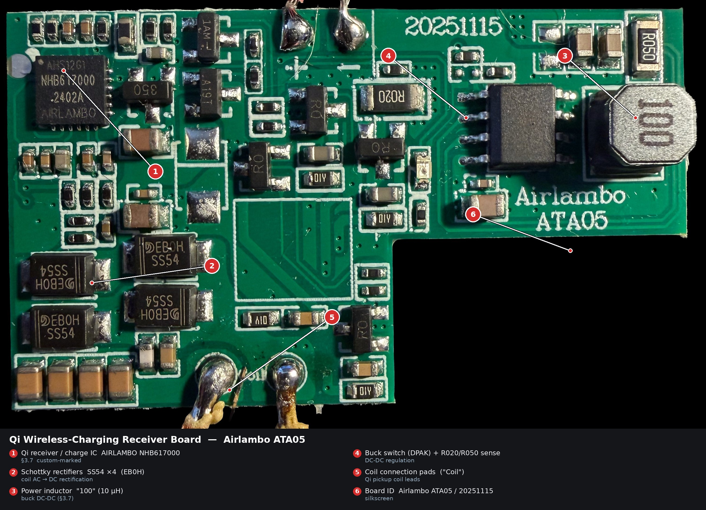

The auxiliary Qi receiver board from the bot's bottom shell (§3.7), with
the pickup coil soldered to the `Coil` pads. It rectifies the coil's AC
(`SS54` Schottky diodes), regulates it through a buck DC-DC stage (10 µH
inductor), and feeds the main board's charge controller. Silkscreen
`Airlambo ATA05`, date code `20251115`.

| # | Component | Marking | Notes |
|---|---|---|---|
| 1 | Qi receiver / charge IC | `AHS12G1 / NHB617000 / 2402A / AIRLAMBO` | Custom Airlambo-marked part (§3.7 / §3.13.13). |
| 2 | Schottky rectifiers ×4 | `EB0H SS54` | Coil AC → DC rectification. |
| 3 | Power inductor | `100` (10 µH) | Buck DC-DC. |
| 4 | Buck switch + sense | DPAK + `R020` / `R050` | DC-DC regulation / current sense. |
| 5 | Coil connection pads | `Coil` | Qi pickup-coil leads. |
| 6 | Board ID | `Airlambo ATA05` / `20251115` | Silkscreen. |

#### 3.13.13 Detail — AIRLAMBO NHB617000 Qi Charge IC

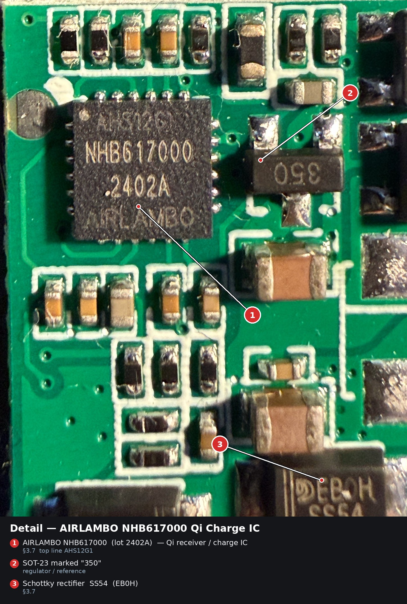

Close-up of the custom **`AIRLAMBO`** charge IC. The full marking reads
`AHS12G1` / **`NHB617000`** / `2402A` / `AIRLAMBO` — the part number §3.7
previously recorded only as "marked AIRLAMBO". Beside it sit a `350`-marked
SOT-23 and one of the `SS54` Schottky rectifiers.

---

## 4. Storage and Boot

### 4.1 Flash Layout

The boot flash is a **Macronix MX25L25645G SPI-NOR** (256 Mbit / 32 MB; ~22 MB partitioned), divided into 10 MTD regions:

| MTD | Name | Size | Type | Mount point | Purpose |
|-----|------|------|------|-------------|---------|
| `mtd0` | `fip` | 576 KB | bootloader | (raw) | FIP / U-Boot |
| `mtd1` | `2nd` | 2 816 KB | image | (raw) | 2nd-stage / YOC-RTOS image |
| `mtd2` | `jump` | 3 456 KB | kernel | (raw) | Linux kernel + DTB |
| `mtd3` | `PQ` | 768 KB | tuning | (raw) | ISP "Picture Quality" data |
| `mtd4` | `PARAM` | 64 KB | params | (raw) | Parameter block (observed empty / 0xFF) |
| `mtd5` | `PARAM_BAK` | 64 KB | params | (raw) | Parameter backup (identical to mtd4) |
| `mtd6` | `ENV` | 64 KB | env | (raw) | U-Boot environment |
| `mtd7` | `ENV_BAK` | 64 KB | env | (raw) | U-Boot environment backup (differs from mtd6) |
| `mtd8` | `ROOTFS` | 8 960 KB | squashfs (ro) | `/` | Linux root filesystem |
| `mtd9` | `DATA` | 5 760 KB | jffs2 (rw) | `/mnt/data` | Writable user data (incl. main app binary) |

`PARAM` and `PARAM_BAK` are byte-identical on a fresh device. `ENV` and
`ENV_BAK` are not — at least one of them holds the live U-Boot environment.

### 4.2 Boot Sequence (Observed)

1. SoC ROM loads FIP from `mtd0`.
2. FIP starts U-Boot (or U-Boot equivalent).
3. U-Boot launches the YOC / AliOS-style **RTOS image** from `mtd1` on the
   secondary core, then jumps to the Linux kernel in `mtd2`.
4. Kernel mounts `mtd8` (squashfs) read-only as `/`.
5. `init` brings up busybox userspace, mounts `mtd9` JFFS2 at `/mnt/data`.
6. Network: AIC8800 driver loads, `vnet0` bridge to RTOS comes up.
7. Various userspace startup scripts:
   - `/etc/detect.sh` (the watchdog — see [Section 10](#10-watchdog-and-stability-tuning))
   - `/mnt/data/ipc71125` (the main application — see [Section 5.2](#52-the-ipc71125-application))
8. Autologin on `ttyS0` as `root`.

### 4.3 Firmware Update Mechanism (V14/V15 Era)

The official OTA mechanism expects the following files to be present (location
varies; SD card or downloaded):

- `ipcupdate` — the new application binary (replaces `/mnt/data/ipc71125`)
- `mcu.bin` — new MCU firmware
- `param.bin` — new parameter block
- Optionally: U-Boot, kernel, 2nd-stage images

If files are missing, the device prints `Update file does not exist. Running
current file.` to the console and reverts to the running firmware.

**Observed failure mode** in the manufacturer's public update packages: only
the U-Boot/kernel/RTOS images are included; the three runtime files
(`ipcupdate`, `mcu.bin`, `param.bin`) are absent. The update therefore cannot
complete, and the device runs whatever the previously installed application
was. See [Section 12.1](#121-firmware-update-package-incomplete).

---

## 5. Software Stack

### 5.1 SDK Base

The system is built from the **CVITEK cv181x_cv180x SDK v4.2.0**, with the
"IPC dual-OS turnkey" configuration. Strings in the binary expose the original
build environment:

```
/root/.jenkins/workspace/cv181x_cv180x_v4.2.0_daily_build/middleware/v2/...
```

This means the developers built on a Jenkins CI on Linux as root using
CVITEK's reference SDK with minimal modification.

The C library is **musl** (`/lib/ld-musl-riscv64v0p7_xthead.so.1`), built for
the T-Head xtheadc RISC-V variant.

### 5.2 The `ipc71125` Application

The main userspace application is a **single large statically-modeled binary**
at `/mnt/data/ipc71125`. For firmware V14, exact size **1 660 648 bytes**.

It is responsible for nearly everything the device does at runtime:

- Camera capture and ISP pipeline orchestration
- H.264 video encoding via CVI VENC
- Audio capture / playback / AEC via CVI AUDIO
- RTSP server (built-in **live555** library, version 2016.11.28)
- Agora RTC client (real-time video to mobile app)
- Qiniu Cloud uploads (linked `libqiniu.so`)
- MCU communication over `/dev/ttyS1`
- SD-card management, file recording (photos/videos)
- WiFi SmartConfig over BLE

Key strings recovered from the binary that map to its internal architecture:

| Symbol / log string | Meaning |
|---------------------|---------|
| `uidEnableMCUPlugin` | Enable a docked MCU plugin (= LinxPort accessory) |
| `uidQueryMCUPlugin` | Query the docked MCU plugin's identity |
| `mcu_uart_fd` | Global file descriptor for the MCU serial line |
| `MCUPerECS` | Function symbol; exact meaning unclear |
| `queueCmd` | Command queue handler |
| `0x35 QueryRtcChannel` | Command code 0x35 = "query RTC channel" |
| `UpdateRtcChannel`, `AppRenewRtcChannel` | Agora real-time channel management |
| `infoUIDstate` | Send Agora user-ID state to MCU |
| `info mcu charge led:%d` | MCU reports back the charge-LED state |
| `uart-send:%d` | Per-frame log every time bytes go to the MCU |
| `rader[%d]:%02x` | Debug byte-by-byte dump (likely a "radar"-named buffer) |
| `upload sn:12:%02x` | MCU returns a 12-byte serial number that gets uploaded |
| `shangADCValue` | Analog voltage value (likely battery), via SARADC channel 1 |
| `AudoLight` | Auto-light control task (typo for AutoLight) |
| `ble-config`, `SMartconfig success` | BLE-based WiFi pairing flow |

The MCU-related code is concentrated in a single .rodata cluster from offset
`0x11b500` to `0x11de00` in the binary — roughly 10 KB of strings, suggesting
the MCU module is a single source file in the original code base.

The word **"LinxPort" does not appear anywhere in the binary.** That name is
purely a marketing/hardware label; internally, dock accessories are called
**"MCU Plugins"**.

### 5.3 Live555 / RTSP Subsystem

The application embeds **live555** (a popular C++ RTSP/RTP library, version
2016.11.28). It listens on port 8554 and offers two H.264 streams plus PCM
audio:

| URL | Stream | Resolution (likely) |
|-----|--------|---------------------|
| `rtsp://<ip>:8554/live0` | Main stream | 1080p H.264 |
| `rtsp://<ip>:8554/live1` | Sub-stream | Lower resolution |

The server is **unauthenticated** — no credentials are required.

**Audio is offered as `audio/L16` (16 kHz mono PCM)** in the SDP — direct
uncompressed audio. This is interesting because the AAC-encoder path
(`app_ipcam_Audio_AencStart`) is observed to fail at startup with a generic
`0xffffffff` error, so the RTSP-only audio bypasses the broken encoder.

### 5.4 Userspace Filesystem Highlights

```
/mnt/data/
├── ipc71125              # main application binary
├── psicp.sh              # PID-kill helper (uses /etc/busybox kill)
├── up.sh                 # vendor dev-update script
│                         #   contains hardcoded dev machine 192.168.3.244
├── jie.txt               # purpose unknown
├── dropbear_ecdsa        # persistent dropbear host key
└── ...                   # logs, recordings, ipcam DB

/etc/
├── busybox               # FULL busybox binary (most applets available
│                         #   via /etc/busybox <applet>, even when not
│                         #   symlinked into /bin)
├── detect.sh             # watchdog / poweroff trigger (see §10)
├── custom_msg_657        # RTOS message-passing tool
├── sub_1080.ini          # ipc71125 startup config
├── *.raw                 # audio prompts for WiFi/connection events
└── ...
```

The `/etc/busybox` binary is **fully featured** — even though only a subset of
applets are symlinked into `/bin`, the full set (stty, dd, hexdump, od, xxd,
strings, lsof, fuser, microcom, telnet, awk, wget, top, etc.) can be invoked
directly as `/etc/busybox <applet>`. This is a massive force multiplier for
on-device investigation. `nc` is **not** included in this build.

### 5.5 Sentry Mode — Motion-Triggered Recording

The phone app exposes a feature called **"Sentry Mode"** (officially
marketed by Aionios as "Sentry Mode: Silent, Always Alert"). When
activated by the user, the bot transitions from regular pet-companion
behaviour into a **security-camera-style monitoring mode**.

**From the manufacturer's marketing copy** (aionios-design.com):

> *"Equipped with Sentry Mode, ata05's built-in sensor detects motion
> at more than 3m, triggering instant app alerts and auto-recording
> for real-time security monitoring. Stay informed, even when you're
> not there."*

The official **> 3 m detection range** is a tight match for the
typical effective range of a low-power 24 GHz mmWave radar like the
SkyRelay RC2412 identified on the radar daughter-board (see §3.10) —
which further confirms that this is the sensor underpinning the
feature.

**Operating mechanics confirmed by Aionios on the Kickstarter thread:**

| Behaviour | Aionios's own wording |
|-----------|----------------------|
| Auto-arm trigger | *"The camera only arms itself after the robot has been idle for 30 s **and the app is closed**."* |
| Recording length | *"Any motion detected in front of the lens then starts a recording whose length matches the setting you chose (**10 s / 30 s / 60 s**)."* — user-configurable in app settings. |
| App-reopen behaviour | *"If you reopen the app while it's still recording, the file stops and saves immediately"* — explains zero-length file artefacts users have reported. |
| Wheels in Sentry Mode | *"In Sentry Mode the **wheels lock**, the camera quietly watches, and any motion triggers an instant phone alert—no roaming or autonomous patrol yet."* |
| Sentry-Mode standby | *"120 days of Sentry Mode standby"* (Aionios, ~2 months ago — note: marketing copy elsewhere says 150 days; the two published figures are not fully self-consistent) |

**Operational sequence (combining the above with our reverse-engineered observations):**

1. User arms Sentry Mode in the phone app.
2. App is closed and the bot sits idle for 30 s.
3. Bot enters Sentry watch state — wheels locked, low-power.
4. The **24 GHz mmWave radar** (see §3.10) watches for movement in its
   field of view, range > 3 m.
5. When the radar detects motion, it signals the sub-board MCU via
   UART and/or its O1 / O2 interrupt lines.
6. The MCU wakes the main board (CV1811C / Linux) over the FFC-UART link.
7. `ipc71125` starts an automatic video recording of 10/30/60 s
   length (per user setting).
8. The user is notified via push from the phone app.
9. Recording is saved to the local microSD card; per Aionios's own
   GDPR statement, **no copy is uploaded to a cloud server**.

**Known reliability issues (Kickstarter community reports):**

- *"Sentry mode does not seem to work at all"* (a backer, 4 months ago) —
  several users report no triggers even with motion in front of the lens.
- *"My ATA05 makes cracking sounds coming out of the speaker when
  sentry mode triggers"* (Michael) — Aionios committed to a firmware fix.
- *"the alarm notification comes with a 1 minute latency"* — Aionios
  acknowledged: *"shorten notification delay"* on their roadmap.
- *"Battery drain is too heavy in sentry mode. Not what i expected.
  You cant even go on a one week holiday"* — Aionios acknowledged
  power-management work needed.
- *"Email alerts (with photos) added to dev roadmap"* — Aionios's
  reply to a feature request. If this ships, it implies at least
  thumbnail uploads to a mail relay or cloud bucket, which would be
  the first clear cloud-side media handling in the product.

This feature explains, post-hoc, a number of design choices that were
otherwise unmotivated:

| Earlier finding | Now explained by Sentry Mode |
|-----------------|------------------------------|
| Why there is a **24 GHz mmWave radar** at all on a "pet companion" | The motion sensor for Sentry Mode (officially confirmed range > 3 m) |
| Why an **`AudoLight`** auto-light-control task exists | To switch on the white-light illuminator (PWM2) for night-time Sentry captures, in conjunction with the ambient-light sensor and the WDR camera mode |
| Why the architecture has **deep-sleep + 4 µs wake-from-LPUART** | So the bot can sit on a low-power Sentry watch without depleting the battery (consistent with 120-150 day standby) |
| Why the MCU **owns the radar and the wake/sleep policy** instead of Linux | So the heavy CV1811C / Linux side can stay powered down until the MCU says "wake up, something happened" |
| Why the wheels lock in Sentry Mode (no roaming patrol) | Confirmed officially: "no roaming or autonomous patrol yet" |

**Privacy note (now with Aionios's own claim):**

Aionios has *explicitly stated* on multiple occasions that Sentry-Mode
footage stays on the device's microSD card and is *not* uploaded to
their cloud:

> *"All photos and videos are stored locally on the robot's TF card —
> none of your media is saved on our servers, so your data stays
> private."* — AioniosCreator, 4 months ago

This contradicts an early naive reading of the firmware that assumed
the linked `libqiniu.so` was actively shipping Sentry clips out. The
empirically-verifiable interpretation now is that **Qiniu library is
dead/dormant code in the binary** and Sentry footage really does stay
on the SD card. Verifiable via LAN packet capture during a Sentry
trigger — see §6.3.

---

## 6. Network Architecture

### 6.1 Interfaces

```
lo        127.0.0.1
vnet0     192.168.1.X (DHCP), bridges Linux <-> RTOS <-> WiFi
```

Note that the WiFi interface is named **`vnet0`**, not `wlan0`. This is
because the AIC8800 driver is on the RTOS side; the Linux side sees only the
virtual ethernet bridge that forwards traffic.

### 6.2 Listening Services (Default)

| Port | Process | Notes |
|------|---------|-------|
| TCP 22 | dropbear | SSH server; authenticates but child fails on `initgroups` (see §12.5) |
| TCP 8554 | ipc71125 | RTSP server (live555) |

### 6.3 Outbound Connections

#### Confirmed from static analysis of `/mnt/data/ipc71125`

| Destination | Protocol | Purpose |
|-------------|----------|---------|
| `ap-*.agora.io` | Agora RTC | Real-time video/audio to mobile app (live presence stream) |
| Qiniu Cloud endpoints | HTTPS | `libqiniu.so` is linked into the binary; whether it is actually called at runtime is an open empirical question — see §1.1 and §5.5 |
| `pool.ntp.org` | NTP | Time sync |
| `8.8.8.8` | DNS | Default resolver |

#### Confirmed from Aionios's own statements on the Kickstarter comments thread

| Destination | Role |
|-------------|------|
| **`cloud-us.eqshares.com`** | Confirmed via a user's DNS-resolution error message (a backer, 4 months ago: *"Unable to resolve host cloud-us.eqshares.com: No address associated with hostname"*). This is the **control-plane backend** that handles device pairing, ownership, wakeup, heartbeat, and command relay. **Servers physically located in the US** (Silicon Valley, per Aionios). |
| **Agora RTC** (a.k.a. **Shengwang** in China) | Aionios's own GDPR statement: *"Our service provider is Shengwang, a company founded in 2014 with service coverage in over 200 countries and regions. They are also a subsidiary of the publicly listed company Agora, Inc. (NASDAQ: API)."* Used for the live video/audio stream with **end-to-end encryption (E2EE)** advertised. |

#### Cloud control-plane endpoints (named by a community member, not denied by Aionios)

A backer's public technical inquiry on the Kickstarter thread (June 2026) named the following endpoints they had identified, asking Aionios whether the device could be repointed to a private equivalent. Aionios responded acknowledging the DIY Space but did not publicly deny these names:

| Endpoint | Apparent purpose |
|----------|------------------|
| `wakeupDevice` | RPC for waking the bot from low-power Sentry watch |
| `sendDeviceHeart` | Periodic device-to-cloud heartbeat |
| `controlPipe` (WebSocket) | Persistent control / command channel from the phone app through the cloud to the bot |
| Provisioning endpoint | The Wi-Fi-provisioning / device-bind step contacts an Aionios-controlled bootstrap endpoint that binds the device to the user's Aionios account |

These names were not visible in our static `strings -t x` clusters of the
binary; they may live in `libqiniu.so` / another linked library, or be
referenced via host-keyed lookups, or be obfuscated. They are an **open
investigation target** — see §6.5 below.

#### Cloud heartbeat and reconnection algorithm (officially documented)

Aionios's Kickstarter Update #15 ("Important Technical FAQs", January 12,
2026) gives the **exact timing parameters** of the device-cloud
heartbeat and reconnection state machine. These were previously
inferred; they are now hard-confirmed:

**Device ↔ Cloud Heartbeat:**

| Parameter | Value | Behaviour |
|-----------|-------|-----------|
| Heartbeat interval | **10 s** | Device sends a heartbeat to `cloud-us.eqshares.com` every 10 seconds while connected |
| Heartbeat-success check | every **20 s** | Device verifies every 20 s that the last heartbeat went through |
| Reconnect threshold | **40 s** without successful heartbeat | Triggers server-reconnect attempt |
| Reconnect-retry interval | every **40 s** | Continues retrying every 40 s (alongside WiFi reconnection) until success |
| Success behaviour | Returns to the regular **10 s** heartbeat cycle | — |

**Device ↔ Router (WiFi) Reconnection (3-tier exponential backoff):**

| Tier | Retry Interval | Number of Attempts | Cumulative Time Before Next Tier |
|------|----------------|--------------------|-----------------------------------|
| 1 | every **5 minutes** | up to 5 | 25 minutes |
| 2 | every **30 minutes** | up to 5 | 2.5 hours |
| 3 | every **60 minutes** | indefinite | (no escalation) |

Each individual reconnection attempt itself takes **~30 seconds**.

**Implications for owners:**

- If the bot goes offline (you don't see it in the app), don't expect
  recovery in seconds — depending on which tier the state machine is
  in, recovery from a flaky WiFi may take **anywhere from 5 minutes
  to over 3 hours**.
- A power-cycle of the bot resets the state machine and forces an
  immediate Tier-1 reconnection attempt — often the fastest fix when
  the bot appears unreachable.
- The 10 s cloud heartbeat is also the **lower bound on how quickly
  the bot can be reached from the app** (Sentry-Mode wake notifications
  travel through this control plane).

**Implication for monitoring:** an outbound flow analysis at the LAN
level should show, while online, a TLS connection to
`cloud-us.eqshares.com` with approximately 1 packet pair every 10 s.
This is one of the easiest fingerprints to verify the bot's cloud
connectivity vs. a "frozen" state.

#### Aionios's own claims about data flow (Kickstarter, ≥9 months ago)

Direct quotes from AioniosCreator's GDPR statement (the most substantive
single post on the campaign, 9 months ago):

| Claim | Aionios's wording |
|-------|-------------------|
| Transport encryption | "We use the latest HTTPS 1.3 protocol to encrypt all signaling and service data, ensuring integrity and privacy during transmission." |
| Media encryption | "We integrated Agora's end-to-end encryption (E2EE). Audio-video streams are encrypted on the user's device and remain undecipherable during transmission—including to Agora and our servers." |
| Cert compliance (Agora) | "Agora holds international certifications like ISO/IEC 27001 and SOC 2 Type II, complying strictly with global privacy regulations." |
| Compliance regime | "ata05's audio-video communication and control fully comply with EU GDPR and US CCPA requirements." |
| Data residency | "Our servers are currently hosted in Silicon Valley, USA, with three years of service pre-paid to ensure long-term stability." |
| Subscription policy | **"We promise no cloud service fees will ever be charged."** — explicit lifetime-free commitment. |
| User-data storage | **"All data is stored locally [on the TF card], and users can expand storage capacity freely."** — explicit denial of cloud-side user-media storage. |

The "media stays on TF card, control plane stays in the US, no
subscription" trifecta is the most concrete public statement of the
product's cloud posture that exists, and is also the strongest *direct
contradiction* to any inference that `libqiniu.so` being linked means
media is being uploaded to Qiniu. The library may simply be a build
artefact from the CVITEK SDK template.

#### Known cloud reliability events

The Kickstarter thread documents at least two distinct Aionios-side
outages:

- **App-side "Timeout"/login failures** with users unable to authenticate
  (two backers, ~3-4 months ago). Aionios
  acknowledged: *"This was caused by oversized server log files, which
  have now been cleared."*
- **`cloud-us.eqshares.com` DNS resolution failures** intermittently
  (a backer, ~4 months ago).

These outages have a clear product consequence: **when Aionios's
control-plane cloud goes down, the bot is unreachable from the app even
on the same LAN.** Multiple backers have repeatedly requested a
local-LAN-only operation mode for resilience; Aionios has acknowledged
the request but not committed to delivering it.

#### Empirical-verification plan (this is the next investigation step)

The most reliable way to confirm what the bot actually talks to is
a packet capture at the LAN level:

1. Park the bot on a router that can `tcpdump` the bot's MAC / IP.
2. Reboot the bot from a cold start.
3. Watch outbound DNS first, then TCP/UDP destinations.
4. Tag each phase: power-on → WiFi connect → cloud provision →
   idle → app live-presence → Sentry-Mode arm → Sentry trigger →
   recording (if any).
5. Note which destinations are *unique to which phase* — that maps
   directly to which feature contacts which backend.

In particular, the "local-storage-only" claim becomes falsifiable by
arming Sentry Mode, triggering a recording, and watching whether *any*
HTTPS connection to Qiniu or otherwise-untrusted infrastructure happens
during or after the trigger. (The Agora and EQShares hosts are
expected; anything else is anomalous.)

#### Conclusion (preliminary)

Statically, there are **no analytics SDKs**, **no AI-inference cloud
endpoints**, and **no periodic phone-home cron jobs** identified in
the userspace binary beyond the cloud surface enumerated above.
The likely runtime cloud topology is:

1. **EQShares cloud** (`cloud-us.eqshares.com`, US-hosted) — control-plane / pairing / wakeup / heartbeat / command relay
2. **Agora RTC / Shengwang** — live video and audio (E2EE)
3. **Qiniu Cloud Storage** — present as linked library, but per Aionios's own statement *not* used for user media; possibly inactive

The "no cloud" claim from the consumer-facing website is therefore best
read as "**no cloud for your media**" — the device still requires
EQShares cloud connectivity for every command, and routes live video
through Agora's relay network, both of which have been confirmed by
direct community observation.

### 6.4 The RTOS Sidekanal

The Linux side can send messages to the RTOS half via:

```
/etc/custom_msg_657 vnet0 <code> [<arg> | 01311301AABBCCDD]
```

Known codes:

| Code | Meaning |
|------|---------|
| 1 | Dev-update marker (used by manufacturer's `up.sh`) |
| 5 | Power off (issued by `detect.sh` when app dies) |
| 13 | WiFi firmware update from file (`vnet0 13 /mnt/sd/linux/wifi.bin`) |

Other codes accept a 4-byte payload encoded as `01311301AABBCCDD`. Many MCU
operations appear to go through this RTOS sidekanal rather than directly over
`/dev/ttyS1` — which explains why direct UART snooping rarely sees traffic in
the idle state.

---

## 7. The Companion MCU (on Sub Board EC501_SUB_V1.0)

> **Note:** Earlier drafts of this document hypothesized that "the MCU"
> was the C906L little core inside the CV1811C SoC. After full disassembly,
> this turned out to be incorrect: there *is* a real, separate MCU,
> mounted on the dedicated sub-board behind the LinxPort interface. See
> [Section 3.2](#32-the-companion-mcu--on-a-separate-sub-board-ec501_sub_v10)
> and [Section 3.12](#312-sub-board-ec501_sub_v10--motor-controller--linxport-hub)
> for the hardware details.

### 7.1 Role

The MCU is the device's **real-time-peripherals coprocessor**. It owns:

- The **physical LinxPort dock interface** (talks 9600 8 N 1 to docked
  accessories; see [Section 8](#8-the-linxport-plugin-interface))
- The **24 GHz radar sensor** UART and its O1/O2 interrupt lines
  (see [Section 3.10](#310-24-ghz-mmwave-radar-sensor))
- **Charge LED** state
- **Battery / SARADC** voltage monitoring (relayed to Linux as `shangADCValue`)
- **BLE setup flow** orchestration (the BLE radio itself lives in the
  AIC8800; the little core acts as the control loop for SmartConfig)
- **Sleep/wake power gating** (the `gpio353` keep-alive line)
- **Device serial number storage** (a 12-byte SN, served to Linux on request)

### 7.2 The App ↔ MCU Link (Cross-Reference)

See [Section 3.2.1](#321-the-app--mcu-link) for the technical details of
the link itself (it's `/dev/ttyS1`, 115200 8 N 1 raw, in a query-response
pattern).

### 7.3 Known Command Codes

Several command codes are now confirmed — `0x35` from the binary's string
table, plus four protocol codes captured live on the MCU debug console
(Header 5, §7.5) and CRC-verified against a docked Purr Laser (§8.5.1):

| Code | Direction | Function |
|------|-----------|----------|
| `0x01` | host → accessory | Query accessory ID (short LinxPort frame, len 0) |
| `0x02` | accessory → MCU | Accessory-ID reply; payload = 1-byte accessory ID |
| `0x45` | MCU → app | Accessory-ID reply (long APP frame, 12-byte UID); answers `uidQueryMCUPlugin` |
| `0x46` | MCU → app | Accessory status report (long APP frame) |
| `0x47` | app ↔ MCU | Plugin **data tunnel**: app→MCU "send data to plugin", MCU→app "forward plugin reply" (long APP frame) — see §8.5.1 |
| `0x03` | MCU → accessory | **Operate** command on the LinxPort wire (carries a 1-byte payload) — see §8.5.1 |
| `0x35` | app ↔ MCU | `QueryRtcChannel` — query/set Agora real-time channel state |

All remaining commands are referenced only as numeric C constants and cannot
be resolved without a disassembler.

### 7.4 Plugin Architecture

The two `uidEnableMCUPlugin` / `uidQueryMCUPlugin` functions form the entire
public API for MCU-side plugins. The model is:

1. The app calls `uidQueryMCUPlugin` periodically (or on demand).
2. The MCU responds with the UID and capability descriptor of the currently
   docked accessory (or "none docked").
3. The app calls `uidEnableMCUPlugin` to activate a recognized accessory.

This is the link between an accessory you plug into the LinxPort dock
([Section 8](#8-the-linxport-plugin-interface)) and the app's
event/control layer.

### 7.5 Live UART Capture — MCU Debug Console (Header 5)

The right-edge 4-pad header on the sub board (`GND / TX / RX / 3V3`, callout 5
in §3.13.6) is the **MCU's debug console**: **115200 8N1**, 3.3 V logic, output
in **GB2312/GBK** (decode as GBK, not UTF-8). It is *not* the raw `/dev/ttyS1`
binary link — it is a verbose human-readable log in which the MCU narrates every
protocol exchange, prints the raw frame bytes, and recomputes each CRC. That
makes it the single most useful observation point on the bot: one 3.3 V
USB-UART adapter (adapter-RX ↔ pad-TX, common GND, TX left open, 3V3 **not**
connected — the bot runs on its own power) reads the whole conversation as
annotated text.

Observed at boot: a DMA init, a 12-iteration read returning `FF` (the unset
12-byte module UID), then a periodic **status heartbeat** with four decoded fields: **button state** (`按键松开` = released / `按键按下` = pressed), **wireless-charge state** (`无线充未使用` = idle / `无线充电中` = Qi charging), **wired-charger state** (`充电器未插入` = unplugged), and **supply-rail voltage** as raw-ADC + volts — ~`3.66 V` on battery, rising to ~`4.74 V` when a USB charge cable is attached (so this field tracks the active supply rail, **not** strictly the cell). These fields are **local debug output** — a heartbeat change is *not* itself sent as a protocol frame (a full Qi-charge on/off cycle in one capture produced **zero** `0x46`/`0x47` traffic). The separate `0x46` "report status" frame (§8.5.1) concerns **accessory** presence, not these power/button fields. Note: the two charge-detect fields behave differently — **Qi charging is detected** (the wireless field flips to `无线充电中` and the supply rail climbs to ~`4.78 V`), but a **wired USB-C cable is not** (the `充电器` field stays `未插入` even as the rail rises). The sub-board MCU therefore sees the Qi charge path but apparently not the main-board USB-C charger-detect signal (§3.7); treat `充电器` as a partial view of the charge state. Docking an accessory logs a `PA8` line, so
**PA8 is the accessory-detect GPIO**. The actual accessory enumeration is
**app-triggered** — it runs when the companion app starts an ID query, not
purely at boot. The verified transcript is in §8.5.1.

---

## 8. The LinxPort Plugin Interface

This is the **specification you need to build your own dockable accessory**
(IR illuminator, environmental sensor, custom indicator, etc.).

### 8.0 Official Terminology and the LinxKey Open Program

In November / December 2025, **after most of the reverse-engineering
work in this document had been completed**, Aionios published an
official **DIY Space** page (`aionios-design.com/pages/diy-space`) that
introduced canonical names for the entire expansion system and launched
the **LinxKey Open** programme. This subsection records the official
terminology so the rest of the manual can be aligned to it.

| Official term | Meaning |
|---------------|---------|
| **LinxPort** *(later spelling)* / **LinxPot** *(original spelling)* | The physical 5-pad expansion interface on the bot. *See "Naming history" below.* Per Aionios: "At the top of the ata05 Teleoperated Robot, we designed an embedded expansion interface — LinxPort." |
| **LinxKey** | A physical accessory that plugs into LinxPort. "These physical modules that plug into LinxPort are called LinxKeys." Your Purr Laser is therefore officially a *LinxKey*. |
| **LinxIcon** | The on-screen icon that appears in the phone app when a LinxKey is detected, exposing that LinxKey's controls. *"Once a LinxKey is inserted, users log in to the ata's eye App, and the corresponding function is instantly activated as a dedicated on-screen icon — the LinxIcon."* |
| **LinxKey Open** | The official long-term initiative for community-developed LinxKeys, launched as a "Christmas gift to everyone who believed in ata05". |
| **ata's eye App** | The official name of the phone app (not "Aionios app"). |

**Naming history — "LinxPot" → "LinxPort":** The interface was originally
branded as **"LinxPot"** in the Kickstarter launch announcement
(Update #13, December 24, 2025) — a wordplay on *Linx* + *Pot* (a
plant pot into which you "plant" LinxKeys). The Aionios website launch
shortly afterwards used the spelling **"LinxPort"** (port like a
network/connector port), and that is the spelling that has stuck since.
**Both names refer to the same 5-pin top-mounted interface.** Anyone
searching for older community discussions, 3D model files, or pre-launch
documentation may find the "LinxPot" spelling and should treat it as
synonymous.

**LinxKey Open — what Aionios officially provides** (per the DIY Space
page):

- *Functional definitions for the 5 circuit connection pins inside LinxPort*
- *Official technical documentation and communication protocols*
- *3D model files for the LinxPort structure and LinxKey interface (STP format)*
- *An upgraded ata's eye App, supporting correct LinxIcon recognition and control for user-built LinxKeys*
- A free downloadable **Christmas-themed LinxKey** as the first official example — originally planned for mass production, ultimately released as DIY instead.

**Where the official resources live:**

The downloads are exposed as buttons on the DIY Space page. As of this
writing the canonical download landing page is
`https://www.aionios-design.com/pages/diy-space`. The direct CDN URLs to
the resource pack and Christmas-LinxKey ZIPs are not statically visible
in the page HTML; they are served from `cdn.shopify.com/s/files/1/0679/8704/6478/files/...`
once the Download button is clicked. Anyone wanting a permanent mirror
of the official pack should download both ZIPs once and archive them
locally — Aionios has at minimum demonstrated their willingness to
re-shape product pages on short notice (the entire DIY Space did not
exist when this manual was first drafted).

**Confirmed by user observation in the Kickstarter comments**
(a backer, June 2026):
> *"We saw the LinxKey Open / DIY Space release. Thank you for publishing
> the LinxPort docs and models."*

### 8.0.1 Official Spec Comparison — Validation Results

In December 2025 Aionios published the official **LinxKey Developer
Manual** as part of the LinxKey Open ZIP (`ata05_diy_guides_V2_251224.zip`),
versioned **V2, dated 2025-12-24**. The pack contains:

- `README.md` / `README.pdf` — protocol and structural design spec
- `models/LinxPort_on_ata05.stp` — 3D STEP model of the LinxPort
  interface on the bot side
- `models/LinxKey_ref.stp` — 3D STEP reference model of a LinxKey
- 5 PNG images (pin layout, pogo-pin spec, bot top-view, LinxKey
  detail, LinxIcon app screenshot)

This subsection records the line-by-line comparison of our
reverse-engineered §8.1 – 8.7 against the official spec.

**Things we got RIGHT** (validated against the official spec):

| Reverse-engineered claim | Status |
|--------------------------|--------|
| Five contacts: VCC / GND / RX / TX / INT | ✅ Confirmed |
| Interface on the TOP of the bot | ✅ Confirmed (resolved earlier in §8.0.2) |
| 9600 baud UART, 8 data bits, 1 stop bit, 3.3 V CMOS levels | ✅ Confirmed (except parity — see corrections below) |
| Magnetic attachment, pogo-pin contacts | ✅ Confirmed |
| MODBUS-flavoured frame format: `[0x03][cmd][params…][CRC16-low][CRC16-high]` | ✅ Confirmed — *exactly matches the three official example frames* |
| CRC-16/MODBUS (poly `0xA001`, init `0xFFFF`, little-endian trailer) | ✅ **Mathematically verified**: all three official example frames pass our §8.4 reference C implementation byte-for-byte (computed CRCs match: `0xA051`, `0xFA61`, `0x60F0`) |
| Handshake bytes `03 01 00 00 51 A0` / `03 02 00 01 38 61 FA` | ✅ Confirmed — *exact byte-for-byte match* with the boot-log frame we captured. Our protocol reverse-engineering was correct. |
| Third operation frame `03 03 00 00 F0 60` | ✅ Confirmed — same bytes (but see "Things to correct" below for what this frame actually means) |
| VCC range 3.4–4.2 V, max current 800 mA | ✅ Confirmed |
| TX/RX cross-wiring on accessory (accessory's TX → bot's RX) | ✅ Confirmed |
| Christmas-themed LinxKey as first official example | ✅ Confirmed (released as DIY 3D models instead of mass-produced) |

**Things we got WRONG (corrections folded into 8.1 – 8.7 below):**

| Reverse-engineered claim | Correction (official spec) |
|--------------------------|----------------------------|
| **INT direction** — we said "bot asserts INT low to wake the accessory" | **OPPOSITE:** the accessory pulls INT low to *announce its presence to the bot*. The bot's VCC supply is gated on this signal — VCC is OFF until INT goes low. |
| **VCC always-on** — we did not note any gating | VCC is enabled by the bot *only after* INT is detected low. Empty LinxPort = no power output. This is a clever low-power design we missed. |
| **Parity: "none" (8N1)** | Official: *"Parity Bit: 1 bit"* — i.e. **parity IS enabled** (1 parity bit). Format is therefore 8E1 or 8O1, **not** 8N1. The official doc doesn't say which (even/odd); to be safe a developer should try 8N1 first (in case it's a translation artefact), then 8E1, then 8O1 — there are only three possibilities. |
| **Pad arrangement** — we drew the five pads in a horizontal row | Official: the pads are arranged **vertically**, top-to-bottom **VCC, GND, RX, TX, INT**. The LinxPort sits in a rectangular recess on the top of the bot, with **2 positioning posts** for alignment and **2 magnets** for retention (see new §8.7 below). |
| **Frame 3 `03 03 00 00 F0 60` as "Enable / start operation"** sent right after handshake | The official semantics is different: after the handshake the LinxIcon merely *lights up* in the app. Frame 3 is sent **only when the user taps the LinxIcon**. So Frame 3 = "user-tap action command", not "auto-enable". The LinxKey echoes the same bytes back as ack. |

**Things the official spec adds that we didn't have:**

- Pogo-pin dimensions (4.5 mm total length, 0.9 mm tip, 1.5 mm working
  diameter, 0.8 mm stroke, 3 mm body, 2 mm flange, 0.5 mm flange
  thickness — see §8.7 below).
- LinxKey mating angle: **91°** to the top surface (the LinxKey
  sits at a slight angle, not perfectly flat — visible in
  `readme_imgs/ata05-sheet.png` and `sheet.png`).
- Pogo-pin protrusion from the LinxKey-side housing: **0.75 mm**
  (`Pogopin 高出平面 = 0.75`).
- Required **ferrous sheet** in the LinxKey (the bot supplies the
  magnets; the LinxKey supplies the iron plate to be attracted —
  the inverse of what a naive design might assume).
- LinxPort outer dimensions: ~18 mm × ~30 mm contact area on the bot
  top; LinxKey base is ~29.30 mm × ~20.97 mm.
- Explicit warning: *"The printed markings on the device may differ
  from the descriptions in this document. Please strictly adhere to
  this document."* — confirms that the silkscreen we identified
  (`INT / TX / RX / GND / VCC`) describes pin function from the
  bot's POV, not the accessory's POV.
- 3D STEP models for both sides — far better than any text
  description for actual housing design.
- App-side LinxIcon visual reference and the full top-bar control
  layout (`Slow / Fast / Color / Night / Light / Sound / Speaker /
  Gallery`, etc. — see §16.3).

**Overall verdict:** the reverse-engineering captured the protocol
**correctly at the bit level** (handshake frames, CRC computation,
baud rate, voltage range, top-mount position). The corrections needed
are about **semantics** (INT direction, VCC gating, parity bit, frame
arrangement) and about **mechanical detail** (vertical layout, pogo
specs, 91° angle). For anyone who has not yet started a LinxKey
project, the authoritative reference is the official ZIP — sections
8.1 – 8.7 below have been corrected to match.

### 8.0.2 LinxPort Location — Confirmed: TOP of the bot

The original drafts of this document state that the five LinxPort pads
are on the **underside** of the bot. The official Aionios DIY Space
page later said "*At the top of the ata05 Teleoperated Robot, we
designed an embedded expansion interface — LinxPort.*"

**This is now resolved.** Aionios's own Kickstarter response from
9 months ago is unambiguous:

> *"For ata05 (this campaign), the DIY accessory port on top, the
> first add-ons we're prototyping are a smart pet module (laser) and
> an AI voice pack, plus a couple of 'secret' sensors we'll unveil
> soon."*

Both the marketing and the engineering side use the word "top". The
LinxPort is on the **upper surface** of the bot, which also makes
physical sense for a laser-pointer accessory (the Purr Laser): a
top-mounted laser can sweep across walls and ceilings for cat play,
whereas a bottom-mounted laser would fire into the floor. The
silkscreen pinout `INT / TX / RX / GND / VCC` we identified is
therefore on the **top side** of the bot's case, not the underside as
earlier drafts of this manual assumed.

The Qi-receiver pad on the **underside** is a separate, lower
interface for the SnailBase charging dock — not the LinxPort.

### 8.0.3 First-Party Plugin Catalogue (As of June 2026)

| Official product name | Marketing description | MSRP / Kickstarter |
|-----------------------|-----------------------|---------------------|
| **Purr Laser** ("ata05 Purr Laser: Interactive Laser Accessory for Cats") | Motorised laser pointer for cat play, controllable through the phone app. The "motion" element implies a small servo/stepper inside the LinxKey that can sweep the laser dot around | MSRP $39 / KS $22.99 |
| **Christmas-themed LinxKey** | First **LinxKey Open** example. Released as free 3D models / source rather than as a sold product (the original mass-production plan was dropped). The intended functionality is not described in detail on the DIY Space page but it is the official "build this yourself" reference. | Free (DIY download) |
| **SnailBase** ("SnailBase Wireless Charging Dock") | Not a LinxKey strictly speaking — it's the Qi charging base. Listed here for completeness | $35.99 |

The Purr Laser is the **canonical retail example of a LinxKey** that
an owner can buy and study. The fact that a $23 cat-toy LinxKey
contains its own actuator (the motorised laser deflection) confirms
that the LinxPort architecture supports **LinxKeys with their own
internal mechatronics**, not just passive sensors or LEDs.


### 8.1 Physical Interface

Five gold flat contact pads recessed into a rectangular cutout on the
**top** of the bot, arranged in a **vertical column**. The accessory
provides spring-loaded pogo pins that press onto these pads when
docked. Two magnets in the bot retain the accessory; two positioning
posts ensure correct alignment. The accessory side must supply a
**ferrous plate** to be attracted by the bot's magnets (see §8.7 below
for the full mechanical spec).

**Official pinout** (from the LinxKey Developer Manual, V2 dated
2025-12-24), from top to bottom looking down on the bot:

```
  Top of bot ↑
   ┌─────────────────────────┐
   │   ○  VCC                │  ← top pad
   │   ○  GND                │
   │   ○  RX                 │  ← receive (input to bot, output from LinxKey)
   │   ○  TX                 │  ← transmit (output from bot, input to LinxKey)
   │   ○  INT                │  ← bottom pad — presence signal
   └─────────────────────────┘
  Bottom of bot ↓
```

> **Important orientation note:** the official spec warns that *"The
> printed markings on the device may differ from the descriptions in
> this document. Please strictly adhere to this document."* The pin
> *names* (RX / TX) are described from the **bot's** point of view.
> When wiring a LinxKey, swap TX and RX: the LinxKey's TX → bot's RX
> pad, and the LinxKey's RX → bot's TX pad.

| Pin (bot label, official) | Type | Direction (from bot's POV) | Notes |
|---------------------------|------|----------------------------|-------|
| **VCC** | Power output (gated by INT, see below) | bot → LinxKey | **3.4 – 4.2 V** direct from the Li-ion battery, **max 800 mA**. **WARNING: NEVER feed 5 V or higher into this pad — the official manual states this will permanently damage the motherboard.** |
| **GND** | Ground | common | Common ground reference. |
| **RX** | UART input | LinxKey → bot | Connects to the LinxKey's TX pin. |
| **TX** | UART output | bot → LinxKey | Connects to the LinxKey's RX pin. |
| **INT** | Digital input | LinxKey → bot | **Presence-detection / activation signal**. The LinxKey-side circuit must pull this pin low to GND while docked. *Per the official spec:* "This pin must be correctly connected/pulled low for the ata05 to enable VCC power and communication functions." |

**Key power-up behaviour — VCC is gated on INT.** The bot does **NOT
supply 3.4–4.2 V on the VCC pad unless INT is held low.** When the
LinxPort is empty (no accessory docked), VCC is off, conserving battery.
When a LinxKey is docked, the LinxKey's hardware shorts INT to GND
(typically via a hard-wired trace, possibly through a tactile reed switch
or just a wire to GND), at which point the bot detects INT low,
enables VCC, and initiates the handshake.

> *Reverse-engineering note:* the original drafts of this document had
> the INT direction wrong (we hypothesized bot-asserts-INT-to-wake-the-
> accessory based on the boot-log frame). The official spec is the
> opposite. This was the single most important error in our
> reverse-engineering of the protocol semantics, now corrected.

### 8.2 Electrical / UART Parameters

| Property | Value |
|----------|-------|
| Baud rate | **9600** (different from the App↔MCU link, which is 115200!) |
| Data bits | 8 |
| Parity | **1 parity bit** (per official spec; even/odd not specified — try 8E1 first, fall back to 8O1 or 8N1) |
| Stop bits | 1 |
| Logic levels | 3.3 V CMOS / TTL |
| Flow control | none |

> *Reverse-engineering correction:* earlier drafts of this manual
> stated "Parity: none (8N1)". The official spec says *"Parity Bit: 1
> bit"*, indicating a parity bit IS present. The exact even/odd choice
> is not given in the official spec; pragmatically a developer should
> attempt 8E1 first (most common embedded default), then 8O1, then
> 8N1 (in case "1 bit" turns out to be a translation artefact). All
> three are easy to switch on most MCU UART peripherals.

### 8.3 Frame Format

All frames follow a MODBUS-flavoured layout:

```
[ 0x03 ] [ command ] [ params… ] [ CRC16-low ] [ CRC16-high ]
```

- Byte 0 is always `0x03` (magic header).
- Byte 1 is the command/state identifier.
- Subsequent bytes are command-specific parameters.
- The last two bytes are **CRC-16/MODBUS** (polynomial `0xA001`,
  initial value `0xFFFF`), little-endian, over **all preceding bytes
  including the `0x03` header.**

### 8.4 CRC Algorithm

Standard CRC-16/MODBUS. Reference C implementation:

```c
uint16_t crc16_modbus(const uint8_t *data, size_t len) {
    uint16_t crc = 0xFFFF;
    for (size_t i = 0; i < len; i++) {
        crc ^= data[i];
        for (int b = 0; b < 8; b++) {
            if (crc & 1) crc = (crc >> 1) ^ 0xA001;
            else         crc =  crc >> 1;
        }
    }
    return crc;
}
/* Stored little-endian: data[len]   = crc & 0xFF;
                          data[len+1] = (crc >> 8) & 0xFF; */
```

### 8.5 Handshake Sequence and Operation

The protocol has **two distinct phases**: a handshake on connect, and
then an *operation command* sent every time the user taps the LinxIcon
in the app. The bot is the **master** in both phases.

**Phase 1 — Handshake (automatic, on connect)**

Triggered when the LinxKey is docked and pulls INT low (see §8.1).
The bot enables VCC, then immediately sends:

```
  BOT → LinxKey:  03 01 00 00 51 A0       "Are you there?"   (6 bytes)
  LinxKey → BOT:  03 02 00 01 38 61 FA    response           (7 bytes)
```

After the bot receives a correctly-CRC'd response, the **LinxIcon
button in the app lights up**, telling the user that a LinxKey is
ready to be used. The bot does NOT send anything else automatically at
this point — it waits for user input.

**Phase 2 — Operation (on-tap, repeats indefinitely)**

Every time the user taps the LinxIcon in the app:

```
  BOT → LinxKey:  03 03 00 00 F0 60       operation command  (6 bytes)
  LinxKey → BOT:  03 03 00 00 F0 60       ack/echo           (6 bytes)
```

The LinxKey is expected to perform its designed function (e.g. fire
a laser, sweep a servo, take a reading, ring a bell) on receipt of
this frame, and then echo the exact same bytes back to the bot as an
acknowledgement.

**Byte-by-byte breakdown of all three frames:**

| Frame | Byte 0 | Byte 1 | Bytes 2–3 | Byte 4 | Bytes (n-2..n-1) |
|-------|--------|--------|-----------|--------|------------------|
| `03 01 00 00 51 A0` | `03` magic | `01` cmd: "ping" | `00 00` | — | `51 A0` CRC LE |
| `03 02 00 01 38 61 FA` | `03` magic | `02` cmd: "pong" | `00 01` *(possibly UID — see below)* | `38` *(unknown field — possibly capability descriptor or device class)* | `61 FA` CRC LE |
| `03 03 00 00 F0 60` | `03` magic | `03` cmd: "operate" | `00 00` | — | `F0 60` CRC LE |

> *Note on the response bytes:* the official spec gives the response
> as a single fixed example, `03 02 00 01 38 61 FA`, without
> decomposing it into fields. The `01` at position 3 is plausibly an
> accessory UID (so a custom LinxKey could pick a unique value), and
> the `38` may be a device-class or capability code, but neither is
> documented as user-configurable in the V2 spec. A safe initial
> implementation is to echo back the exact bytes `03 02 00 01 38 61
> FA` and let the bot's app side handle identification — this is
> known to work because the Aionios reference firmware demonstrably
> lights up the LinxIcon with that exact response.

**CRC verification** (mathematically confirmed against §8.4 reference
implementation):

| Frame data (no CRC) | Computed CRC-16/MODBUS | Stored bytes (little-endian) | Match? |
|---------------------|------------------------|------------------------------|--------|
| `03 01 00 00` | `0xA051` | `51 A0` | ✅ |
| `03 02 00 01 38` | `0xFA61` | `61 FA` | ✅ |
| `03 03 00 00` | `0x60F0` | `F0 60` | ✅ |

This is also a useful test vector for any new LinxKey codebase — if
your `crc16_modbus()` returns these three values for those three
inputs, you have the algorithm right.

> *Reverse-engineering correction:* an earlier draft of this manual
> described Frame 3 as *"Enable / start operation"* sent
> automatically right after the handshake. The official spec is
> different: Frame 3 is sent every time the user **taps the LinxIcon
> in the app**, not as part of the handshake. The LinxKey must
> therefore be able to handle Frame 3 repeatedly, indefinitely, after
> the initial handshake — not just once.

**Limitations of the V2 spec.** The published protocol is intentionally
minimal: there's a presence-detect handshake and a single
button-like operation. The V2 spec does not document:

- Sending parameters with the operation (e.g. "fire laser for N ms")
- Multiple distinct operations from a single LinxKey
- The LinxKey pushing unsolicited data to the bot (e.g. sensor readings)
- A graceful disconnect / sleep handshake

A more complex LinxKey (e.g. the **Purr Laser**) almost certainly uses
either a richer in-band protocol on top of these frames (e.g. multiple
bytes packed into the command's parameter slot) or out-of-band
mechanisms not documented in V2. The minimum supported design pattern
in V2 is a one-shot button accessory.

### 8.5.1 Live Capture — Verified with the Purr Laser (ID `0x31`)

The handshake in §8.5 is the *published spec*. We have now captured the real
exchange live on the MCU debug console (§7.5) with the first-party **Purr
Laser** docked, which both **confirms the spec byte-for-byte** and **resolves
the two open questions** flagged in §8.5.

**Resolved field interpretation.** The bytes after the command byte are a
standard **2-byte big-endian length** followed by that many data bytes —
*not* a UID in the `00 01` slot. In the reply `03 02 00 01 31 …` the MCU log
explicitly labels `00 01` as "数据长度 = 1 byte" and the `31` as "配件ID值
(1-byte accessory ID)". The generic `38` in the spec example was therefore just
a placeholder accessory ID; **the Purr Laser's real ID is `0x31`.** Note the **mixed endianness**, confirmed verbatim by the now-readable MCU log: the 2-byte length is **big-endian** (`大端格式`, so `00 01` = 1) while the CRC trailer is **little-endian** (`小端格式`). An implementer must not assume one byte order for the whole frame.

**Two frame families** are now distinguished:

- **Short LinxPort wire frames** (MCU ↔ accessory, 9600 8N1):
  `[0x03][CMD][LEN:2 BE][DATA…][CRC:2 LE]` — no UID.
- **Long APP frames** (MCU ↔ SoC app over `ttyS1`, 115200 8N1):
  `[0x03][UID:12][CMD][LEN:2 BE][DATA…][CRC:2 LE]` — a 12-byte module UID
  precedes the command. **In app→MCU frames this UID is the bot's 12-character
  serial in ASCII — `XXXXXXXXXXXX`, the same string on the main-board QR label
  (§3.13.1); in MCU→app frames the firmware leaves it `FF×12`.** These frames
  carry the app↔plugin traffic (`0x45`, `0x46`, `0x47`).

**Captured enumeration transcript** (app-triggered, laser docked):

```
APP requests accessory ID  →  MCU queries the accessory (3× retry):
   MCU → laser:   03 01 00 00 51 A0            cmd 0x01 "query ID"     (len 0)
   laser → MCU:   03 02 00 01 31 A1 FC         cmd 0x02 "ID reply"     (ID = 0x31)
   MCU validates CRC 0xFCA1 → extracts accessory ID 0x31
   MCU → app:     03 FF…FF 45 00 01 31 14 2C   cmd 0x45 "ID reply→app" (19 B, UID = FF×12)
```

**Captured operate flow** (app "fire laser"). Tapping the laser in the app sends
a `0x47` tunnel frame down to the MCU, which re-wraps it as a `0x03` operate
frame on the LinxPort wire; the laser echoes it, and the MCU tunnels the reply
back up as `0x47`:

```
   APP → MCU:    03 [XXXXXXXXXXXX] 47 00 01 00 ⟨crc⟩   cmd 0x47 "send data→plugin"  (27 B, UID = ASCII serial)
   MCU → laser:  03 03 00 01 00 61 D4                  cmd 0x03 OPERATE  (payload 0x01 = laser ON / 0x00 = OFF)
   laser → MCU:  03 03 00 01 00 61 D4                  echo / ack
   MCU → APP:    03 FF…FF 47 00 01 00 D4 40            cmd 0x47 "forward plugin reply→app"  (19 B)
```

This **refines §8.5 Phase 2**: the real operate frame is
`03 03 00 01 <payload> <CRC>` — it carries a 1-byte payload (the laser's on/off state, decoded below), not the
zero-payload `03 03 00 00 F0 60` of the spec example. The in-band parameter slot §8.5 speculated about is therefore real, and
the whole app↔plugin data path is tunnelled end-to-end through command `0x47`
(long APP frames), translated to/from `0x03` operate frames on the 9600-baud
wire by the MCU.

**Operate payload = laser on/off.** Capturing all three app actions resolves the
payload byte — `0x03`-operate is a **stateful on/off switch**, not the one-shot
"tap" of the spec's §8.5 Phase 2 model:

| App action | Payload | Operate frame (MCU → laser) | Forwarded to app (`0x47`) |
|---|---|---|---|
| Laser **ON** | `0x01` | `03 03 00 01 01 A0 14` | `03 FF×12 47 00 01 01 15 80` |
| Laser **OFF** | `0x00` | `03 03 00 01 00 61 D4` | `03 FF×12 47 00 01 00 D4 40` |
| App **closed** | `0x00` | `03 03 00 01 00 61 D4` | same as OFF — **fail-safe off** |

Closing the app explicitly pushes `0x00`, so the laser cannot be left on by a
disconnect. *(Note on the ~`4.74 V` seen in these captures: a USB charge cable was attached at the time, so the `电池电压` field was reading the ~4.7 V supply/charge rail, not the ~3.66 V battery — see §7.5. An earlier draft wrongly attributed this elevated reading to the LinxPort VCC rail.)* The APP→MCU `0x47` frame is
sometimes zero-padded to 27 bytes; the real frame is the 19-byte
`03 [UID] 47 00 01 <payload> <CRC>` and the CRC sits at the standard position.

On dock the laser also emitted a 25-byte `0x02` burst
(`02 36 01 11 50 48 57 35 33 38 14 17 23 45 00 06 00 03 54 41 85 01 00 BB EC`,
CRC `0xECBB` ✓) containing the ASCII substring `…6·######…` — plausibly a
model/serial string; not yet decoded.

**CRC verification** (CRC-16/MODBUS per §8.4 — all confirmed against this live capture):

| Frame (rumpf, no CRC) | Computed | Stored LE | Match |
|---|---|---|---|
| `03 01 00 00` | `0xA051` | `51 A0` | ✅ |
| `03 02 00 01 31` | `0xFCA1` | `A1 FC` | ✅ |
| `03 FF×12 45 00 01 31` | `0x2C14` | `14 2C` | ✅ |
| 25-byte `0x02` burst | `0xECBB` | `BB EC` | ✅ |
| `03 [XXXXXXXXXXXX] 47 00 01 00` | _serial-dependent_ | _recompute_ | — |
| `03 03 00 01 00` (operate) | `0xD461` | `61 D4` | ✅ |
| `03 FF×12 47 00 01 00` | `0x40D4` | `D4 40` | ✅ |
| `03 [XXXXXXXXXXXX] 47 00 01 01` (laser ON) | _serial-dependent_ | _recompute_ | — |
| `03 03 00 01 01` (operate ON) | `0x14A0` | `A0 14` | ✅ |
| `03 FF×12 47 00 01 01` | `0x8015` | `15 80` | ✅ |

Command codes seen: `0x01` query-ID, `0x02` ID-reply, `0x03` operate (wire),
`0x45` ID-reply→app, `0x46` status→app, `0x47` plugin-data tunnel ↔ app (§7.3).
The operate flow and its payload are now fully decoded (`0x01` on / `0x00` off);
the one remaining gap is the `0x46` **accessory-status** byte for a *present* accessory (only the no-accessory `0x00` is captured so far — undock/redock the accessory with the app open to see it change), plus whether any accessory uses multi-byte plugin data.

### 8.6 Power Budget for an Accessory

| Property | Spec |
|----------|------|
| Supply voltage | 3.4 V (low battery) — 4.2 V (full charge) |
| Maximum current | 800 mA |
| Recommended design current | < 500 mA (leave headroom) |
| Voltage tolerance | Plan for a regulator/buck on the accessory if you need stable 3.3 V or 5 V |

For a typical IR illuminator with 4–8 IR LEDs at 100 mA each plus a small MCU,
a buck-boost or simple LDO is sufficient.

### 8.7 Recommended MCU for Accessories

Any small microcontroller that can do 9600 baud UART will work. Reasonable
choices:

| MCU | Why |
|-----|-----|
| **WCH CH32V003** | RISC-V, ~$0.10, fully open toolchain, native UART, plenty of pins |
| **STM32G030** | ARM Cortex-M0+, very low cost, mature toolchain |
| **ATtiny414/814** | If you prefer 8-bit AVR; UPDI-programmable |

The state machine is tiny: idle → wait-for-handshake → respond → wait-for-op
→ operate → idle.

### 8.8 Mechanical Specifications

These dimensions are taken directly from the official Aionios LinxKey
Developer Manual (V2, 2025-12-24) and from the included STEP files
(`LinxPort_on_ata05.stp`, `LinxKey_ref.stp`). For any actual housing
work, **use the STEP files** rather than these numbers — they are
authoritative and have all the tolerances baked in.

**Pogo-pin specification (LinxKey side):**

The official spec strongly recommends a specific pogo pin profile:

| Pogo-pin dimension | Value |
|--------------------|-------|
| Total length | **4.5 mm** |
| Top tip diameter | 0.9 mm |
| Top working diameter | 1.5 mm |
| Working stroke (spring compression) | **0.8 mm** |
| Body length | 3.0 mm |
| Flange diameter | 2.0 mm |
| Flange thickness | 0.5 mm |
| Bottom solder tip length | 0.7 mm |
| Bottom solder tip diameter | 0.9 mm |
| Pogo-pin protrusion above LinxKey surface | **0.75 mm** |
| Number of pogo pins per LinxKey | **5** |

Standard 4.5 mm spring-loaded pogo pins are widely available from
generic Chinese suppliers (search e.g. "4.5mm spring loaded pogo
pin Ø0.9 Ø1.5") for a few cents each.

**LinxPort dimensions (bot side):**

The LinxPort cutout on the bot's top surface is a rectangular recess
containing the five pads, two positioning posts, and two embedded
magnets.

| LinxPort dimension | Value |
|--------------------|-------|
| Pad pitch (pin-to-pin spacing) | **2.5 mm** (4 × 2.5 = 10 mm total height of the 5-pad column) |
| Pad column height | 10.00 ± 0.05 mm |
| Recess width | ~18 mm |
| Recess depth into top surface | 2.50 ± 0.10 mm |
| Mating angle | **91°** (the LinxKey mates at a slight 1° tilt to the bot's flat top surface) |
| Positioning posts | **2 of them**, square shape, used for alignment |
| Magnets in bot | **2 of them**, embedded under the top surface for retention |

**LinxKey dimensions (accessory side, reference):**

The reference LinxKey shape (per `LinxKey_ref.stp`):

| LinxKey dimension | Value |
|-------------------|-------|
| Overall width (mating face) | ~29.30 mm |
| Overall depth | ~20.97 mm |
| Magnet/post hole spacing (horizontal) | 7.97 mm |
| Magnet/post hole spacing (vertical) | 7.97 mm |
| Required ferrous plate | **YES** — the LinxKey provides an iron plate that gets attracted by the bot's magnets. Without this plate the magnetic attachment will not hold. |

> Note on the magnet/iron polarity convention: the **bot supplies the
> magnets**, the **LinxKey supplies the ferrous plate** ("iron sheet"
> in the official spec). A naive design putting magnets in the LinxKey
> and iron in the bot would also physically work, but is incorrect per
> the official spec and may cause issues with the bot's own magnetic
> environment (e.g. compass/orientation sensors if any are ever added).

**3D model files in the official ZIP:**

- `LinxPort_on_ata05.stp` — the LinxPort cutout as it appears on the
  bot. Use this as a "negative" when designing a LinxKey that has to
  fit *into* this recess.
- `LinxKey_ref.stp` — a reference LinxKey base shape, intended as a
  starting point for derivative designs.

Both files are STEP (.stp) format, openable by any CAD package
(FreeCAD, SolidWorks, Fusion 360, Onshape, OpenSCAD via conversion).

---

## 9. Root Access and Serial Console

### 9.1 UART Header Location

The main board has a **silkscreen-labelled debug UART header** on its
upper side. Four pads in a row, labelled directly on the PCB silkscreen:

```
+------+------+------+------+
| 3V3  | RX   | TX   | GND  |
+------+------+------+------+
```

These are the SoC's `ttyS0` console — exactly where you want to solder
a 2.54 mm pin header (or wires directly) for serial access. No reverse
engineering of pinout required; the labels are right there.

The user soldered to these pads and connected via a USB-UART
adapter (DSD TECH SH-U09C5, FT232RL) at **3.3 V logic levels**.

> **Warnings:**
>
> - Do **not** use a 5 V level adapter. The CV1811C UART pads are 3.3 V.
>   Use a proper level-shifting USB-UART (FT232RL with VIO=3.3 V, CP2102N,
>   or similar).
> - **Wiring is crossed:** your adapter's `TX` connects to the board's
>   `RX` pad, your adapter's `RX` connects to the board's `TX` pad.
>   Ground is common.
> - Do **not** connect the adapter's VBUS/5 V output to the `3V3` pad — the
>   board has its own power, and feeding 5 V into a 3.3 V rail will damage
>   the SoC.

There is a **second four-pad header** elsewhere on the board, silkscreen
labelled `GND / TX / RX / VBAT`. Its function is not confirmed — almost
certainly an MCU-side debug or programming UART. It is **not** the SoC
console (the SoC console is the one labelled `3V3 / RX / TX / GND`
described above).

### 9.2 Console Parameters

```
Baud:        115200
Data bits:   8
Parity:      none
Stop bits:   1
Flow ctrl:   none
```

The console autoboots into a root shell on `ttyS0`. No login prompt under
normal conditions.

### 9.3 Login Credentials

If you do see a login prompt (e.g. after odd boot states):

```
Username:  root
Password:  cvitek
```

The password was recovered by cracking the legacy DES hash from `/etc/passwd`
in the firmware image. **Anyone with a copy of the firmware can derive this
password trivially.** Anyone with physical access to the device can read it
via the UART pads. Treat the device as administratively unauthenticated.

### 9.4 Useful On-Device Tools

The full busybox applet set is available via `/etc/busybox`:

```bash
BB=/etc/busybox

$BB stty -F /dev/ttyS1 -a              # check serial settings
$BB hexdump -C file.bin                # binary inspection
$BB strings -t x /mnt/data/ipc71125    # offsets + strings
$BB netstat -ltn                       # listening sockets
$BB cat /proc/tty/driver/serial        # UART TX/RX byte counters
$BB cat /proc/interrupts | grep tty    # IRQ counters
$BB telnet 127.0.0.1 8554              # raw protocol testing
```

`/etc/busybox --list` returns the full applet set in this build.

### 9.5 SSH / Dropbear (Broken)

The system runs **dropbear** on TCP 22, and password authentication does
succeed. However, the privilege-drop step inside the dropbear child fails on
**`getgrouplist` / `initgroups`** — every session dies immediately after
auth, both interactive and command mode.

Root cause: a libc-level bug in this particular musl/uClibc build that
manifests system-wide (`id` itself prints `can't get groups`). It cannot be
fixed on the running, read-only rootfs without compiling a new libc.

If you really need network shell access, the practical workaround is to
*not* use dropbear and instead use `socat`/`screen` over a serial-to-IP
bridge, or to mount the rootfs writable from an external host. SSH is
otherwise **closed as not-easily-fixable**.

---

## 10. Watchdog and Stability Tuning

### 10.1 The `detect.sh` Watchdog

At boot, `/etc/detect.sh` is started as `/bin/sh /etc/detect.sh`. Its job:

1. Periodically check that `ipc71125` is running.
2. If `ipc71125` dies for 4 minutes, gracefully shut the device down:
   ```sh
   echo 0 > /sys/class/gpio/gpio353/value
   /etc/custom_msg_657 vnet0 5
   rmmod aic8800_netdrv-yao.ko
   umount /mnt/sd
   poweroff
   ```

The RTOS then re-powers the device, which looks like a reboot from the user's
side. **This is the source of the apparent "4-minute reboot loop" when
`ipc71125` is killed or crashes.**

The script also produces a doubled `ipcam 进程正在运行` log line on the
console — this is the source of the visible heartbeat spam.

### 10.2 Quieting the Console

To kill the spam, mute the app's stdout, and stop the 4-minute auto-shutdown
in a single block (run as root after boot):

```bash
BB=/etc/busybox

# Kill detect.sh
DETECT_PID=$($BB ps -ef | $BB grep '[d]etect.sh' | $BB awk '{print $1}')
[ -n "$DETECT_PID" ] && kill -9 $DETECT_PID

# Restart ipc71125 with stdout/stderr to /dev/null
APP_PID=$($BB pidof ipc71125)
[ -n "$APP_PID" ] && kill -9 $APP_PID && sleep 2
cd /
$BB nohup /mnt/data/ipc71125 -i /etc/sub_1080.ini > /dev/null 2>&1 &
```

**Caveat:** these changes are RAM-resident. A physical reboot restores the
factory state. To persist, you would need to write to JFFS2 — out of scope
for this manual; that's modification, not investigation.

---

## 11. Backup and Recovery

### 11.1 Pulling a Full Firmware Backup

Insert a FAT32-formatted SD card (≥ 64 MB; 4 GB or larger is convenient).
Then on the device:

```bash
BB=/etc/busybox

# Mount the SD card. Windows may format without partition table;
# in that case mount the raw device:
mkdir -p /mnt/sd
$BB mount -t vfat /dev/mmcblk0 /mnt/sd     # try this first
# or, if there is a partition table:
# $BB mount -t vfat /dev/mmcblk0p1 /mnt/sd

mkdir -p /mnt/sd/firmware_backup
cd /mnt/sd/firmware_backup

for i in 0 1 2 3 4 5 6 7 8 9; do
  NAME=$($BB grep "^mtd${i}:" /proc/mtd | $BB awk '{print $4}' | $BB tr -d '"')
  $BB dd if=/dev/mtd${i} of=mtd${i}_${NAME}.bin bs=4096 2>/dev/null
done

$BB md5sum *.bin > md5sums.txt
$BB sync
cd /
$BB umount /mnt/sd
```

This produces 10 `mtdN_NAME.bin` files plus a `md5sums.txt`. Total ~22 MB.

### 11.2 Verifying the Backup on Another Machine

On Windows PowerShell:

```powershell
cd D:\firmware_backup
Get-FileHash *.bin -Algorithm MD5
```

Compare against `md5sums.txt`. Hashes must match exactly (case
insensitive — PowerShell prints upper case, busybox prints lower case).

On Linux/macOS:

```bash
cd /path/to/firmware_backup
md5sum -c md5sums.txt
```

### 11.3 Restoring a Partition

Should you ever brick a writable partition (e.g. modify `/mnt/data` into an
unbootable state), boot to the UART console, mount the SD card, and:

```bash
$BB dd if=/mnt/sd/firmware_backup/mtdN_NAME.bin of=/dev/mtdN bs=4096
```

**Read-only partitions (mtd0–mtd8)** cannot be flashed from within a running
Linux user space without unlocking the MTD; recovery in that case requires
booting from an alternative source (U-Boot console over UART, or external
flasher on the SPI-NOR pads).

### 11.4 Partitions Worth Touching vs. Not

| Partition | Modify? | Why |
|-----------|---------|-----|
| `mtd0 fip` | NO | Brick risk; needs external flasher to recover |
| `mtd1 2nd` | NO | RTOS — bricks the dual-core boot |
| `mtd2 jump` | maybe | Custom kernel possible if you understand the boot chain |
| `mtd3 PQ` | NO | ISP tuning; modifying degrades camera image |
| `mtd4–7 PARAM/ENV` | with care | U-Boot environment can be tweaked here |
| `mtd8 ROOTFS` | NO | squashfs, read-only by design; rebuild from scratch is hard |
| **`mtd9 DATA`** | **yes** | Where the application lives; safe to experiment if backed up |

---

## 12. Known Issues and Bugs

### 12.1 Firmware Update OTA Failure (iOS-Specific) — Officially Acknowledged

**Manufacturer status update:** This issue has now been **publicly
acknowledged by Aionios** in Kickstarter Update #20 (March 10, 2026,
*"ata05 V14 Firmware – Manual TF Card Installation (OTA Failure Fix)"*).
Aionios's own statement:

> *"the V14 firmware update process is still not running smoothly for
> iOS users, even after following the restart steps shared in
> Update #19."* — AioniosCreator

The "restart steps shared in Update #19" referenced above are simply
*"press the on/off button on the ata05 to restart the machine"* after
the OTA — a minimal procedure that turned out to be insufficient for
iOS users specifically; see §12.2 for the full Update #19 context.

The previously-undocumented finding of this manual (the OTA packages
shipped from the manufacturer were not completing the runtime portion
of the upgrade) is officially resolved as **an iOS-app-side bug** in
the OTA flow, not a missing-files problem in the OTA archive itself. A
follow-up confirmation from Aionios:

> *"Android users can generally complete OTA updates smoothly without
> issues. This TF card manual update method is primarily tailored for
> iOS users who've been encountering persistent OTA upgrade problems."*

**Critical operational warning** (per Kickstarter Update #17, February
2026):

> *"Please DO NOT restart or power off your AIONIOS ata05 at any point
> during the OTA firmware update! Interrupting the update process will
> brick your device and make it unable to boot normally. … For the
> safest experience, we highly recommend performing the OTA update
> right before you go to bed and leaving the device completely
> undisturbed while it runs."*

So a partial OTA can leave the device unbootable. This is consistent
with the fact that the OTA package over-writes `mtd9` (and possibly
other partitions); a power cut during the JFFS2 write loses the
filesystem.

**Official recovery procedure** (Kickstarter Update #17 + Update #20):

This is the **manufacturer-sanctioned offline TF-card recovery flow**
for stuck, bricked, boot-looping, red-flickering-LED, or
no-connection units:

1. Power off the bot via the bottom switch.
2. Remove the microSD ("TF") card from the slot.
3. Insert into a card reader on a host computer.
4. Acquire the recovery firmware package:
   - Follow / like the official **AIONIOS Facebook page**:
     `https://www.facebook.com/profile.php?id=61578074704500`
   - Click **"Send Message"** (not WhatsApp). An auto-reply bot
     responds instantly with a direct download link for the latest
     recovery firmware.
5. Unzip the package. **Copy ALL extracted files directly to the
   root directory of the TF card** — not into any subfolder.
6. Safely eject the card. Reinsert into the bot.
7. Power on. Leave undisturbed for ~5 minutes.
8. The bot plays a startup upgrade sound effect (see §16.11) and
   begins automatically. It will restart several times during the
   upgrade — this is normal.
9. Listen for the "normal online / ready" sound = upgrade complete.
10. Power-cycle (off → on) one final time. The bot should boot
    normally and report the new firmware in the app.

**Note on V15 firmware:** as of Kickstarter Update #23 (May 15, 2026),
the Aionios Google Drive link
`https://drive.google.com/file/d/1B0tQI0lVpRszUz9aUgF558eW39SG8orY/`
serves the V15 recovery package, not V14. The link URL is unchanged
between V14 and V15 — the content behind it has been silently updated.

**For owners who want a known-good fallback** that does *not* depend on
Facebook-bot availability or future Aionios cloud changes, this manual
recommends performing the full MTD backup procedure described in §11
*before* attempting any firmware update.

### 12.2 Version Display Unreliability

The phone app's "MCU firmware version" field can read **`00.00.00.00`** even
on a fully-functional device with a working MCU. Similarly, the application
firmware version sometimes mis-reports V13 vs V14.

**Aionios's official remediation** (Kickstarter Update #19, March 4,
2026, *"Important Tip for Firmware Version Updates"*):

> *"This is not a failed update — it's a display cache issue: the
> firmware has already been successfully installed, but the device's
> system information hasn't refreshed yet. The fix is simple and
> quick: After you finish the firmware update, simply press the
> on/off button on the ata05 to restart the machine. Once it powers
> back up, the app will correctly display the new firmware version,
> confirming the update was fully applied."*

In practice, this fix works for backers on Android but **frequently
does NOT resolve the issue on iOS**, as reported by multiple backers
in the comment thread on the same update (multiple backers:
*"Still not updating from iPhone app, showing old firmware after
powering on and off and reformatting memory card"*). The community
identified the iOS-specific nature of the problem **before** Aionios
publicly acknowledged it. The follow-up Kickstarter Update #20 (one
week later, see §12.1) introduced the TF-card manual install method
specifically because Update #19's restart procedure was insufficient
on iOS.

**Root cause:** for Android-side displays this is genuinely a
cosmetic app-side reporting artefact and a power-cycle clears it.
For iOS, it is a symptom of an actual app-to-bot synchronisation
fault in the OTA flow (the firmware never successfully reaches the
bot via the iOS app's transport path). The MCU itself is functional
in both cases regardless of what the phone app displays.

### 12.3 Audio Encoder Init Failure

At startup, the application emits:

```
CVI_AUD_SYS_Bind failed with 0xffffffff!
app_ipcam_Audio_AencStart failed with 0xffffffff!
Thread_AudioAo_Proc EXIT!
Stop Ao OK!  /  Stop Ai OK!
```

The AAC encoder fails to bind, and Audio Output / Input threads exit cleanly.
The device then runs **video-only** for any AAC-encoded path (Agora,
recordings). The RTSP server uses raw PCM (`audio/L16`) and is unaffected.

**Cause:** unknown. May be a routine race in the SDK; may be environment-
dependent. Reboot does not always cure it.

### 12.4 RTSP `live555 error: no data received in 10s`

VLC and other RTSP clients can complete RTSP setup (OPTIONS, DESCRIBE, SETUP,
PLAY) successfully against the device's port 8554, but no RTP data follows.
After 10 s the client times out with:

```
live555 error: no data received in 10s, aborting
```

Even `--rtsp-tcp` (forcing RTP over TCP control channel) does not help. The
SDP correctly describes H.264 video and L16 audio. Most likely cause: a known
class of embedded-live555 bugs where the server signals successful SETUP for
TCP-interleaved transport but actually attempts to deliver RTP via UDP — and
those UDP packets get lost or never sent.

**Workaround:** none discovered. The phone app does not use RTSP — it uses
Agora — so this only affects local-network direct viewing.

### 12.5 Dropbear SSH Sessions Die Immediately

See [Section 9.5](#95-ssh--dropbear-broken). Auth succeeds, then the
child process dies on `getgrouplist`/`initgroups`. Affects this specific
musl build on the read-only rootfs. Not fixable without a libc rebuild.

### 12.6 No `nc` in busybox build

`netcat` is not compiled into this build of busybox 1.32. For socket testing
from the device, use `telnet`, `wget` (HTTP only), or a `/dev/tcp` shell
redirection if your shell supports it (the busybox ash in this build
**does not** support `/dev/tcp`).

### 12.7 Community-Reported Issues (Kickstarter Comments, June 2026)

Bugs and issues reported by other backers on the Aionios Kickstarter
project page. Listed here as a complement to the bugs found in this
manual's own investigation, both because they reveal the actual lived
experience of the product and because they often align with our
firmware findings.

| Reported issue | Notes / our interpretation |
|----------------|----------------------------|
| **Cannot upgrade from V13 → V14 firmware** (multiple backers) | Matches exactly our finding in §12.1 — the OTA package is incomplete. Aionios's documented workaround is to distribute a Google Drive link (e.g. `https://drive.google.com/file/d/1B0tQI0lVpRszUz9aUgF558eW39SG8orY/view?usp=drive_link`) containing the complete update; the OTA itself reportedly never converges to V14 on many units. |
| **Purr Laser LinxKey magnets mechanically detach** (multiple backers) | "*the magnets pull the bottom piece apart and break the connection*" — a Purr Laser mechanical / magnetic-coupling defect that Aionios reportedly has not yet acknowledged or replaced units for. |
| **Laser LinxKey not detected after firmware update** (John) | Likely fixed in the Aionios-distributed Google Drive firmware. |
| **Camera tilt stuck (won't go down)** (a backer) | New units have higher friction at first; Aionios suggests manually exercising the tilt range to break it in. |
| **Battery drained to < 2 min runtime** (a backer) | Marketing claims 12 h continuous + 120 days Sentry standby (per Aionios's own reply). A unit dropping to 2 minutes is acknowledged by Aionios as "absolutely not normal." Replacement procedure unclear. |
| **Robot won't roll straight** (a backer) | Drift consistent with mismatched left/right wheel speeds — could indicate firmware-side stepper-control mistuning, hardware wear, or one DC motor degraded. Useful diagnostic for the open question in §3.11 about motor type / configuration. |
| **Random "ding" / chime sounds at odd hours** (two backers) | These are status / network-event tones triggered by the app on the device. Aionios has committed to a future "tap-to-disable-all-sounds" feature, not yet shipped at time of writing. |
| **WiFi connection looping** (a backer) | Could be SmartConfig pairing failure, MTU/auth issue, or simple credential mistype; Aionios's first-line diagnostic is "try via mobile hotspot, check for special characters in WiFi name/password." |
| **Broken / non-functional on-off button on arrival** (vincent lau) | Hardware QC. |
| **Slow / no response to support emails** (multiple backers) | A recurring complaint. Aionios responses *on* the Kickstarter comment thread are visibly faster than over email. Practical advice from one community member: "raise issues on Facebook for actual responses." |
| **Tracking-number / shipping issues** (multiple backers) | Logistics-side issues with the shipping partner ("PBID" tracking errors); not technical issues with the bot itself. |
| **A backer's deep cloud-control inquiry** (June 2026) | A separate backer working on private/on-prem deployment publicly asked Aionios for: configurability of the provisioning backend (the default is identified as **"EQShares cloud"**); documentation for `wakeupDevice` / `sendDeviceHeart` / `controlPipe` WebSocket endpoints; whether the Agora App ID is fixed in firmware; an SDK for movement/camera/audio/telemetry/SD-card/Sentry-mode/LinxKey state. Aionios's public response: *"While we don't have a dedicated public API yet, we've made all our open-source files available in our DIY Space."* In other words: LinxKey docs yes, full cloud / robot-control API no (yet). |

The Kickstarter comment thread is, as of June 2026, the single best
source for current product-state issues — there are 563 comments on
the project page, of which a substantial fraction concern post-launch
problems. Anyone considering a custom firmware approach should
read at least the first few dozen comments before starting work, since
they document failure modes that may also need to be handled by a
replacement firmware.

---

## 13. Investigation Methodology

This section records *how* the above was learned, so others can replicate
or extend the work.

### 13.1 Tools Used

- **Hardware:** USB-UART adapter at 3.3 V (DSD TECH SH-U09C5 / FT232RL),
  soldered to the board's TX/RX/GND debug pads.
- **Host:** Windows 11 + PuTTY for serial terminal; PowerShell for
  network/checksum work.
- **Software (on-device):** busybox 1.32 applets via `/etc/busybox`.
- **Software (host-side):** standard Linux dev tools to analyze the
  firmware-update archive (`unzip`, `binwalk`, `strings`, `xxd`,
  `hexdump`).

### 13.2 Approach in Phases

1. **Firmware-package analysis (no device contact).** Unpacked the
   manufacturer's OTA archive, compared file sizes and SHAs against the
   running device, identified missing files (the cause of the V14→V15
   update failure).
2. **Serial console access.** Soldered UART pads; identified autologin;
   verified read access to filesystem.
3. **Password recovery.** Extracted `/etc/passwd` hash; cracked the legacy
   DES hash to `cvitek`.
4. **Live exploration.** Mounted the running rootfs; inventoried processes,
   files, sockets; identified key components.
5. **Static analysis.** `strings -t x` over `/mnt/data/ipc71125` to map
   debug/log strings to functional areas, locate offsets, identify the
   single MCU-related .rodata cluster.
6. **MCU snooping (limited).** Confirmed `/dev/ttyS1` is the MCU link
   at 115200 8 N 1 raw; measured TX/RX byte counters under various
   conditions; replayed the one known frame from the boot log; concluded
   the link is strictly query-response and rarely active in idle.
7. **Backup.** Captured all 10 MTD partitions via `dd` to an SD card with
   md5sum verification.

### 13.3 What Worked Particularly Well

- Reading `/proc/tty/driver/serial` and `/proc/interrupts` to measure
  UART activity precisely (the byte counters distinguish "is the TX path
  fine?" from "is the peer responding?")
- Treating the `/etc/busybox` binary as a hidden tool chest rather than
  relying on the symlinked applet subset
- The `strings -t x` + cluster-search workflow for `.rodata` mapping
  without a disassembler

### 13.4 What Did Not Work

- **Live concurrent UART snoop while the app runs.** The Linux tty layer
  delivered all bytes to the application; the parallel `dd` reader got
  nothing, regardless of order of opens.
- **Replaying the one known MCU frame** — produced no MCU response. Likely
  the frame is a fire-and-forget set command.
- **SSH** — dropbear authenticates but child cannot complete privilege
  drop (libc bug).
- **VLC streaming over the RTSP server** — server completes RTSP
  handshake but does not deliver RTP data; suspected live555-embedded bug.

---

## 14. Glossary

| Term | Meaning |
|------|---------|
| **AEC** | Acoustic Echo Cancellation (in the audio path) |
| **Agora** | A commercial real-time-communications cloud (agora.io); the ata05 uses it for phone-app live video. |
| **CVI / CVITEK / Sophgo** | The chip vendor of the SoC. CVITEK is the Chinese brand; Sophgo is the same company internationally. |
| **detect.sh** | The /etc init script that watches the app and powers the device off if it dies. |
| **DTB** | Device Tree Blob; hardware description handed to the Linux kernel at boot. |
| **FIP** | Firmware Image Package; ARM/RISC-V firmware container used by U-Boot. |
| **JFFS2** | A flash-friendly writable filesystem. Used here for `/mnt/data`. |
| **Linx / LinxKey / LinxPort** | Marketing terms for the dock and pluggable accessories. Internal code calls them "MCU Plugin". |
| **live555** | A C++ library for RTSP/RTP servers and clients. Embedded in `ipc71125`. |
| **MTD** | Memory Technology Device — Linux's abstraction for raw flash partitions. |
| **PWM2** | The second PWM output on the SoC's PWM controller; drives the white-light illuminator LED. |
| **Qiniu** | A Chinese cloud-storage provider. Linked here for media uploads. |
| **RTOS** | The Real-Time OS running on the SoC's secondary core (YOC / AliOS-based). |
| **SARADC** | Successive-Approximation ADC; the chip's general analog input. Used for battery voltage on this board. |
| **SDP** | Session Description Protocol — the text-based "what's in this stream" block returned by an RTSP server in response to DESCRIBE. |
| **VENC** | The CV-family video encoder block. Provides hardware H.264/H.265 encoding. |
| **vnet0** | Virtual ethernet bridge between the Linux side and the RTOS side. Carries the WiFi traffic, since the WiFi driver lives on the RTOS side. |

---

## 15. References

### Official Aionios / TOALL Sources

- **Aionios product site** — https://www.aionios-design.com  
  Marketing copy, product specifications, FAQ. The "Expandable Modules"
  section is the official statement of intent on third-party LinxPort
  plugins.
- **🎯 Aionios DIY Space (LinxKey Open program)** — https://www.aionios-design.com/pages/diy-space  
  **The single most important official resource for this manual.**
  Official LinxPort pinout, communication protocol, 3D model files
  (STP), and the Christmas-LinxKey reference example. Download both
  ZIPs from the page and archive them locally — see §8.0.
- **About AIONIOS** — https://www.aionios-design.com/pages/about-us  
  Brand etymology, TOALL relationship, ATA naming convention,
  "five major iterations" statement.
- **Products collection** — https://www.aionios-design.com/collections/all  
  Full first-party catalogue (bot + Purr Laser + SnailBase + combos).
- **Purr Laser product page** —
  https://www.aionios-design.com/products/ata05-purr-laser-interactive-laser-accessory-for-cats  
  Canonical first-party LinxKey reference example.
- **Kickstarter project page (campaign + comments + updates)** —
  https://www.kickstarter.com/projects/aionios/ata05-teleoperated-robot-your-remote-presence-fully-alive  
  563 community comments and **23 official updates** from the creator
  as of June 2026. Primary source for community-reported issues
  (§12.7), exact heartbeat/reconnect timings (§6.3), and
  community-discovered details (e.g. the "EQShares cloud" name).
- **Key technical Updates** (chronological, all under
  `kickstarter.com/projects/aionios/.../posts/<id>`):
  - **Update #3** (Sep 26, 2025) — AI Modular Expansion (ChatGPT/Gemini),
    Christmas Decoration LinxKeys plan.
  - **Update #5** (Oct 13, 2025) — Wireless charging origin story
    (Type-C was original; Qi added during campaign as backer-driven retrofit).
  - **Update #13** (Dec 24, 2025) — LinxKey Open launch announcement.
    The original spelling **"LinxPot"** is used in this post; later
    rebranded to "LinxPort" — see §8.0.
  - **Update #15** (Jan 12, 2026) — *"Important Technical FAQs"*. The
    single most important update for cloud timing data (heartbeat,
    reconnect schedule); see §6.3, §16.14.
  - **Update #17** (Feb 13, 2026) — *"Firmware Recovery Steps for
    Stuck/Bricked Units"* + Chinese New Year break notice. The
    official recovery procedure documented in §12.1.
  - **Update #19** (Mar 4, 2026) — *"Important Tip for Firmware
    Version Updates"*. First attempt to fix the post-update version
    display issue (press on/off button to restart). Works for Android
    but not for iOS — Update #20 a week later replaced this with a
    full TF-card install. See §12.2.
  - **Update #20** (Mar 10, 2026) — *"V14 Manual TF Card Installation
    (OTA Failure Fix)"*. Official acknowledgement that the OTA
    failure is iOS-specific; full procedure at:
    `https://www.kickstarter.com/projects/aionios/ata05-teleoperated-robot-your-remote-presence-fully-alive/posts/4631416`
  - **Update #21** (Mar 25, 2026) — *"ATA05 Sound Meanings: Full
    Reference Guide"*. See §16.11.
  - **Update #22** (Apr 9, 2026) — Red Dot Award 2026 announcement,
    references the prior Good Design Award.
  - **Update #23** (May 15, 2026) — Amazon US launch + "Double 8"
    referral programme + V15 firmware made available.
- **Sound Meanings Notion document** (Aionios-controlled, by Peter Wang) —
  https://www.notion.so/peterwang1996/Meaning-of-Sounds-in-ata05-2e33e513d386801882c9c5d4a94083b6  
  Canonical reference for what each bot beep / chime / status sound
  means. Referenced from Kickstarter Update #21.
- **Crash log upload (iOS)** — `peterwang1996.notion.site/How-to-Send-Crash-Log-to-Us-iOS-2b93e513d38680668f70fb99ebf9707c`
- **Crash log upload (Android)** — `peterwang1996.notion.site/How-to-Send-Crash-Log-to-Us-Android-2bc3e513d38680b78174c1d2bb5bdb13`
- **iF Design Award entry** — https://ifdesign.com/en/winner-ranking/project/aioniostoall-humanized-teleoperated-robot-ata05/758287  
  Industry recognition; cites "ultra-thin 74mm body, 30mm+ obstacle clearance".
- **MUSE Design Award Gold** — three categories: Smart Home, Pet-Friendly, User Experience.
- **Red Dot Award 2026** (Product Design) — per Update #22.
- **Good Design Award** (Japan, G-Mark) — referenced in Update #22.
- **ata's eye App** — the official phone-app name (per the DIY Space
  page). Required for LinxIcon-based control of LinxKeys.
- **Aionios Facebook Page** — `https://www.facebook.com/profile.php?id=61578074704500`  
  Hosts the auto-reply Messenger bot that distributes the firmware
  recovery package on demand. See §12.1.
- **AIONIOS Discord server** — https://discord.com/invite/DXmWhQqU2H  
  Best for live community help.
- **Official user manual (PDF)** —
  https://cdn.shopify.com/s/files/1/0679/8704/6478/files/ata05-user-manual-250925.pdf  
  Mirror of the printed user manual (also archived at
  `manuals.plus/toall-design/all-terrain-teleoperated-robot-for-remote-control-manual`).
- **Aionios support contact** — `hi@aionios-design.com`  
  *Note from §12.7:* email-side response times appear to be significantly
  slower than reply times on the public Kickstarter comment thread,
  Discord, or the Aionios Facebook page.
- **V14/V15 firmware recovery download (Google Drive)** —
  https://drive.google.com/file/d/1B0tQI0lVpRszUz9aUgF558eW39SG8orY/view  
  Same URL has served V14 then V15 over time; content silently updated.

### Platform / SoC

- **CVITEK / Sophgo cv181x_cv180x SDK** — internal Jenkins-built; closest
  public equivalent is the Milk-V Duo SDK on GitHub.
- **Milk-V Duo project** — community resources for the closely-related
  CV1800B/CV1812H/CV1811C family.
- **live555 streaming media library** — http://www.live555.com/liveMedia/
- **Agora RTC** — https://www.agora.io
- **AIC8800 driver references** — community ports for OpenWrt and similar.

### Sub-Board MCU (HDSC HC32L130J8TA)

- **HC32L130 / HC32L136 Datasheet (Chinese, manufacturer mirror)** —
  https://www.zlgmcu.com/data/upload/file/Utilitymcu/HC32L130_HC32L136-sjsc.pdf
- **ARM Keil Device Family Pack for HDSC HC32L130** —
  https://www.keil.arm.com/packs/hc32l130-hdsc/devices/  
  (Provides startup code, linker scripts, CMSIS headers for use with
  ARM Keil MDK or any IDE that consumes CMSIS packs.)
- **CMSIS Pack direct download (Pack v1.0.1)** —
  https://raw.githubusercontent.com/hdscmcu/pack/master/HDSC.HC32L130.1.0.1.pack
- **HDSC official GitHub organisation** — https://github.com/hdscmcu  
  Contains the `pack` repo (CMSIS packs for all HC32 families) and a
  `pyOCD` fork. Note: the org shows zero contributions in the last year,
  so do not expect active maintenance. The pyOCD fork appears not to
  contain meaningful HC32-specific patches over upstream pyocd/pyOCD —
  HC32 support reaches end users through the standard CMSIS-pack
  mechanism, not through a custom pyOCD build.
- **pyOCD (upstream)** — https://github.com/pyocd/pyOCD  
  The actual open-source toolchain entry point. The recommended flow
  for the HC32L130J8TA is:
  ```
  pip install pyocd
  pyocd pack install HDSC::HC32L130
  pyocd gdbserver --target HC32L130J8TA
  ```
- **HDSC official documentation portal** — hdsc.com.cn (Huada Semiconductor)

### Companion Files in This Project

- `Aionios_ata05_Firmware_Update_Report.docx` / `.pdf` — formal report to
  the manufacturer about the missing-files bug in their OTA packages.
- `firmware_backup_v14/` — Bit-for-bit copy of all 10 MTD partitions of a
  verified-working V14 device, plus `md5sums.txt` for integrity.
- **`ata05_diy_guides_V2_251224.zip`** — the official Aionios LinxKey
  Open developer pack (version V2, dated 2025-12-24). Contains:
  - `README.md` / `README.pdf` — the authoritative LinxKey developer
    manual (protocol, electrical, structural design guidelines).
  - `models/LinxPort_on_ata05.stp` — 3D STEP model of the LinxPort
    interface on the bot side (use as a "negative" when designing a
    LinxKey housing).
  - `models/LinxKey_ref.stp` — 3D STEP reference model of a LinxKey.
  - `readme_imgs/` — 5 PNG diagrams (pin layout, pogo-pin spec,
    bot top-view with dimensions, LinxKey sheet detail, LinxIcon
    app screenshot).  
  Validated against our §8 reverse-engineering in §8.0.1 — all
  protocol-level claims (frame format, CRC-16/MODBUS, handshake
  bytes, baud rate, voltage) match exactly.

---

## 16. Community Knowledge — Curated FAQ from Kickstarter

This section consolidates the operational knowledge spread across the
project's 563-comment / 23-update Kickstarter thread, organised as a
practical FAQ that owners can consult before contacting Aionios
support. All quotes are from AioniosCreator's own replies unless
attributed to a specific community member. Section reflects the state
as of June 2026.

### 16.1 The Single-Most-Reported Issue: Firmware V13 → V14 Update Fails

This is by far the most common topic in the comments (244 of the 1249
parsed blocks mention firmware, update, OTA, or related terms).

**Symptoms:**

- App reports the update started but firmware version stays at V13.
- App-side version display gets stuck at `00.00.00.00` (cosmetic;
  see §12.2).
- Some users report bricked / non-responsive units after a failed update.

**Aionios's documented workarounds:**

1. **Format the microSD card** (FAT32) before retry. *"I had to
   format my SD card in order to install the latest firmware
   upgrade"* — 2019 Guy, confirmed effective.
2. **Use a mobile hotspot** for both the phone and the bot during
   the update process: *"connecting both your iPhone 15 and the ata05
   to a mobile hotspot ... often fixes connectivity problems that
   can block firmware updates."* The hotspot path bypasses
   intermittent home-router issues.
3. **Connect to 2.4 GHz, not 5 GHz**: *"try connecting both your
   phone and the ATA05 to a 2.4GHz WiFi network (instead of 5GHz)
   — this will improve stability and reduce latency."*
4. **Direct download** of the firmware file from Aionios's Google
   Drive link (distributed manually to affected backers):
   `https://drive.google.com/file/d/1B0tQI0lVpRszUz9aUgF558eW39SG8orY/view?usp=drive_link`
   The file is staged on the microSD card and installed manually.
5. **WiFi name should not contain special characters** (`#`, `$`, `&`,
   spaces). The iPhone version of the app requires manually typing
   the WiFi name (the Android version allows network selection).

Cross-references: §12.1, §12.7.

### 16.2 Cloud, Privacy, and Local-Only Operation

| Question | Aionios's answer |
|----------|------------------|
| Does the bot work without internet? | No. All control routes through Aionios's cloud (`cloud-us.eqshares.com`) and Agora's relay network even when the phone and bot are on the same LAN. Multiple users have requested local-LAN-only mode; Aionios has acknowledged the request but not committed to delivering it. |
| Are my photos/videos uploaded? | **No, per Aionios.** *"All photos and videos are stored locally on the robot's TF card — none of your media is saved on our servers."* (4 months ago) The `libqiniu.so` library linked in the firmware is presumed dormant. |
| Is the video stream encrypted? | Yes, Aionios advertises Agora E2EE: *"Audio-video streams are encrypted on the user's device and remain undecipherable during transmission—including to Agora and our servers."* |
| What if Aionios shuts down? | Aionios's commitment: *"Our servers are hosted in the US, and we've already got the next three years covered."* After that, no public commitment. The bot becomes a paperweight in that scenario, since all control goes through Aionios's cloud. |
| Are there subscription fees? | **No** — Aionios's explicit lifetime-free commitment: *"We promise no cloud service fees will ever be charged."* |
| GDPR / CCPA compliance? | Aionios claims full compliance, with HTTPS 1.3 transport and Agora-side ISO 27001 / SOC 2 Type II. |

### 16.3 App Behaviour and UI Tips

The official LinxIcon.png screenshot in the LinxKey Open ZIP gives the
clearest view of the **ata's eye App** UI yet. The visible control
surface, as of V2 / December 2025:

**Top status bar (left to right):**

- Device ID indicator (example: `EU8-V0003`) — region code + version.
- Battery indicator.
- WiFi indicator.

**Top control row (left to right):**

| Icon | Function |
|------|----------|
| **Slow** (turtle) | Set drive speed to slow / default 0.55 m/s |
| **Fast** (running figure) | Speed boost mode — hold for 2× speed |
| **Color** | Switch live view to colour / visible-light mode (IR-cut filter engaged, audible mechanical click) |
| **Night** | Switch live view to IR / B&W night-vision mode |
| **Light** | Toggle the on-board white-light illuminator (PWM2, see §3.5) |
| **Sound** | Toggle bot-side speaker (pet meow/bark sounds and chimes) |
| **Speaker** (microphone) | Toggle the bot's microphone (live audio from the bot's environment) |
| **Gallery** | Open the local recordings library (TF-card stored photos/videos) |

**Right-side vertical action bar (top to bottom):**

| Icon | Function |
|------|----------|
| **LinxIcon** | LinxKey activation — appears only when a LinxKey is docked and handshaked. Tapping it triggers Frame 3 (operation command) to the docked LinxKey. See §8.5. The icon is customised per LinxKey-UID, so different LinxKeys show different icons (e.g. a laser for the Purr Laser). |
| **Rush** | Possibly an alternate / sustained 2× boost mode |
| **Video** | Start / stop manual video recording |
| **Sound FX** | Trigger pet sound effects (cat meow, dog bark) through the bot's speaker |
| **Photo** | Take a single still photo |

**Bottom-left:** virtual joystick for driving the bot.

**Operating tips compiled from Aionios and community feedback:**

| Tip | Source |
|-----|--------|
| **Swipe up/down on the live-view screen** to tilt the camera (no physical button on the bot for this). | Aionios |
| **"Shift" icon (running figure) held down = 2× speed boost.** Otherwise the bot drives at 0.55 m/s — deliberately slow for "tele-presence" feel. | Aionios |
| **"Expand" button (top right of app)** reveals microphone, speaker, and additional control icons. | Community ("Me!") |
| **"Night" / IR toggle** in the top bar makes a mechanical click (IR-cut filter physically pivots in/out). | Aionios |
| **In night mode, turning on the fill-light activates the on-board IR emitters.** ✅ *Confirmed by phone-camera test: 2 IR emitters in night mode, 2 white LEDs in colour mode.* *"if you use the night setting be sure to turn on the light which illuminates the infrared LED so you can see better in the dark. In color mode the light turns on the bright LED."* | Community ("Me!") |
| Use 2.4 GHz WiFi for the bot, not 5 GHz, for better range and lower latency. | Aionios |
| WiFi network names must avoid `#`, `$`, `&`, spaces — these break pairing. | Aionios |
| Android app supports WiFi network selection from a list; iOS requires you to type the name. | Community |
| **The camera up-down control does not work on iPhone for some users; works on Android.** | Community (2019 Guy) |
| Device-ID naming convention is `<region>-<version>`, e.g. `EU8-V0003` for the 3rd EU-region unit. | Inferred from LinxIcon screenshot |

### 16.4 Sentry Mode — Practical Notes

- **Arms only when:** robot idle for 30 s AND the app is closed.
- **Recording length** is user-selectable: 10 s / 30 s / 60 s.
- **Reopening the app while recording** stops and saves the file
  immediately. This explains zero-length recording artefacts.
- **Wheels lock** in Sentry Mode — no patrol mode exists yet (Aionios
  has it on their roadmap conceptually but not committed).
- **Standby budget:** Aionios quotes 120 days in Sentry Mode (versus
  150 days general standby — the two published figures are not fully
  self-consistent; see §1.1).
- Multiple users report Sentry Mode triggers unreliably, plus
  speaker "cracking" sounds at the moment of trigger — fix promised
  in next firmware.
- Notification latency in the app is ~1 minute for some users —
  Aionios committed to "shorten notification delay" on roadmap.
- **Email alerts with photo thumbnails** are a planned future feature.
  If shipped, this implies first-time cloud-side handling of user
  media — to be revisited at that point.

### 16.5 The Purr Laser LinxKey

- **Official product name:** "ata05 Purr Laser: Interactive Laser
  Accessory for Cats" — see §8.0.3.
- **MSRP $39, Kickstarter $22.99.** As of June 2026 still available
  on the Aionios shop.
- **Known design defect:** the magnets that hold the Purr Laser onto
  the bot can pull the bottom housing apart, breaking the contact.
  Reported by multiple backers
  ("People have been complaining for months with no response").
  Aionios has acknowledged: *"We'll keep refining the Purr Laser for
  better reliability."*
- **Community workaround** (christopher henry, 3 months ago): *"Marble
  on top of flat portion of laser where it inserts into main unit.
  Scotch tape around entire unit (left & right), between wheels
  pulling down on the marble."* In other words: external mechanical
  weighting + tape to keep the magnetic coupling firm.
- **After the bot's V14 firmware update**, Purr Laser detection issues
  are reportedly resolved (Aionios's Google-Drive firmware link, §16.1).

### 16.6 Sounds, Chimes, Beeps

Many users report the bot makes random chimes, beeps, and animal
sounds (cat meow, dog bark) at all hours, including at night.

- **There is no settings-side off switch yet** as of June 2026 firmware.
- Aionios has confirmed *"A one-tap option to fully disable all
  diagnostic sounds and chimes is coming in our next software update"*
  — not shipped yet at time of writing.
- A full **"ATA05 Sound Meanings: Full Reference Guide"** is published
  by Aionios as Update #15 (or similar) on the Kickstarter campaign
  — read this to identify what each beep pattern means.
- The "Aionios is remotely watching me" worry of some users is
  explicitly denied by Aionios: *"we never remotely access your
  ata05—that 'dinging' sound is one of the device's built-in status
  prompt tones, which has multiple meanings."*

### 16.7 Hardware Surprises and Easter Eggs

- **The bot can drive upside down** (two backers, 5 months ago).
  Flip it over with the wheels in the air — it keeps driving. Not
  in the marketing copy; an emergent property of the symmetric
  chassis.
- **The Purr Laser plugin used as a "flip-recovery lever"** — a
  community-discovered Easter egg, acknowledged by Aionios: *"If
  so, you've unlocked an official community Easter egg!"* The laser
  plugin's protruding shape can be used as a small lever to right
  the bot from a flipped position.
- **The bot has 4-wheel drive that doesn't grip well on smooth
  hardwood/tile** — wheels spin on acceleration. Aionios's
  recommendation: accelerate more gradually. Community: replace
  the wheels with grippier ones if/when offered.
- **Auto-return-to-charger is not supported** as of June 2026.
  Users must manually drive the bot back to the SnailBase via the
  app.

### 16.8 Customer Service Notes

Across the 563 comments there is a consistent pattern that emerges:

- **Aionios responds faster on the Kickstarter comment thread than
  on email.** Multiple backers report repeated unanswered support emails.
- **A community Facebook page exists** and gets responses from
  Aionios — multiple users have moved their issues there. Link
  shared by community: facebook.com/share/1BH1oJTYEN.
- **An official Discord server exists**:
  `https://discord.com/invite/DXmWhQqU2H` — best for live community
  help.
- The official support contact `hi@aionios-design.com` exists but is
  noted by multiple users as slow / unresponsive.

### 16.9 Shipping & Logistics (not technical, but heavily-asked)

- Tracking is via PledgeBox (`https://pledgebox.com`), then by PBID
  number through the Chinese shipping company at
  `http://szjhy.rtb56.com/track_query.aspx` (Shenzhen Jinhuayuan).
- Many backers report customs delays / lost parcels / undelivered
  units. This is the **largest source of negative reviews** alongside
  firmware update problems.
- Aionios cannot redirect packages once in transit (they enter a
  fixed cross-border logistics route).

### 16.10 Roadmap / Promised But Not Yet Delivered

| Feature | Aionios's commitment | Status (June 2026) |
|---------|----------------------|--------------------|
| Disable-all-sounds toggle in app | "coming in our next software update" | Not shipped |
| Email alerts with photos | "added to dev roadmap" | Not shipped |
| Sentry mode reliability + reduced latency | "Improve power management, shorten notification delay" | Partial — V14/V15 firmware improves some aspects |
| Patrol mode (autonomous routing) | Implicit roadmap item, not committed | Not shipped |
| "AI voice pack" LinxKey | "first add-ons we're prototyping" (Update #3, Sep 2025) — ChatGPT / Google-Gemini partnership for kid + elderly voice companionship | Not shipped |
| "Secret sensors" LinxKey | Hinted at 9 months ago | Not shipped (or possibly the now-shipped 24 GHz radar?) |
| Christmas Decoration Edition (lights, Christmas tree, Santa hats) | "sample testing stage" Sep 2025 (Update #3) | Not mass-produced; instead released as 3D-model-only LinxKey on DIY Space |
| Auto-return-to-charger | Acknowledged as not yet available | Not shipped |
| "Community Lab" forum on the Aionios site | Promised 9 months ago | DIY Space launched instead (different scope) |
| Full public SDK / API | Repeatedly promised | DIY Space published; SDK not yet |
| Higher-grip wheel set | Community-requested, not committed | Not shipped |

### 16.11 Sound Code Reference — Aionios Update #21

Aionios published a centralized **Sound Meanings reference** in
Kickstarter Update #21 (March 25, 2026). The full Notion-hosted table
is at:

`https://www.notion.so/peterwang1996/Meaning-of-Sounds-in-ata05-2e33e513d386801882c9c5d4a94083b6`

The peterwang1996 Notion workspace appears to belong to a member of
the Aionios development team (also publishes crash-log uploading
docs for iOS and Android — see §15 References). The short
quick-reference from Update #21 itself:

| Sound | Meaning |
|-------|---------|
| Network Configuration Started | Double-press of RESET (= power button) has put the bot into pairing mode |
| Network Configuration Completed | Pairing succeeded; bot is ready to use |
| Network Configuration Failed | Check Wi-Fi name and password (avoid `#`, `$`, `&` and spaces in the SSID) |
| ATA05 Connected to Network | Device is awake and operational |
| Firmware Update Started | Update in progress — **do not power off** (see §12.1) |
| Online / Ready sound | Update complete, or normal operational state restored |

The full Notion document expands these with several more sounds
(start-up upgrade sound, charge-state indications, etc.). Owners are
encouraged to read the Notion document end-to-end once — a number of
"random beeping" complaints in the community comments turn out to be
benign status tones with documented meanings.

### 16.12 The Official Recovery Procedure for Bricked Units

Documented in detail in §12.1. Summary: **TF card method via Facebook
Messenger auto-reply bot** at the official AIONIOS Facebook page
(`facebook.com/profile.php?id=61578074704500`). Send the page a
message — the bot replies with a direct download link to the latest
recovery firmware. Copy all files to TF card root, reinsert, power
on, wait. Officially supported recovery from any "stuck", "boot
loop", or "red LED flashing" state.

### 16.13 The Official Purr Laser Cover Fix (with Super Glue)

In Kickstarter Update #21 comments (March 2026), Aionios published an
officially-recommended **permanent fix** for the well-known Purr Laser
cover/magnet defect:

> *"Temporary fix: Just gently press that slightly lifted cover back
> into place, then re-seat the laser module — should work right away.
> Permanent fix: A tiny dab of CA glue (super glue) on the cover will
> keep it from popping up again, so no more issues down the line."*

Translated: cyanoacrylate adhesive on the cover lip. This is a notable
admission that the LinxKey magnetic-attach mechanism on the Purr Laser
was not engineered for the actual load it experiences in use, and that
end-users are expected to do a permanent epoxy-class fix on a finished
product. Save yourself the chasing — apply the glue when it first
arrives.

### 16.14 Cloud Reconnect Timing — Hard Numbers

Documented in §6.3, but worth a quick reference here for owners:

- **Heartbeat to `cloud-us.eqshares.com`:** every 10 s
- **Tier 1 WiFi reconnect:** every 5 minutes × 5 attempts (25 min)
- **Tier 2 WiFi reconnect:** every 30 minutes × 5 attempts (2.5 h)
- **Tier 3 WiFi reconnect:** every hour, indefinitely

If your bot is "missing" in the app, fastest recovery is to
**power-cycle the bot** rather than wait for the reconnect schedule.

### 16.15 Late-Cycle Milestones (Information-Only)

For backers tracking the product's commercial trajectory beyond the
crowdfunding campaign:

- **iF Design Award 2026** announced by Aionios March 2, 2026
  (Update #18). iF database entry #758287.
- **Red Dot Award 2026** (Product Design) — Aionios Update #22, April
  9, 2026. Aionios's most prestigious design award.
- **Good Design Award** (Japan / G-Mark) — also referenced in Update #22.
- **Amazon US launch** — May 15, 2026 (Update #23). Includes a
  community referral program ("Double 8": 8% off code + 8% PledgeBox
  cashback for referrals).
- **V15 firmware** silently distributed via the same Google Drive link
  as V14 (Update #23 references it). Owners running V14 from before
  May 2026 are on an older binary than what's currently being shipped.

---

## 17. FCC Database Investigation — `2BQFZ-ATAMPM-05`

### 17.1 The Label on the Device

The ata05 ships with a regulatory label that includes:

```
FCC ID:  2BQFZ-ATAMPM-05
CMIIT ID: 25 J312VYA623
Model:    ATA MPM-05
Power:    DC 5V ⎓ 2A
Manufacturer: TOALL Design Consulting (Shanghai) Co., Ltd.
Made in: PRC
```

The FCC ID decomposes into:

- **Grantee code:** `2BQFZ` — the FCC's permanently-assigned 5-character
  identifier for the company that obtained the certification.
- **Product code:** `ATAMPM-05` — a model-derived string chosen by the
  grantee, matching the bot's model number "ATA MPM-05" with the
  hyphen positioned differently.

Format check (per FCC rules in 47 CFR §2.926):

- Length 5 chars, starts with a digit, no `0` or `1` → **valid format** ✅
- Grantee codes that begin with a number consist of exactly 5 chars → matches ✅
- Product code length 9 chars, alphanumeric plus a single non-consecutive
  hyphen → **valid format** ✅

So the label is structurally well-formed. The question is whether
this specific code has been assigned by the FCC and whether the
device has actually been certified.

### 17.2 What the Public Aggregators Show

Two third-party sites mirror the FCC's Equipment Authorization
System (EAS): **fccid.io** and **fcc.report**. Both are typically
days-to-weeks behind the FCC's official database but are very useful
because they expose full filings (internal photos, test reports,
schematics, user manuals) via clean URLs.

**fccid.io:** as of this investigation, `https://fccid.io/2BQFZ`
returns no grantee page indexable by Google. fccid.io's typical
"this code is not in our database" response page reads:

> *"Do you have a device with this FCC ID printed on it? It may be
> unauthorized equipment or a mis-labeled device. Email
> info@fccid.io with a picture of the label and we can conduct a
> more exhaustive search for your equipment."*

It is unclear (without direct access to the fccid.io page) whether
`2BQFZ` triggers this exact "not found" response or simply isn't
indexed by Google yet. Both possibilities are consistent with the
observation.

**fcc.report:** the URL pattern `https://fcc.report/FCC-ID/<id>/`
returns a per-ID detail page for any indexed FCC ID. The pattern is
well-known (verified against `2BC96NI-7301` (NETVUE) and Apple's
`BCG` grantee). The URL `https://fcc.report/FCC-ID/2BQFZ-ATAMPM-05/`
is not indexed by Google as of this investigation.

**Google direct search** for `2BQFZ`, `2BQFZ-ATAMPM`, and
`ATAMPM-05` returns no FCC-relevant hits.

### 17.3 Cross-Check: Toall's Known Grantee Code

The Toall parent group does already have at least one FCC grantee:

- **`2BGSQ`** = *"Toall Technology Company Limited"*, registered at
  *"Binhai Community, Yuehai Street, Nanshan District"* — i.e. a
  **Shenzhen** entity.

But the ata05 user manual identifies the manufacturer as **"TOALL
Design Consulting (Shanghai) Co., Ltd."** — a **Shanghai** entity,
which is a legally different company in Chinese corporate law (under
*"Administrative region + Trade name + Industry + Co., Ltd."*
naming rules). It's very common for Chinese groups to operate
separate legal entities in Shenzhen (manufacturing) and Shanghai
(design / IP holding). If TOALL Shanghai filed for its own grantee
code separately, that code could be `2BQFZ`. The two grantee codes
would belong to the same corporate group but appear as different
applicants in the FCC database.

### 17.4 Alphabetic Neighborhood Sanity Check

Grantee codes that begin with a digit are issued by the FCC in
roughly chronological order. Looking at neighbors of `2BQFZ`:

| Grantee code | Company | Status |
|--------------|---------|--------|
| `2BPRR` | (not found in public indexes) | — |
| `2BPRT` | Shenzhen liangjian technology co., ltd | ✅ Registered (recent) |
| `2BPRU` | (not found in public indexes) | — |
| **`2BQFZ`** | **Hypothetical: TOALL Design Consulting (Shanghai)** | **❓ Unconfirmed** |
| `2BQF*` (other) | (no nearby matches found) | — |
| `2BRPT-HR01` | (no specific match) | — |
| `2BNQK` | (not found) — fccid.io explicitly warns "unauthorized or mis-labeled" | ❌ |
| `2BC96` | NETVUE INC | ✅ Registered |
| `2BGSQ` | Toall Technology Company Limited (Shenzhen) | ✅ Registered |

The alphabetic range `2BP…` – `2BR…` is being **actively assigned**
to Chinese OEMs in late 2024 / 2025, which is consistent with the
ata05's commercial timeline (Kickstarter campaign closed Sept 30,
2025; first US shipments late 2025). A code of `2BQFZ` issued in
mid-2025 would be in the expected lexicographic position.

### 17.5 Resolved — Direct EAS Query Confirms the Filing is Real

A subsequent investigation pass used a browser-driven session to fill
out the FCC's official **Equipment Authorization System (EAS) Generic
Search** form (the same form referenced in §17.6 below). The form
requires POST submission with internal CSRF/session tokens, which our
earlier `web_fetch` attempts couldn't satisfy — but a normal browser
session does.

**The cert is real.** The search returned **4 grants under FCC ID
`2BQFZATAMPM-05`** (FCC stores the ID without the optional separator
hyphen — `2BQFZ-ATAMPM-05` on the device label and `2BQFZATAMPM-05`
in the database are the same FCC ID), all issued **04/28/2026** —
i.e., 28 April 2026, which is **roughly five weeks before the time
of this investigation**. That's well after the aggregators
(fccid.io, fcc.report) typically harvest, and explains conclusively
why nothing was indexed in §17.2 above. **Scenario (A)** in §17.5
was correct.

**Grant header (identical across all four filings):**

| Field | Value |
|-------|-------|
| Grantee Code | `2BQFZ` |
| Grantee | **TOALL Design Consulting (Shanghai) Co., Ltd** |
| Address | Room 225, No.501, Jiujiang Road, Huangpu District, Shanghai 200001, China |
| FCC ID | `2BQFZATAMPM-05` |
| Application Purpose | Original Equipment |
| Final Action Date | **2026-04-28** |
| Test Lab | **MORLAB** (Shenzhen Morlab Communications Technology Co., Ltd, BaoAn District, Shenzhen) |
| Test Report No. | `SZ26030174W01` (for the 24 GHz radar; other rule parts use sibling report numbers) |
| Test dates | 2026-03-20 to 2026-03-23 |
| Test report issue date | 2026-04-23 |
| Standard for the radar | **47 CFR Part 15 Subpart C** (specifically §15.245 — Field Disturbance Sensors at 24.0–24.25 GHz) |

This also confirms our §1 identification of the manufacturer
(TOALL Design Consulting Shanghai) and our §13 hypothesis that the
"design house in Shanghai + manufacturing in Shenzhen" pattern was
the right one — the FCC test lab is in Shenzhen, while the grantee
is in Shanghai.

### 17.6 The Four Grants Cover Three Radios

The FCC certifies each frequency range separately, even when the
silicon is the same chip. The four grants under `2BQFZATAMPM-05`
break down as follows:

| Filing # | Frequency Range | What It Is |
|----------|------------------|------------|
| 1 | **2412.0 – 2462.0 MHz** | 2.4 GHz Wi-Fi (channels 1–11, US) and Bluetooth — the AIC8800M40B's lower band (§3.4) |
| 2 | **5180.0 – 5240.0 MHz** | 5 GHz Wi-Fi **UNII-1** (channels 36–48) |
| 3 | **5745.0 – 5825.0 MHz** | 5 GHz Wi-Fi **UNII-3** (channels 149–165) |
| 4 | **24115.0 MHz** (24.0–24.25 GHz band) | **24 GHz mmWave radar** — the SkyRelay RC2412 (§3.10) |

This **directly confirms** several reverse-engineered claims in this
manual:

- The bot has **dual-band Wi-Fi** — 2.4 GHz + 5 GHz UNII-1 + UNII-3.
  Aionios's marketing copy mentioned "dual-band Wi-Fi 6", and although
  Wi-Fi 6 specifically isn't proven here (an FCC filing covers
  frequency, not protocol), the dual-band claim is real.
- The 5 GHz support spans both UNII-1 (low) and UNII-3 (high) — UNII-2
  is not in the grant list, which means the bot either does not
  operate in the DFS bands (5.250–5.725 GHz) or that range was filed
  under a different procedure. Either way, real-world 5 GHz
  performance will be confined to the channels above.
- **The 24 GHz mmWave radar is independently confirmed.** §3.10's
  identification of the SkyRelay RC2412 module (1 TX + 2 RX patch
  antennas, ~5×5 mm each) is consistent with the radar antenna data
  in §17.8.3 below.

### 17.7 Confidentiality Status of the Filed Exhibits

Each of the four grants has its own exhibit bundle. The exhibits
fall into three categories:

**Publicly downloadable now:**

- Attestation Statements (3 docs each — Certification Equipment Type,
  Certification Applicant, US agent designation)
- Cover Letters (Letter-of-Authorization, Confidentiality Request,
  Software Configuration Control Declaration)
- **ID Label / Location Info** — confirms the physical label design
- **RF Exposure Info** (MPE evaluation)
- **Test Reports** — full measured data for each grant:
  - Antenna spec sheet (Wi-Fi filing has one, Radar filing has its own)
  - Test-Data-for-5-2GWIFI (~1.8 MB)
  - Test-Data-for-5-8GWIFI (~1.5 MB)
  - 5.2G / 5.8G channel-specific reports (~1.0–1.1 MB each)
  - 24 GHz radar test report `SZ26030174W01` (~1.5 MB, 38 pages)

**Short-term confidential until 2026-10-25** (six months after grant
issuance, the standard FCC embargo for photos and user-facing
documents that would help a competitor clone the product before
launch):

- External Photos (~1.2 MB)
- **Internal Photos (~3.4 MB)** — the most valuable artefact for
  cross-checking §3
- Test Setup Photos (~715 KB)
- Users Manual (~1.8 MB)

**Permanently confidential** (FCC honoured the manufacturer's
long-term confidentiality request for these — they will not become
public on the FCC site, ever):

- **Block Diagram** (~57 KB) — disappointing but unsurprising
- **Schematics** SCH 1 + SCH 2 (~260 KB + ~100 KB)
- **Operational Description** (~80 KB) — the plain-language "how it
  works" doc; would have answered many of our §7 questions
- **SDR Software/Security Info** (~145 KB) — declarations about how
  firmware/software updates are controlled

So the structural questions (what's the SoC, what's connected to
what, exactly how the firmware loads) remain reverse-engineered. The
RF behaviour (exact channels, EIRP, antenna gain, harmonic
suppression) is fully documented.

### 17.8 Key Data from the Public Exhibits

#### 17.8.1 The Physical FCC Label

Per the **ID Label/Location Info** PDF (`9250689`, 151 KB):

| Field | Value |
|-------|-------|
| Label size | 3.0 cm × 4.0 cm |
| Position on bot | Side of the housing, between the wheels |
| Label text (verbatim) | "ata05 Humanized Teleoperated Robot — Model: ATA MPM-05 — FCC ID: 2BQFZATAMPM-05" |

The PDF includes a photo with a red arrow pointing to the label
position on the bot, matching what an owner sees on their own device.

#### 17.8.2 The Wi-Fi Antenna — `EC501 Antenna`

The Wi-Fi-side antenna spec sheet is filed as a "Recognition Letter"
from **Shenzhen Deshiqin Technology Co., Ltd** (English brand:
**DESHIQIN**), trading as **Dosking MicroElectronics Co., Ltd**, at:

> Building 2, Private Enterprise Technology Park, Xili University
> City, Nanshan District, Shenzhen (Hongji Building), West Block 403
> — TEL: 0755-88602767 — FAX: 0755-82793883

with the customer field listing **耘趣 (Yunqu)** — likely the internal
Airlambo / Aionios code name for the project / sub-assembly.

**Crucially, the antenna is identified internally as `EC501 Antenna`.**
This is the **same `EC501` project string** that appears on the bot's
own PCB silkscreens — `EC501_MB_V3.0` (main board) and `EC501_SUB_V1.0`
(sub board) — see §3.6 and §3.12. So `EC501` is the **Airlambo project
ID for the entire ata05 hardware family**, not just a board revision.
This is a strong, independent confirmation of our PCB identification.

Antenna spec table:

| Property | Value |
|----------|-------|
| Frequency band | 2.4 GHz Wi-Fi + 5.8 GHz Wi-Fi (single dual-band antenna, not two separate parts) |
| 2.4 GHz frequency range | 2400–2550 MHz |
| 5 GHz frequency range | 5150–5850 MHz |
| VSWR target | ≤ 3.0 across both bands |
| Match network | Simple π-network with E1 / E2 / E3; in production E2 = 0 Ω jumper (E1 / E3 unpopulated) |
| Network analyzer used | Keysight E5071B |
| Cable to test point | 120 mm copper tube with SMA-J |

Measured antenna gain (passive test, on production sample dated
2025-06-17):

| Frequency (MHz) | Efficiency (%) | Gain (dBi) |
|------------------|----------------|------------|
| 2400 | 28.52 | 0.50 |
| 2440 (mid-band) | 26.92 | −0.24 |
| 2480 | 27.68 | 0.51 |
| 5150 | 29.7 | 0.7 |
| 5400 | 51.3 | **1.4** |
| 5600 | 43.3 | **1.6** (peak) |
| 5800 | 29.9 | 0.4 |
| 5850 | 22.4 | −1.0 (worst) |

So the antenna is essentially **isotropic on 2.4 GHz** (peak +0.7
dBi, dip −0.24 dBi) and **mildly directional on 5 GHz** with peaks
in the lower-middle 5 GHz range (5400–5600 MHz, +1.4 to +1.6 dBi).
Efficiency 27–51 %, typical of a small embedded PIFA-class antenna
in a plastic/metal hybrid enclosure.

The 2D radiation pattern plots in the spec sheet show a typical
"squished torus" shape — near-omni in azimuth, with nulls at the
zenith/nadir. For a four-wheel rover sitting on the floor, this is
the right orientation for ground-level coverage.

#### 17.8.3 The 24 GHz Radar Antenna

The radar-side antenna spec (FCC exhibit ID `9250545`, "Antenna-Radar")
documents the SkyRelay RC2412's integrated patch antenna:

| Property | Value |
|----------|-------|
| Operating frequency | 24.00 – 24.25 GHz (centered ~24.03 GHz) |
| Polarisation | Linear |
| Antenna configuration | **1 TX + 2 RX** (1T2R) ← matches §3.10 |
| Antenna gain (combined TX+RX) | **0.36 dBi** measured (spec target: 0 dBi) |
| EIRP | **10 dBm** (10 mW) |
| E-plane beamwidth at 0 dBi | −45° to +50° (95° total) |
| H-plane beamwidth at 0 dBi | −58° to +57° (115° total) |
| Side-lobe suppression | ≥ 20 dB (both planes) |
| SWR | 2 |
| Characteristic impedance | 50 Ω |
| PCB size | **39 × 13 mm** |
| TX/RX isolation | −43.86 dB |

The 1T2R configuration directly confirms our §3.10 visual
identification (1 TX patch, 2 RX patches close together for AoA
estimation). The wide H-plane beamwidth (115°) explains the bot's
practical use case — wide-field presence detection in a room — and
the relatively narrow E-plane (95°) keeps RF off the ceiling.

#### 17.8.4 24 GHz Radar Emission Measurement

Test conducted by MORLAB per FCC §15.245 (Field Disturbance Sensors
in 24.0–24.25 GHz):

| Frequency (GHz) | Level (dBµV/m at 3 m) | Detector | Limit | Verdict |
|------------------|-----------------------|----------|-------|---------|
| 23.026 | 52.47 | Peak | 74 | PASS (general spurious limit) |
| **24.028** | **59.29** | Peak | 74 | PASS (fundamental) |
| **24.034** | **76.30** | Peak | (15.245 limit) | **PASS** (fundamental, narrow band) |
| 24.034 | 67.64 | Avg | (15.245 limit) | PASS |
| 28.087 | 40.98 | Avg | 54 | PASS |
| 39.149 | 57.74 | Peak | 74 | PASS |
| 48.062 (2nd harm) | 38.37 | Avg | 68 | PASS (lots of margin) |
| 50–56 (2nd-harm band) | 36–38 | Avg | 54 | PASS |

The radar operates as a **narrow-band emitter centred at ~24.03 GHz**
with a bandwidth of only a few MHz (24.028 to 24.034 GHz). That
bandwidth is consistent with a **CW Doppler radar** or simple low-BW
FMCW, *not* a high-resolution wideband FMCW (which would occupy
~250 MHz). So the bot's radar reports presence and gross motion, but
not fine range resolution — consistent with the "presence + simple
motion" role we inferred in §3.10.

The 2nd-harmonic (~48 GHz) and higher harmonics are all 30+ dB below
the limit — the radar IC has good front-end filtering.

#### 17.8.5 RF Exposure (MPE)

The RF Exposure Info exhibit (~200 KB) addresses Maximum Permissible
Exposure. For a Part-15 device with EIRP under 100 mW (the 24 GHz
radar) and a Wi-Fi module at typical AIC8800-class power, the bot
falls into the "no SAR testing required, MPE calculated by formula"
category. The calculated minimum separation distance is small
(centimetres), which is why the bot can be operated handheld /
in-room without warning labels.

### 17.9 What's Still Embargoed (Re-check 2026-10-25)

The following will become public on the FCC site on **2026-10-25**
(six months after the 2026-04-28 grant):

| Exhibit | Why we want it |
|---------|----------------|
| **Internal Photos** (~3.4 MB) | The gold mine. Independent professional teardown photos of the main board, sub board, antennas, battery, Qi receiver — directly cross-checkable against §3. Almost certainly will let us positively ID the unidentified small ICs noted in §3.9. |
| External Photos (~1.2 MB) | Studio shots of the bot from multiple angles — useful for any future visual ID work (e.g. distinguishing batches). |
| Test Setup Photos (~715 KB) | Photos of the bot mounted on the test bench with various probes; sometimes reveals UART/JTAG pad usage at the test lab. |
| Users Manual (~1.8 MB) | The version filed with the FCC; sometimes a draft with internal annotations or unreleased features visible. |

A reminder in the project's task tracker for ~late October 2026
would close out the FCC track of this investigation.

### 17.10 Investigation Status — RESOLVED

| Investigation step | Status |
|--------------------|--------|
| FCC ID format check (structural validity) | ✅ Valid |
| FCC ID label content captured from device | ✅ Done (§17.1) |
| Decompose into grantee + product code | ✅ Done |
| Search Google for any public index of `2BQFZ` | ✅ Done — no hits, as expected for a 5-week-old grant |
| Search fccid.io for `2BQFZ` grantee page | ❌ Could not fetch via aggregator (cert too recent) |
| Search fcc.report for the full FCC ID | ❌ Could not fetch via aggregator (cert too recent) |
| Cross-check Toall's known grantee `2BGSQ` (Shenzhen) | ✅ Different entity — Shanghai vs Shenzhen |
| Alphabetic neighborhood sanity check | ✅ `2B…` range is being actively assigned in 2024–2025 |
| **Query FCC official EAS at apps.fcc.gov directly** | ✅ **CONFIRMED — 4 grants returned, all issued 2026-04-28** |
| Confirm grantee identity & address | ✅ TOALL Design Consulting (Shanghai), Huangpu District |
| Confirm frequency ranges covered | ✅ 2.4 GHz + 5 GHz (UNII-1+3) WiFi + 24 GHz radar |
| Confirm test lab identity | ✅ MORLAB (Shenzhen) — Report `SZ26030174W01` |
| Confirm Wi-Fi antenna part | ✅ Shenzhen Deshiqin / Dosking — internal name `EC501 Antenna` |
| Confirm radar TX/RX configuration | ✅ 1T2R (matches §3.10) |
| Confirm radar emission within FCC limit | ✅ PASS — narrow-band at 24.03 GHz, harmonics 30+ dB below limit |
| Internal Photos available | ⏳ Embargoed until 2026-10-25 |
| Block Diagram / Schematics / Operational Description available | ❌ Permanently confidential |

**Final outcome:** the FCC certification of the ata05 is **real,
fresh (28 April 2026), and complete** — covering all three radios the
bot contains. The bot is legitimately FCC-certified for sale and use
in the United States. The §17.2 / §17.3 / §17.4 indirect signals
were all consistent with this outcome; the aggregator delay was the
only reason we couldn't see it without going to the EAS directly.

The most valuable artefacts — Internal Photos with professional
teardown shots — are embargoed until **late October 2026**, which is
when this investigation should be revisited.

---

*End of document.*
